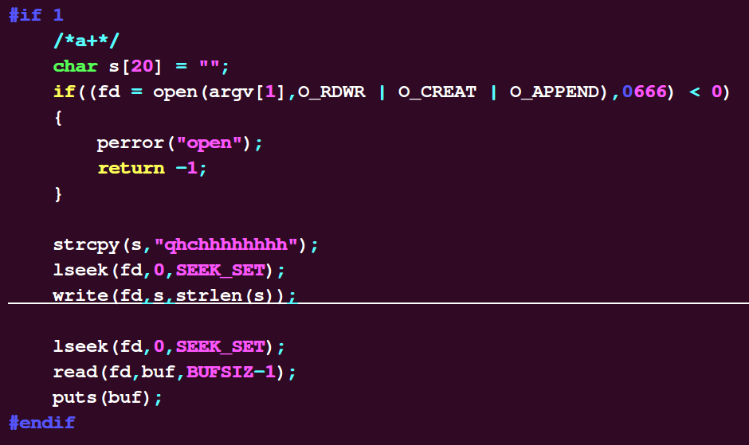
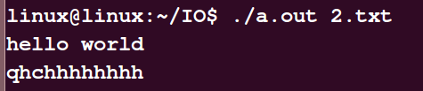

# 标准IO：


## 1.标准IO介绍：

文件基础：

概念：

一组相关数据的有序集合


文件类型：


常规文件 r

目录文件 d             linux中把目录也看作是文件

字符设备文件 c

块设备文件     b      优盘

管道文件        p

套接字文件     s        

符号链接文件  l       相当于通向真正文件的门牌入口


Unix基础知识：系统调用和库函数


用户代码调用系统给我们提供的接口使显卡驱动输出（比如printf函数），一般通过库函数实现

为什么不直接调用内核？

不同系统给我们提供的接口是不一样的，比如linux\windows系统，提供的接口不一样，但如果想实现同样的输出，那就需要改动大量的代码，移植性差，这时候引入库函数，充当翻译官，将写的代码翻译成该系统下的系统调用，比如在windows系统下写好的代码移植到linux下，因为接口是不一样的，所以不能直接调用，而通过库函数则可以翻译成linux下的系统调用，再去调用输出驱动，库函数printf就是一个标准I/O


具体可参考该文件：


==系统调用与库函数的关系==：


库函数其实是别人写好的一些代码供我们使用，使用时只用包含头文件即可，库函数是一些系统调用的封装，几乎每一个操作系统都会有C库，C库相当于翻译官，代码在不同操作系统之间移植时，可以被C库翻译为不同操作系统下的系统调用，去请求内核的服务，进而访问硬件，因此移植性比较好，而直接使用系统调用，一是移植性差，二是缺乏安全性


https://blog.csdn.net/m0_47170940/article/details/123923358


标准IO介绍：


由ANSI C标准定义

主流操作系统上都实现了C库，标准IO通过缓冲机制减少系统调用，实现高效


流：


FILE指针：每个被使用的文件都在内存中开辟一个区域，用来存放文件的有关信息，这些信息是保存在一个结构体类型的变量中，该结构体类型是由系统定义的，取名为FILE。

标准I/O库的所有操作都是围绕流(stream)来进行的，在标准I/O中，流用FILE *来描述。


标准IO预定义三个流，程序运行时自动打开：


**流**（FILE），将文件看作资源，C语言中的文件都是以二进制性质存放的，当这些文件执行被调用移动等操作时，成为流（可类比为水流，水为资源），流分为文本流和二进制流，其实就是是用结构体封装好的文本信息，比如int fclose(FILE *stream);,参数为流指针也即是结构体指针或者看作文件信息指针，标准IO所有操作都是围绕流进行的

## 2.缓冲区实验
==那么为什么要有缓冲区呢？==
当计算机的高速部件与低速部件通讯时,必须将高速部件的输出暂存到某处,以保证高速部件与低速部件相吻合。通常情况下，就是为了高效的处理我们的cpu和i/o设备之间的交互，因为我们知道cpu处理速度是很快的。举个例子，电脑的cpu通常情况下要处理很多事务，而我们从键盘敲下的文字相对于cpu的处理是很慢的，cpu不能老等着我们，它可以这时候去处理别的事务。所以当我们敲小的文字被先放到了缓冲区，等待cpu最后的统一处理。这样就让计算机的cpu变得高效起来。
==那么缓冲区又有哪些分类呢？==
我们将缓冲区分为全缓冲、行缓冲和无缓冲。

**全缓冲**：我们缓存在缓冲区的东西在缓冲区满的时候，才写入磁盘或者我们调用fflush刷新缓冲区才能写入到磁盘。对于全缓冲，如果我们缓冲区没满，或者我们没有手动刷新缓存，那么缓存区的内容是不能写入到磁盘的。
**行缓冲**：我们标准输入、标准输出都是采用的行缓存，也就是遇到换行符的时候，才会将缓存区的东西写入到磁盘。
**无缓存**：有的时候，我们希望一些内容在第一时间写入磁盘或者显示出来，比如我们显示错误信息的时候，这时候典型的例子比如标准出错，它就是直接显示出错信息，而不会先放入缓存
————————————————
版权声明：本文为CSDN博主「小C博客」的原创文章，遵循CC 4.0 BY-SA版权协议，转载请附上原文出处链接及本声明。
原文链接：https://blog.csdn.net/lws123253/article/details/83029742


man 2  查看系统调用函数 

man 3  查看库函数


验证行缓冲：


代码如下：

```c
#include <stdio.h>

#include <unistd.h>


int main()

{

  /*

  int i;


​    for(i=0;i<1023;i++)

  {
​      printf("a");
  }
  
  */

  printf("hello world!");

// printf("bc");

  /*while(1)

  {
​     sleep(1);
  }*/

  return 0;
}
```


执行结果如下：


造成上面结果的原因是：程序运行结束后也会输出结果，下面我们加上while(1)死循环


```c
#include <stdio.h>

#include <unistd.h>


int main()
{

  /*

  int i;
  
​    for(i=0;i<1023;i++)

  {
​      printf("a");
  }

  */

  printf("hello world!");

// printf("bc");

  while(1)
  {
​     sleep(1);
  }

  return 0;
}
```

程序运行结果：


代码中while死循环里的sleep函数作用是使循环空间休眠，不会占用CPU

可见此时行缓冲方式并未输出结果。


下面改为printf("hello world\n");结果如下：


输出打印到终端，原因是行缓冲方式遇到\n输出


全缓冲的缓冲区：


```c
#include <stdio.h>

#include <unistd.h>


int main()

{

  int i;


  for(i=0;i<100;i++)

  {

​      printf("a");

  }

  printf("hello world!");


  while(1)

  {

​     sleep(1);

  }

}
```


printf("a");中没有加'\n'，根据程序结果可知：将a打印100次并没有输出

下面改为1000次，结果如下：


仍然没有输出，再将a改为打印2000次，结果如下：


那么行缓冲区大小是多少呢？根据上面的运行结果可知一共是1024个a，也就是是1k字节，下面进行验证：


将循环改为执行1023次


```c
#include <stdio.h>

#include <unistd.h>


int main()

{

  int i;


  for(i=0;i<1023;i++)

  {

​      printf("a");

  }

// printf("hello world!");

  //printf("b");

  while(1)

  {
​     sleep(1);
  }

}
```

结果如下：


再将循环改为1024次，结果如下：


这样不太直观，下面将代码改为：


```c
#include <stdio.h>

#include <unistd.h>

int main()
{
  int i;

  for(i=0;i<1023;i++)

  {
​      printf("a");
  }

// printf("hello world!");

  printf("b");

  while(1)

  {
​     sleep(1);
  }
}
```

执行结果为：


将输出'b'的打印语句改为  printf("bc");，输出结果为：


可见输出结果中最后输出了第1024位的b字符，对比前面结果（缓冲区中有1024个字节的字符时并没有输出），可见缓冲区大小为1024字节。


全缓冲与行缓冲：

==一般指向终端的都是行缓冲，其它则是全缓冲==，error一般为无缓冲直接显示到终端上。即每一次使用fopen打开文件时就是全缓冲，输出到终端就是行缓冲


https://www.baidu.com/link?url=TG-UENxa6LXw2elnWQQeKUfWMtRIp-jamyeH03sg3Jg-iVDSbLykeijYRJF0yxlpM2FZpC5FvbvRV-GZ3dPirb67LjoemRbY1HGmdoTTckW&wd=&eqid=d3012ce00001cad30000000463eb4120


### 行缓冲，全缓冲，无缓冲的详细介绍

摘自CSDN

#### 一.标准IO缓冲区

1.1缓冲区的类型

行缓存：和终端相关的缓冲区就是行缓存 stdin stdout

全缓存: 和文件相关的就是全缓存 fopen打开的文件

不缓存：没有缓冲区 stderr


#### 二.缓冲区的大小

2.2.1行缓存：大小1024
#include <head.h>

int main(int argc, const char* argv[])
{
    int ch;
    对于标准输入行缓存大小验证的时候，必须有输入才有数据
    scanf("%d", &ch);
    printf("size = %ld\n", stdin->_IO_buf_end - stdin->_IO_read_base);
     1024

```c
printf("size = %ld\n", stdout->_IO_buf_end - stdout->_IO_read_base);
 1024
 
fprintf(stderr,"q121231qweqweqweqweqweqweqwe2");
printf("size = %ld\n", stderr->_IO_buf_end - stderr->_IO_read_base);
0
while(1);
 
return 0;
```
}

2.2.2全缓存：大小4096
#include <head.h>

int main(int argc, const char* argv[])
{
    FILE* fp;

```c
if ((fp = fopen("./tim.txt", "a+")) == NULL)
    PRINT_ERR("fopen error");
 
fprintf(fp,"q121231qweqweqweqweqweqweqwe2");
printf("size = %ld\n",fp->_IO_buf_end - fp->_IO_buf_base);
//4096
return 0;
```
}
2.2.3无缓冲：
为0


#### 三.缓冲区的刷新时机


##### 3.1行缓存的刷新时机

#include <head.h>

int main(int argc,const char * argv[])
{
    1.行缓存遇到换行符的时候会刷新缓冲区
     printf("hello world\n");
     while(1);
    
```c
2程序结束的时候行缓存也会被刷新
 printf("helloworld");
 
3.当输入和输出切换的时候也会刷新缓冲区
 int ch;
 printf("helloworld");
 scanf("%d",&ch);
 while(1);
 
4.当关闭文件描述符的时候也会刷新缓冲区
 printf("helloworld");
 fclose(stdout);
 while(1);
 
5.调用fflush主动刷新缓冲区
 printf("helloworld");
 fflush(stdout);
 while(1);
 
6.当缓冲区满也会刷新缓冲区
int i;
for(i=0;i<1028;i++){
    fputc('a',stdout);
}
while(1);
return 0;
```
}

##### 3.2全缓存的刷新时机：

#include <head.h>

int main(int argc,const char * argv[])
{
    FILE *fp;

```c
if ((fp = fopen("./hello.txt", "w")) == NULL)
    PRINT_ERR("fopen error");
 
1.换行符不会刷新全缓存
fprintf(fp,"hello world\n");
 while(1);

2.程序结束的时候全缓存也会被刷新
 fprintf(fp,"hello world");
 
3.当输入和输出切换的时候也会刷新全缓冲区
 int ch;
 fprintf(fp,"hello world\n");
 ch = fgetc(fp);
 while(1);
 
4.当关闭文件描述符的时候也会刷新全缓冲区
 printf(fp,"hello world\n");
 fclose(fp);
 while(1);
 
5.调用fflush主动刷新全缓冲区
 fprintf(fp,"hello world\n");
 fflush(fp);
 while(1);
 
6.当缓冲区满也会刷新全缓冲区
int i;
for(i=0;i<4097;i++){
    fputc('a',fp);
}
while(1);
return 0;
```
}

————————————————
版权声明：本文为CSDN博主「向着太阳迎着光_」的原创文章，遵循CC 4.0 BY-SA版权协议，转载请附上原文出处链接及本声明。
原文链接：https://blog.csdn.net/a2998658795/article/details/126712349


## 3.文件的打开和关闭


文件的打开：占用资源

文件的关闭：释放资源


文件的打开函数：

FILE *fopen(const char *path,const char *mode)；

失败返回NULL


path:普通文件当前路径不需要加目录，其他文件要使用完整的路径

mode:

参数：（重点）

   


r    只读打开，条件是文件必须存在，若不存在还读则会出错返回NULL

r+ 读写方式打开，条件同上，并且写的时候将数据从头开始写入

w  只写打开，若文件存在，则将文件里的数据清空，若文件不存在则重新创建

w+读写打开，其他同w

a   只写打开，文件不存在则创建，存在则将要写入的内容追加到文件末尾

a+ 读写打开，其他同a


文件打开模式区别和辨析：

**w+** 打开文件并读写  1. 文件存在，则清空(也即写入空); 2. 文件不存在，则创建文件 ; 3. 文件流定位到开始位置， 所以read() 会得到空。

**r+**  打开文件并读写   1. 文件存在，打开文件，文件指针定位到文件开始位置； 2. 文件不存在， 则报错文件不存在。

**a+**  打开文件并读添   1. 文件存在，打开文件，文件指针定位到文件开始位置，但不清空；2.  文件不存在，创建文件； 3. 打开后读取时，在文件开头位置，4. 写入时，添加到文章末尾，并且指针位于添加后的末尾，所以再次读取会乱码。

另外，

\1. w 打开文件写入，也会清空文件，如果使用read()，则报错；a 打开文件添加，数据流添加到文件末尾，而不是w模式的清空后，添加到文件末尾。

\2. b可以附加到上述的字母后，形成rb, rb+, wb等等模式，针对二进制文件，比如exe, elf, jpeg格式的文件，进行文件操作； 在unix 类型的系统上，text格式与二进制的处理相同，但是非unix类型的系统上，换行格式不同，所以需要用加b模式来在指定是否是二进制。


返回值：出错时返回NULL指针，成功返回FILE*类型的流指针，使用fopen函数时必须判断是否为空指针


错误信息：


原型：void perror(const char *s);

perror("fopen");   库函数  需要包含头文件   <stdio.h>


原型：char *strerror(int errno);

strerror(errno);     库函数  需要包含头文件    <errno.h>  <string.h>

printf("fopen:%s\n",strerror(errno));


文件关闭：

int fclose(FILE *stream);

成功返回0，失败返回EOF（-1），并设置errno


流关闭后自动刷新缓冲区数据，释放缓冲区，比如：常规文件缓冲区写入磁盘


程序正常终止时，所有的流均被关闭


另外fclose函数参数不为NULL，否则会出现段错误


------


# 标准IO的读写：


## 按字符输入：


为什么返回值用int 呢？  因为char、unsigned char 的数据范围是-128-+127、0-255，而int的数据范围是-32768-+32767，数据范围足够大，足以容纳任何返回值


另外stdin也是FILE *的指针，是系统定义好的（标准输入--键盘）


打开文件后读取，读取操作从头进行，读完一个读写指针后移。

getchar()标准输入函数执行时会阻塞，等待用户输入


## 按字符输出：


三种字符输出函数的返回值都是int型

putc(c,stdout);  stdout相当于FILE *，是系统已经定义好的标准输出（显示器）


int fputc(int c,FILE *stream);

调用fputc函数


```c
#include <stdio.h>


int main()

{
   FILE *fp;

   int rec;

   fp = fopen("1.txt","w+");


   if(fp == NULL)
   {
​      perror("fopen");

​      return 0;
   }

   /*

   rec = fgetc(fp);

   if(rec == -1)

   {
​      perror("fgetc");

​      fclose(fp);

​      return 0;
   }

   printf("get char:%c\n",rec);

   rec = getchar();

   printf("get stdin:%c\n",rec);

   fclose(fp);

   fp = fopen("1.txt","r");


   if(fp == NULL)

   {
​      perror("fopen");

​      return 0;
   }


   rec = fgetc(fp);

   printf("get char:%c\n",rec);

   rec = fgetc(fp);

   printf("get char:%c\n",rec);


   rec = fgetc(fp);

   printf("get char:%c\n",rec);

  */

   int wrc = 'w';

   rec = fputc(wrc,fp);

   if(rec == -1)
   {
​     perror("fputc");

​     fclose(fp);

​     return 0;
   }

   printf("fputc:%c\n",rec);

   fclose(fp);

   return 0;
}
```


调用后需要对返回值进行出错判断，标准的出错判断代码为上面标红部分


## 按行读取字符：


char *fgets(char  *s,int size,FILE *  stream);


注意返回值为char *类型的指针    形参为：缓存区、输入字符的大小、文件流指针（文件）


若定义输入的字符数为size,那么当从指定的文件中实际输入的字符数大于等于size-1时，会输入size-1个用户字符+‘\0’结束符到缓存区中（如果恰好输入size-1个字符，那么直接将在这些字符后加上'\0'输入到缓存区）；若用户实际输入的字符数小于size-1，则直接将用户输入的字符原样输入到缓存区内存空间，后面跟上'\n'


如果程序中连续调用fgets函数会怎样？

下面进行验证：


源码如下：


```c
#include <stdio.h>


int main()
{
   FILE *fp;

   char buff[100];

   char *ret;

   int retn;

   fp = fopen("1.txt","r");

   if(fp == NULL)

   {
​      perror("fopen");

​      return 0;
   }


   ret = fgets(buff,5,fp);

   if(ret == NULL)

   {
​      perror("fgets");

​      fclose(fp);

​      return 0;
   }

   printf("buff:%s\n",buff);

 
   ret = fgets(buff,5,fp);

   if(ret == NULL)

   {
​      perror("fgets");

​      fclose(fp);

​      return 0;
   }

   printf("buff:%s\n",buff);

   ret = fgets(buff,5,fp);

   if(ret == NULL)

   {
​      perror("fgets");

​      fclose(fp);

​      return 0;
   }

   printf("buff:%s\n",buff);

   fclose(fp);

   return 0;

}
```

如果程序执行前，流指针指向的文件1.txt内容为(size-1为4)：


那么这三次分别读进缓存区的内容为：

aaaa'\0'

aa'\n'

wewe'\0'


结果如下：


输出aa时，将aa'\n'   完整输出后，因输出语句printf为行缓冲，遇到'\n'结束释放缓存，故再加一个回车


拓展：


函数原型：

char* fgets ( char* str, int size, FILE* stream)

*str: 字符型指针，用来存储所得数据的地址。字符数组。

size: 整型数据，要复制到str中的字符串的长度，包含终止NULL。

*stream:文件结构体指针，将要读取的文件流。

意义：从stream所指向的文件中读取size-1个字符送入字符串数组str中。


功能：从文件中读取字符串，每次只读取一行。


注意：

\1. fgets每次最多只能读取n-1个字符，第n个为NULL。

\2. 当遇到换行符或者EOF时，即使当前位置在n-1之前也读出结束。

\3. 若函数返回成功，则返回 字符串数组str的首地址

————————————————

版权声明：本文为CSDN博主「噗噗酱」的原创文章，遵循CC 4.0 BY-SA版权协议，转载请附上原文出处链接及本声明。

原文链接：https://blog.csdn.net/yihe_xinyi/article/details/78728379


## 按行输出函数：


课堂例程代码：


```c
#include <stdio.h>


int main()
{
   FILE *fp;

   char buff[100];

   char *ret;

   int retn;

   fp = fopen("1.txt","r+");


   if(fp == NULL)

   {
​      perror("fopen");

​      return 0;
   }

   /*

   ret = fgets(buff,5,fp);

   if(ret == NULL)

   {
​      perror("fgets");

​      fclose(fp);

​      return 0;
   }

   ret = fgets(buff,5,fp);

   if(ret == NULL)

   {
​      perror("fgets");

​      fclose(fp);

​      return 0;
   }

   ret = fgets(buff,5,fp);

   if(ret == NULL)

   {
​      perror("fgets");

​      fclose(fp);

​      return 0;
   }


   printf("buff:%s\n",buff);

   */

   //puts("hello world");


   retn = fputs("hello world",fp);


   if(retn == -1)

   {
​      perror("fputs");

​      fclose(fp);

​      return 0;
   }

   printf("hahaha\n");

   fclose(fp);

   return 0;

}
```


假如代码执行前1.txt文件是这样的(注意打开文件模式是读写)


那么按照代码执行结果是：


假如原1.txt文件首行内容少，比如这样：


那么再来看下程序执行后的结果：


说明采用r+模式，原内容会被覆盖掉，从结果可以看出，原来首行的'\n'也被吃掉了，下一行接到了上面


若采用a+追加模式，内容会被直接追加到文件后面：


## 二进制读写：

文件读写过程：磁盘— 文件缓冲区 — 应用程序的内存空间


文本文件和二进制文件：


文本文件：文本文件只能存储文本，是一种特殊的二进制文件（解释格式确定--ASCII码或Unicode码）

二进制文件：除了文本文件都是二进制文件，绝大部分文件都是二进制文件，比如图形、图像、声音文件等


**文本文件是基于字符编码的文件，常见的有ASCII、Unicode等，二进制文件是基于值编码的文件，可以看成是变长编码，你可以根据自己的需要，决定多少个比特代表一个值。**


**如果是需要频繁的保存和访问数据，那么应该采取二进制文件进行存放，这样可以节省存储空间和转换时间。**

**如果需要频繁的向终端显示数据或从终端读入数据，那么应该采用文本文件进行存放，这样可以节省转换时间。**

**文本文件的打开方式和二进制文件打开方式的区别：**

**(1)文本模式中回车被当成一个字符’\n’，在文件中如果读到0x1B,文本模式会认为这是文件结束符，会按照一定方式对数据做相应的转换。**

**(2)二进制模式中’\n’会被认为是两个字符0x0D，0x0A;在读到0x1B时，二进制模式不会对文件进行处理。**

文本工具打开一个文件的过程是怎样的呢？拿记事本来说，它首先读取文件物理上所对应的二进制比特流，然后按照你所选择的解码方式来解释这个流，然后将解释结果显示出来。一般来说，你选取的解码方式会是ASCII码形式（ASCII码的一个字符是８个比特），接下来，它8个比特8个比特地来解释这个文件流。例如对于这么一个文件流”01000000_01000001_01000010_01000011”(下划线”_”，为了增强可读性手动添加的)，第一个8比特”01000000”按ASCII码来解码的话，所对应的字符是字符”A”，同理其它3个8比特可分别解码为”BCD”，即这个文件流可解释成“ABCD”，然后记事本就将这个“ABCD”显示在屏幕上。


用记事本打开二进制文件与上面的情况类似。记事本无论打开什么文件都按既定的字符编码工作（如ASCII码），所以当他打开二进制文件时，出现乱码也是很必然的一件事情了，解码和译码不对应嘛。例如文件流”00000000_00000000_00000000_00000001”可能在二进制文件中对应的是一个四字节的整数int 1，在记事本里解释就变成了”NULL_NULL_NULL_SOH”这四个控制符。

————————————————

版权声明：本文为CSDN博主「Cacra」的原创文章，遵循CC 4.0 BY-SA版权协议，转载请附上原文出处链接及本声明。

原文链接：https://blog.csdn.net/u014465934/article/details/81586278


读写函数：

size_t  fread(void *ptr,size_t size,size_t n,FILE *    fp);

void *ptr,读取内容放的位置指针

size_t size，读取的块的大小

size_t n ，读取的个数

FILE *fp， 读取的文件流指针


size_t fwrite(const void *ptr,size_t size,size_t n,FILE *fp);

void *ptr,写文件内容的位置指针

size_t size，写的块的大小

size_t n ，写的个数

FILE *fp， 要写的文件流指针


读文本：

size_t  fread(void *ptr,size_t size,size_t n,FILE *    fp);


fread（从文件流读取数据）  

表头文件  #include<stdio.h>

定义函数  size_t fread(void * ptr,size_t size,size_t count,FILE * stream);

函数说明  fread()用来从文件流中读取数据。参数stream为已打开的文件指针，参数ptr 指向欲存放读取进来的数据空间，读取的字节数以参数size*count来决定。
Fread()会返回实际读取到的count数目，如果此值比参数count来得小，则代表可能读到了文件尾了或者有错误发生(前者几率大)，这时必须用feof()或ferror()来决定发生什么情况。

返回值  返回实际读取到的count数目。
————————————————
版权声明：本文为CSDN博主「fisher」的原创文章，遵循CC 4.0 BY-SA版权协议，转载请附上原文出处链接及本声明。
原文链接：https://blog.csdn.net/gaofeidongdong/article/details/7069244


代码思路：

代码一开始先是定义一个文件流指针fp、接收返回值变量ret、指向内存的指针buff，fp用于接收打开文件函数返回的文件指针，ret接收读写函数的返回值，buff用于接收申请内存后的返回指针

接着调用文件打开函数：fopen，并进行打开成功失败的判断，然后申请一块内存并强制类型转换为char *类型并进行申请成功与否的判断

调用fread函数并使ret接收其返回值，并进行成功与否的判断，该函数的功能是将fp指向的文件的内容按照读一块，块大小为10字节的规则读取，放入用户申请得到的buff内存空间中，最后将内存空间的字符打印出来


源码如下：


```c
#include <stdio.h>

#include <stdlib.h>

int main()
{
   FILE *fp;

   int ret;

   char *buff;

   if((fp = fopen("1.txt","r")) == NULL)
   {
​       perror("fopen");

​       return 0;
   }


   if((buff = (char *)malloc(100)) == NULL)
   {
​       perror("malloc");

​       fclose(fp);

​       return 0;
   }


   ret = fread(buff,10,1,fp);


   if(ret == -1)

   {
​     perror("fread");

​     goto end;
   }


   printf("buff:%s\n",buff);

end:

   free(buff);

   fclose(fp);

   return 0;

}
```


结果图：

要读取的文本：


读取到buff内存：


可见读了6个a,1个'\n'，和下面一行'wew'共10个字符，另外不要忘了程序最后要释放内存、关闭文件


写读二进制：


思路：

1.首先定义一个结构体，并取一个别名STU，结构体成员分别为：name[]\age\sex[]，分别用来存放学生的名字、年龄、性别，main函数中定义几个变量，fp用于接收文件打开函数的返回值，ret用来接收读写文件函数的返回值，以及定义了两个结构体类型的变量stu,stu2


2.调用fopen函数，并判断返回值

3.结构体成员初始化赋值

4.调用fwrite函数，并用ret接收其返回值，并对返回值进行判断，其中fwrite函数功能是将stu结构体内存里的内容，写入fp指向的文件，写入规则为：写1个块，块大小为结构体大小

5.若写入成功，打印"write succeed"，注意先将文件关闭再打开，再调用fread函数进行读取，最后打印结构体成员值


另外要注意：要额外定义一个结构体变量stu2，用来存放从文件读入的内容，如果还用原来的stu，因为写入操作后stu指针移动到了最后，读取的话是从1.bin文件中去内容放到指针位置处，那么打印时就从指针处开始打印


```c
#include <stdio.h>

#include <string.h>


typedef struct student

{
​    char name[20];

​    int  age;

​    char sex[10];

}STU;


int main()

{
​    FILE *fp;

​    int ret;

​    STU stu,stu2;


​    if((fp = fopen("1.bin","w+")) == NULL)
​    {

​        perror("fopen");

​        return 0;

​    }

​    strcpy(stu.name,"zhangsan");

​    stu.age = 49;

​    strcpy(stu.sex,"male");

   
​    ret = fwrite(&stu,sizeof(stu),1,fp);

​    if(ret == -1)

​    {

​       perror("fwrite");

​       goto end;

​    }


​    else

​    {

​       printf("write succeed\n");

​    }

​    fclose(fp);//重要


​    if((fp = fopen("1.bin","r")) == NULL)

​    {

​        perror("fopen");

​        return 0;

​    }

​    ret = fread(&stu2,sizeof(stu2),1,fp);

​    if(ret == -1)

​    {
​       perror("fread");

​       goto end;
​    }

​    printf("%s %d %s\n",stu2.name,stu2.age,stu2.sex);

end:
​    fclose(fp);    

​    return 0;
}
```


如果直接用VI编辑器打开，会出现下面的结果，原因是该文件为二进制文件，而VI编辑器可以正常打开文本文件，打开二进制文件时，会以字符的形式显示字符内容，这是由于文本显示是根据ASCII码显示的，VI编辑器相当于一个翻译器，将二进制数据按字节为单位以ASCII对应的字符显示出来，而有的无法显示（比如控制符）。而且，name[20]数组只赋值了8个字符，后面的空缺部分会随机显示，sex数组同理。


另外一定要注意：代码中标红部分为先关闭fp指向的文件，再打开。因为经过fwrite写入操作时，fp指针已经移动到了最后，如果直接读取，会什么也读不到。

注意：

文件写完后，文件流位置指针移到了末尾，如果直接就开始读，读不出来内容


解决方法：

移动位置指针（后面讲解）

关闭后重新打开，流指针会自动跳到开头


------


# 流刷新定位、格式化输入输出


## 流刷新定位：


流刷新：


若输出到显示器使用：fflush(stdout);


流的定位：


注意事项：


==打开模式a下，fseek无效==

rewind(fp)  相当于fseek(fp,0,SEEK_SET);

这三个函数只适用于2G以下的文件


获取文件大小：

==手动向1.txt文件中输入字符时，会自动追加\0==，这时如果求取文件大小会比用fwrite函数只写字符时要多一个，比如：


源码：

```c
#include <stdio.h>


int main()

{
​    FILE *fp;

​    long n;

​    if((fp = fopen("1.txt","r")) == NULL)

​    {
​       perror("fopen");

​       return 0;
​    }


//    fwrite("qhc",3,1,fp);

​    fseek(fp,0,SEEK_END);

​    n = ftell(fp);

​    printf("%d\n",(int)n);


​    fclose(fp);

​    return 0;
}
```


假如文件注释，向文件1.txt中手动写入qhc,输出结果为4，此时文件指针定位到文件末尾即\0后面

假如将文件中的注释解除，则输出结果为3，文件指针定位到文件末尾，在字母c后面


## 格式化输入输出：


格式化输出：


格式化输入：


重点掌握sprintf函数和sscanf函数


## 标准IO练习：


源码：

思路：

①：类型变量定义：

FILE *fp;               用于接收文件打开函数返回的流指针，打开文件失败接收NULL

time_t ctime;       用于接收系统时钟调用函数time()返回的秒数，存放到类型为time_t的内存中

struct tm*cltime; 用于接收本地时间函数localtime()返回的结构体指针，即它指向秒数转化为本地时间后所存放的结构体

 int line = 0;         初始行数为0

 char buff[32];      字符数组，用于接收从fp指向的文件中读取的字符串

 ②：以a+模式打开文件1.txt，fp接受返回后的指针

 ③：计算文件行号基数

 ④：循环体，每隔一秒向1.txt文件中写入系统时间转化后的本地时间，并递增显示行号


```c
#include <stdio.h>

#include <time.h>

#include <unistd.h>

#include <string.h>


int main()

{
​    FILE *fp;

​    time_t ctime;

​    struct tm*cltime;

​    int line = 0;

​    char buff[32] = 0;


​    if((fp = fopen("1.txt","a+")) == NULL)
​    {
​        perror("fopen");

​        return 0;
​    }


​    while(fgets(buff,32,fp) != NULL)

​    {
​        if(buff[strlen(buff)-1] == '\n')

​        {

​          line++;

​        }
​    }

​    while(1)

​    {

​        ctime = time(NULL);  //参数传为NULL即可（如果不为空，秒数也会存放到参数里的指针指向的内存）

​        cltime = localtime(&ctime);  //注意参数是秒数存放的内存的地址（指针）

​        printf("%04d-%02d-%02d %02d:%02d:%02d\n",cltime->tm_year+1900,cltime->tm_mon+1,cltime->tm_mday,cltime->tm_hour+12,cltime->tm_min,cltime->tm_sec);

​        fprintf(fp,"%d %04d-%02d-%02d %02d:%02d:%02d\n",line,cltime->tm_year+1900,cltime->tm_mon+1,cltime->tm_mday,cltime->tm_hour+12,cltime->tm_min,cltime->tm_sec);//换行符不会刷新全缓冲的缓冲区


​        fflush(fp);


​        line++;


​        sleep(1);  //系统休眠函数，头文件为“unistd.h”；
​    }


​    fclose(fp);

​    return 0;
}
```


int tm_year   获取的数加1是正确的月份

int tm_mon   获取的数加上1900是正确的年份


计算文件内行总数：


while(fgets(buff,32,fp) != NULL)

​    {

​       if(buff[strlen(buff)-1] == '\n')   //判断是否读到了行结束位置【文件中的输出每一行最后都有回车（fprintf格式化输出 秒后跟了一个'\n'）】。若是，行号加1

​       {

​          line++;

​       }

​    }


注意写文件最后每一次循环都要加上fflush，将缓存区内容写到磁盘里面。


关于fprintf之后，内容没有写入到文件中：

https://www.baidu.com/link?url=5MhKDbJaqDu__NR0qvZlzGLDC628TzdKNgnCdTzbHcWtmUQ4hoVls_rYWio4hMB0Snbk5PEpp6dQ1UkCqT_o8KWWyTrwozBhRgt0D-2b-7u&wd=&eqid=928ab2b9000073830000000463eb39dd


# 文件IO


什么是文件IO？


又称为系统IO，系统调用，是操作系统提供的接口


是Posix定义的一组函数


不提供缓冲机制，每次读写都引起系统调用


文件IO的API：


open、close、read、write


文件IO的文件描述符：


是0-1023的一组数字（非负整数），代表文件


0 ，1， 2  分别表示    ：   标准输入、标准输出、标准错误


而且实际打开文件的文件描述符从3开始，因为程序运行时会自动分配0，1，2三个默认的文件描述符，这三个位置已被占据。


文件IO操作通过文件描述符进行


## 文件的打开和关闭：


文件打开函数open:


只有两个参数的open函数只用来打开文件，有三个参数的open函数用于创建不存在的文件


成功时返回文件描述符，错误时返回EOF，需要进行判断


参数mode :创建文件时open函数的第三个参数指定新文件的权限，实际权限为：mode-umask


参数flags：


标准IO读写参数与文件IO读写参数对比：


下面为使用open函数创建一个文件1.txt：


```c
#include <stdio.h>

#include <sys/types.h>

#include <sys/stat.h>

#include <fcntl.h>


int main()

{
​    int fd;

​    fd = open("1.txt",O_WRONLY | O_CREAT | O_TRUNC, 0664);

​    if(fd < 0)
​    {
​        printf("open failed\n");

​        return -1;
​    }

​    printf("succeed\n");

​    return 0;
}
```

注意使用open函数要包含三个头文件，且要对返回的fd文件描述符进行判断


## 文件的读取 写入 和定位：


读文件：


返回值：读取成功返回实际读取的字节数，出错返回-1，如果调用read函数之前已经到达文件末尾，则这次read返回0，另外count若为0，则read返回0


注意：read函数读完文件字符才返回字符数，如果使用while循环调用，循环体只能执行两次，若字符未达到文件尾，当读完时返回一个实际读取的字符数，再次调用read函数，read到达文件尾，返回0，可参考后面的代码，而且遇到\0结束,read为阻塞函数


==拓展：==

摘自man 手册：

返回值：

```c
On success, the number of bytes read is returned (zero indicates end of

​       file), and the file position is advanced by this number.  It is not  an

​       error  if  this  number  is smaller than the number of bytes requested;

​       this may happen for example because fewer bytes are actually  available

​       right  now  (maybe  because we were close to end-of-file, or because we

​       are reading from a pipe, or from a terminal),  or  because  read()  was

​       interrupted  by  a  signal.  On error, -1 is returned, and errno is set

​       appropriately.  In this case it is left unspecified  whether  the  file

​       position (if any) changes.
```

read的返回值一共有三种情况：

\1. 大于0：成功读取的字节数；

\2. 等于0：到达文件尾；

\3. -1：发生错误，通过errno确定具体错误值。

Note：本次讨论只限于阻塞的fd，不讨论非阻塞情况。


通过这个man的介绍，看似read的应用很简单，但真的是这样吗？莫忘了Linux中文件是一个很common的概念。它可以是一个真实的文件，也可以是一个socket，一个设备，等等。对于真实的文件，文件尾EOF是一个确定的情况。


1.那么如果是一个socket，它的返回值何时为0呢？


所以无论是 本端还是对端调用shutdown或者close时，都有可能导致本端的read返回为0。这里之所以说可能导致，是因为shutdown时可以指定 shutdown的行为，是关闭发送还是接收。


2.还有，在read的过程中，如果被信号中断，究竟是返回-1，还是返回一个正值或者0呢？

如果已读取了一些字节，那么就返回copied即已读取了的字节数——小于我们要去读取的字节数。如果没有读取任何字节，那么就返回-1，且errno为 EINTR。


3.当对端关闭后，是否socket还可以读取对端关闭socket前发送的数据呢？


即使对端关闭socket，本端仍可以读取对端在关闭之前发送的数 据。

https://www.cnblogs.com/jingzhishen/p/4393155.html


写文件：


与read类似，可参考read函数


定位（fd）：


可以参考fseek函数，参数几乎一样


注意：

与fseek一样，标准IO的fseek在fopen的a、a+模式下对写无效，对读有效；   

而lseek同理，在open的O_WRONLY | O_CREAT | O_APPEND 和 O_RDWR | O_CREAT | O_APPEND

模式下对写无效，对读有效






作业：


下面是使用文件IO实现“每隔1秒向文件1.txt写入当前系统时间,行号递增”：


（本程序是修改过的，源码有问题，收录在错题集）


```c
#include <stdio.h>

#include <unistd.h>

#include <sys/types.h>

#include <sys/stat.h>

#include <fcntl.h>

#include <time.h>


int main()

{
​    int fd;

​    int ret;

​    time_t ctime;

​    struct tm *cltime;

​    char buff[1024] = {0};

​    char buff1[1024]= {0};

​    int line  = 0;


​    if((fd = open("1.txt",O_RDWR | O_CREAT | O_APPEND, 0666)) == -1)

​    {
​        perror("open");

​        return -1;
​    }

//    printf("succeed fd:%d\n",fd);

​    ret = read(fd,buff1,sizeof(buff1));

//    printf("ret= %d\n",ret);


​    line = ret/23;

//    printf("line= %d\n",line);


​    while(1)

​    {
​        ctime = time(NULL);


​        cltime = localtime(&ctime);

//        printf("%04d-%02d-%02d %02d:%02d:%02d\n",cltime->tm_year + 1900,cltime->tm_mon + 1,cltime->tm_mday

//                ,cltime->tm_hour,cltime->tm_min,cltime->tm_sec);

​        sprintf(buff,"%02d %04d-%02d-%02d %02d:%02d:%02d\n",line,cltime->tm_year + 1900,cltime->tm_mon + 1,cltime->tm_mday

​                ,cltime->tm_hour,cltime->tm_min,cltime->tm_sec);

​        if(write(fd,buff,23) == -1)
​        {
​            close(fd);

​            return -1;
​        }

​        line++;

​        sleep(1);
​    }

​    close(fd);

​    return 0;
}
```


------

# 目录操作和库的使用：


opendir打开目录函数：


注意包含头文件<dirent.h>


## 读目录流内容：

函数readdir：


注意包含头文件<dirent.h>

参数是opendir返回的目录流指针，目录流指针指向打开的目录，readdir操作后，返回下一个目录项的struct dirent*类型的结构体指针，指向下一个目录项（结构体），而且每一个目录项的结构体都包含成员char d_name[256],具体可参见man 手册


closedir

参数为目录流指针dp


修改文件访问权限：


一般用第一个函数

chmod 第二个参数为要修改成的权限

注意如果在共享文件夹下，不方便使用，因为共享文件为linux与windows公用，而有些权限在windows下不可修改


## 获取文件属性（stat）：

该函数使用时要加上头文件：

 \#include <sys/types.h>

 \#include <sys/stat.h>

 \#include <unistd.h>


注意stat函数的参数：第一个为要获取属性的源文件，第二个为获取后属性所存放的结构体的指针

且结构体类型为struct stat


下面是struct stat结构体的介绍：


判断文件类型、获取文件访问权限：


文件类型和获取文件权限均是通过访问成员st_mode得到


下面通过使用stat函数来获取文件属性信息，并打印到命令行：


```c
#include <stdio.h>

#include <sys/types.h>

#include <sys/stat.h>

#include <unistd.h>

#include <time.h>


int main()

{
​    struct stat buff;

​    int ret;

​    int i;

​    struct tm* t;


​    if((ret = stat("chmod.c",&buff)) == -1)  //注意参数为指针，查看man手册

​    {
​       perror("stat");

​       return -1;
​    }


​    if(S_ISREG(buff.st_mode))

​    {

​       printf("-");

​    }

​    if(S_ISDIR(buff.st_mode))

​    {

​       printf("d");

​    }

​    if(S_ISCHR(buff.st_mode))

​    {

​       printf("c");

​    }


​    if(S_ISBLK(buff.st_mode))

​    {

​       printf("b");

​    }


​    if(S_ISFIFO(buff.st_mode))

​    {

​       printf("p");

​    }


​    if(S_ISSOCK(buff.st_mode))

​    {

​       printf("s");

​    }


​    for(i=8;i>=0;i--)

​    {

​       if(buff.st_mode & (1<<i))   //二进制移位操作，与运算

​       {

​         switch(i%3)

​         {

​         case 2:

​             printf("r");

​             break;

​         case 1:

​             printf("w");

​             break;

​         case 0:

​             printf("x");

​             break;

​         }

​       }


​       else

​       {

​           printf("-");

​       }

​    }

​    printf(" %d ",(int)buff.st_size);


​    t = localtime(&buff.st_ctime);


​    printf("%04d-%02d-%02d %02d:%02d:%02d",t->tm_year+1900,t->tm_mon+1,t->tm_mday,t->tm_hour,t->tm_min,t->tm_sec);


​    printf(" chmod.c\n");

​    return 0;

}
```

附：linux下的文件属性查看：


前面d开头的文件为目录文件，横线开头的为常规文件


------

## 静态库的使用：


可执行文件中必须有main函数

如果调用库文件里的内容，编译时就把相关代码和main函数合并，生成可执行文件


创建静态库：


①：编写库文件代码，编译生成.o目标文件


②：ar命令创建 libxxx.a 文件

​       ar -rsv libxxx.a  xxx.o

​       注意：libxxx.a 静态库文件以lib为前缀，.a为后缀      

​                 没有mian函数的.c文件无法生成可执行文件，否则执行结果如下：


链接错误：

test.c:(.text+0x7): undefined reference to `hello'

collect2: error: ld returned 1 exit status


含义：表示hello函数在编译的源码内没有找到实现

解决方法：实现代码或者找到hello函数对应的库并链接它


链接静态库：


gcc -o 可执行文件  源.c文件  -L路径  -lxxx


-L  跟上库所在的路径

-l   跟上库的名称


## 动态库的使用（也叫共享库）：


1.生成位置无关代码的目标文件(带有全局偏移表的.o文件)：

gcc -c -fPIC xxx.c  xxx.c.......


注意必须加上-fPIC(小写亦可)，编译后生成的.o文件中用  nm  命令查看会有全局偏移表（不加-fPIC没有）：


例如：


2.生成动态库：

将上一步所生成的目标文件用gcc 命令生成后缀为.so的动态库文件


gcc -shared -o libxxxx.so xxx.o xxx.o.......


3.链接动态库文件

gcc -o test test.c -L. -lmyheby

使test.c文件与上一步生成的共享库文件进行链接，生成可执行文件


执行动态库的可执行文件错误：

./test: error while loading shared libraries: libmyheby.so: cannot open shared object file: No such file or directory


含义：找不到可执行文件所需的共享库文件(程序运行加载动态库时不会在-L文件下查看，而是去/usr/lib或者/lib下找动态库)


解决方法：


①：找到共享库，放到/usr/lib里面


②：或者使用命令：  

​      export  LD_LIBRARY_PATH=$LD_LIBRARY_PATH:你的共享库文件目录


将它添加在~/.bashrc文件的最后一行，使用source ~/.bashrc生效，其实就是每次执行可执行    文件时，它会自己跑到这个文件里面，查找用户定义的共享库文件目录里是否存在所需要的共享库文件


查看可执行文件的动态库：


ldd :     ldd  可执行文件名


例如：

   

```shell
 linux@linux:~$ ldd test

​    linux-gate.so.1 =>  (0xb77bf000)

​    libmyheby.so => /home/linux/IO/libmyheby.so (0xb77b9000)

​    libc.so.6 => /lib/i386-linux-gnu/libc.so.6 (0xb75f6000)

​    /lib/ld-linux.so.2 (0xb77c0000)
```


如果没找到需要的动态库：

   

```shell
 linux@linux:~$ ldd test

​    linux-gate.so.1 =>  (0xb773f000)

​    libmyheby.so => not found

​    libc.so.6 => /lib/i386-linux-gnu/libc.so.6 (0xb7579000)

​    /lib/ld-linux.so.2 (0xb7740000)
```


静态库与动态库的区别：

https://blog.csdn.net/Hit_By_Apple/article/details/128187457


 静态库和动态库的区别_-星雨-的博客-CSDN博客_静态库和动态库的区别](https://blog.csdn.net/qq_42688149/article/details/116376057)


# 标准IO与文件IO的区别：

其实标准IO就是库函数，文件IO（系统IO）就是系统调用


①： 文件IO与标准IO遵循的标准不同：

   文件I/O 又称为低级磁盘I/O，遵循POSIX相关标准。任何兼容POSIX标准的操作系统上都支持文件I/O。标准I/O被称为高级磁盘I/O，遵循ANSI C相关标准。只要开发环境中有标准I/O库，标准I/O就可以使用。（Linux 中使用的是GLIBC，它是标准C库的超集。不仅包含ANSI C中定义的函数，还包括POSIX标准中定义的函数。因此，Linux 下既可以使用标准I/O，也可以使用文件I/O）。


②：标准IO有缓冲机制，文件IO则没有

   通过文件I/O读写文件时，每次操作都会执行相关系统调用。这样处理的好处是直接读写实际文件，坏处是频繁的系统调用会增加系统开销，标准I/O可以看成是在文件I/O的基础上封装了缓冲机制。先读写缓冲区，必要时再访问实际文件，从而减少了系统调用的次数。


③：操作的文件句柄（入口）不一样

   文件I/O中用文件描述符表现一个打开的文件，可以访问不同类型的文件如普通文件、设备文件和管道文件等。而标准I/O中用FILE（流）表示一个打开的文件，通常只用来访问普通文件。


④：来源不同

  标准IO来自标准C库，而文件IO来自操作系统内核


具体可参考：

https://blog.csdn.net/zqixiao_09/article/details/50444465

