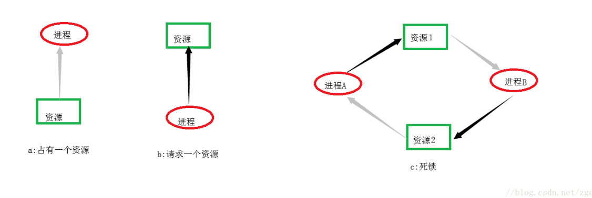
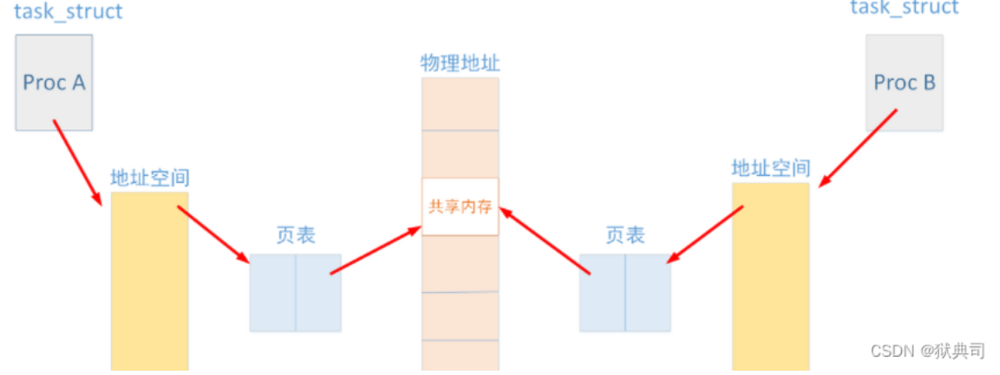

# 进程的创建和回收：


## 进程概念：


什么是程序？

程序是磁盘上的文件（指令和数据的集合），是静态的


什么是进程？

进程是执行一个程序所分配的资源的总称

是程序的一次执行过程

是动态的，包括创建、调度、执行、消亡


进程（pcb）内容：


下面作详细解释：


总结：

BSS段存放未初始化的全局变量和静态变量，程序运行前会自动地清零，所以我们才可以看到全局变量的初始值是0；


数据段存放已初始化的全局变量，也包括static存放的静态变量（所谓初始化是我们自己赋值）


代码段存放程序运行代码（源文件编译后生成的机器码），也可能包含一些只读常量，例如字符串常量等


堆是用于存放进程中被动态分配的内存段，是指调用malloc等函数分配内存时，新分配的内存就会被加到旧内存上（堆扩张），故称堆，当使用free等函数释放掉内存空间后，被释放的内存从堆中被剔除（堆缩减）


栈：又称堆栈，用于存放局部变量（但不包括静态局部变量--static修饰的）,和函数的参数、函数的返回值等


进程放在RAM里面，而程序放在ROM里面


进程控制块：

用于存放进程的属性


进程标识的PID


进程用户


进程状态、优先级


文件描述符表


进程的类型：


分为交互进程、批处理进程、守护进程


交互进程：shell下启动，可以在前台运行（终端上输入ctrl  c 退出），也可以在后台运行


批处理进程：和在终端无关，在作业队列中顺序执行


守护进程：和终端无关，一直在后台进行


进程的状态：


进程的运行态：


进程的等待

为什么要等待？

cpu空间资源不够，进程必须轮流使用cpu


------


## 进程常用命令：


ps         查看系统进程快照

top       查看系统动态进程信息     使用shift >右翻页   shift <左翻页

/proc    查看进程详细信息


**ps****命令详细参数：**

**-e****：显示所有进程**

**-l****：长格式显示更加详细的信息**

**-f****全部列出，通常和其他选项联用**

通常使用ps -elf命令显示所有进程的详细信息，具体进程标志见下表所示：

| **表头** | **含义**                                                     |
| -------- | ------------------------------------------------------------ |
| F        | 进程标志，说明进程的权限，常见的标志有两个:1：进程可以被复制，但是不能被执行；4：进程使用超级用户权限； |
| S        | 进程状态。进程状态。常见的状态有以下几种：-D：不可被唤醒的睡眠状态，通常用于 I/O 情况。-R：该进程正在运行。-S：该进程处于睡眠状态，可被唤醒。-T：停止状态，可能是在后台暂停或进程处于除错状态。-W：内存交互状态（从 2.6 内核开始无效）。-X：死掉的进程（应该不会出现）。-Z：僵尸进程。进程已经中止，但是部分程序还在内存当中。-<：高优先级（以下状态在 BSD 格式中出现）。-N：低优先级。-L：被锁入内存。-s：包含子进程。-l：多线程（小写 L）。-+：位于后台。 |
| UID      | 运行此进程的用户的 ID；                                      |
| PID      | 进程的 ID；                                                  |
| PPID     | 父进程的 ID；                                                |
| C        | 该进程的 CPU 使用率，单位是百分比；                          |
| PRI      | 进程的优先级，数值越小，该进程的优先级越高，越早被 CPU 执行； |
| NI       | 进程的优先级，数值越小，该进程越早被执行；                   |
| ADDR     | 该进程在内存的哪个位置；                                     |
| SZ       | 该进程占用多大内存；                                         |
| WCHAN    | 该进程是否运行。"-"代表正在运行；                            |
| TTY      | 该进程由哪个终端产生；                                       |
| TIME     | 该进程占用 CPU 的运算时间，注意不是系统时间；                |
| CMD      | 产生此进程的命令名；                                         |


top -p PID   查看某个进程

ps命令查看某个进程：

ps -elf|grep command ，例如ps -elf|grep watchdog


nice命令  按用户指定的优先级运行进程

nice  [-n NI值]  command                修改命令优先级


   NI范围是-20~19。数值越大优先级越低（人越好，越不容易占有自己想要的，很讽刺对吧）

普通用户调整NI值的范围是0~19，而且只能调整自己的进程。

普通用户只能调高NI值，而不能降低。如原本NI值为0，则只能调整为大于0。

只有root用户才能设定进程NI值为负值，而且可以调整任何用户的进程。

renice 改变正在运行进程的优先级

   renice [优先级] PID


jobs   查看后台进程

bg  +序号   将挂起的进程在后台运行

fg   +序号号   把后台运行的进程放到前台运行

ctrl +z   把前台进程放到后台并停止

ctrl +c   如果程序正在前台运行，按此组合键，可以退出进程

./xxx(可执行文件名)  &       可以将后台暂停的程序在后台运行

前台：

​	我们来谈一谈什么是前台，很好理解。假如此时我们只有一个终端，此时出现提示字符让我们操作的环境就是前台。举个例子，我们输入指令vim，此时会进入vim的操作平台，这时我们就处于前台状态。
​	而像我们在bash下执行我们的程序时，比如执行不断地打印，这些打印情况等我们都可以看到，这就是前台进程。就像Windows下的qq，此时我打开qq，并且处在它的界面上使用，此时qq就是一个前台进程。

后台：

​	而后台就是指任务可以自动执行，不用我们人为干预，我们也无法使用ctrl c中止。

------


## 创建子进程（重要）：


子进程是由另一个进程（父进程）创建的进程

注意：在linux下，除了0号进程，任何进程都是由别人创建的子进程，自己写的可执行程序test执行后，是由shell创建的


fork干了哪些事？

==将进程A（父进程）的代码复制一份，到进程B（子进程）==


函数原型：

\#include  <unistd.h>

pid_t  fork(void);


创建新的进程，失败时返回-1

成功时父进程返回子进程的进程号，子进程返回0

通过fork的返回值区分父进程和子进程


注意：==子进程只执行fork以下的程序==

​          父子进程执行顺序是由操作系统决定的


注意：若父进程先结束

​         子进程成为孤儿进程后，被init进程收养

​          子进程同时变为后台进程


​         若子进程先结束

​        父进程如果没有及时回收，子进程变成僵尸进程


当先杀死子进程时，用ps -elf|grep xxx命令查看，发现：子进程仍然存在，只是变成了僵尸进程，等待父进程回收


而这时如果按ctrl c 退出父进程,再用ps -elf|grep xxx命令查看，发现子进程也没有了：


这是因为父进程退出后被父进程上一级的进程（shell）回收，自然孙子进程也被回收


如果使用for循环循环创建子进程时，如果不加退出条件，子进程从第二次循环开始也会执行循环体（虽然子进程执行的是fork以下的程序，但是没有出口就会跳到循环开头）


子进程退出：


\#include <stdlib.h>

\#include  <unistd.h>

void  exit(int  status);

void  _exit(int  status);

void  _Exit(int  status);

\* 结束当前的进程并将status返回

\* exit结束进程时会刷新(流)缓冲区，而_exit函数不会


exit函数（如果程序中不加exit，程序结束时，会默认隐式调用exit函数，也会刷新流缓冲区，如果main函数程序后没有return，也会默认加上return 同时隐式调用exit函数，注意只有main函数的return 会隐式调用exit，其他函数只会返回上一级，也不会刷新缓冲区）


测试代码：


```c
#include <stdio.h>

#include <stdlib.h>

#include <unistd.h>


int test_exit();

int main()  
{
​    while(1)
​    {
​       test_exit();
​    }


   // printf("hello world");


​    //_exit(0);


​    //printf("after exit");

​   
​    //sleep(5);

​    return 0;

}


int test_exit()
{

​    printf("hello world");

​    return 0;
}
```


执行程序后，hello world被输出到终端，因为虽然test函数被调用时返回上一级，由于不是main函数，不会隐式调用exit函数，不会引起exit函数的刷新缓冲区功能，但是由于主函数中时while死循环，被调用的test函数返回到主函数后，再次执行，一直到缓冲区被hello world占满，输出到终端，由于cpu处理速度很快，故占满缓冲区（行缓冲1024）的时间很短，因此就有了瞬间刷满全屏的现象


**exit函数**

函数名: exit()

所在头文件：**stdlib.h**

功 能: 关闭所有文件，终止正在执行的进程。

- exit(1)表示异常退出.这个1是返回给操作系统的。
- exit(x)（x不为0）都表示异常退出
- exit(0)表示正常退出
- exit()的参数会被传递给一些操作系统，包括UNIX,Linux,和MS DOS，以供其他程序使用。

stdlib.h: void exit(int status);

参 数 : status //程序退出的返回值.

exit（0）：正常运行程序并退出程序。

exit（1）：非正常运行导致退出程序；

return（）：返回函数，若在主函数中，则会退出函数并返回一值。

(https://www.cnblogs.com/wind-zhou/p/12869612.html#_labelTop)

**拓展知识：**

1. return返回函数值，是关键字； exit 是一个函数。
2. return是语言级别的，它表示了调用堆栈的返回；而exit是系统调用级别的，它表示了一个进程的结束。
3. return是函数的退出(返回)；exit是进程的退出。
4. return是C语言提供的，exit是操作系统提供的（或者函数库中给出的）。
5. return用于结束一个函数的执行，将函数的执行信息传出给其他调用函数使用；exit函数是退出应用程序，删除进程使用的内存空间，并将应用程序的一个状态返回给OS(操作系统)，这个状态标识了应用程序的一些运行信息，这个信息和机器和操作系统有关，一般是 0 为正常退出，非0 为非正常退出。
6. 非主函数中调用return和exit效果很明显，但是在main函数中调用return和exit的现象就很模糊，多数情况下现象都是一致的。


***\*简述创建子进程中的写时拷贝技术？\****

由于fork完整地拷贝了父进程的整个地址空间，因此执行速度是比较慢的。为了提高效率，Unix系统设计者创建了vfork。vfork也创建新进程，但不产生父进程的副本。它通过允许父子进程可访问相同物理内存从而伪装了对进程地址空间的真实拷贝，当子进程需要改变内存中数据时才拷贝父进程。这就是著名的“写操作时拷贝”(copy-on-write)技术


## 进程的回收：


\#include <sys/wait.h>

  pid_t wait(int *status);

成功时返回回收的子进程的进程号；失败时返回EOF

若子进程没有结束，父进程一直==阻塞==

若有多个子进程，哪个先结束就先回收

status 指定保存子进程返回值和结束方式的地址   （使用exit函数结束子进程时，儿子的遗物【返回值、结束方式】会被装到status里面）

status为NULL表示直接释放子进程PCB,不接收返回值


进程返回值和结束方式：


进程回收：


0表示阻塞，WNOHANG表示不逗留，不管子进程是否结束都继续往下执行，返回值不再是子进程的进程号

wait(&status)  相当于  waitpid(-1,&status,0)


==参数：==

pid


pid>0时，只等待进程ID等于pid的子进程，不管其它已经有多少子进程运行结束退出了，只要指定的子进程还没有结束，waitpid就会一直等下去。

pid=-1时，等待任何一个子进程退出，没有任何限制，此时waitpid和wait的作用一模一样。

pid=0时，等待同一个进程组中的任何子进程，如果子进程已经加入了别的进程组，waitpid不会对它做任何理睬。

pid<-1时，等待一个指定进程组中的任何子进程，这个进程组的ID等于pid的绝对值。


options


options提供了一些额外的选项来控制waitpid，目前在Linux中只支持WNOHANG和WUNTRACED两个选项，这是两个常数，可以用"|"运算符把它们连接起来使用

WNOHANG ：若由pid指定的子进程未发生状态改变(没有结束)，则waitpid()不阻塞，立即返回0

WUNTRACED： 返回终止子进程信息和因信号停止的子进程信息

wait(wait_stat) 等价于waitpid(-1,wait_stat,0)


------


# exec函数族和守护进程


## exec函数族：


我们写的程序进程的父进程是shell（bash）,那shell是怎么实现创建子进程的呢？


\* 进程调用exec函数族执行某个程序

\* 进程当前内容被指定的程序替换（重要）

\* 实现让父子进程执行不同的程序

​      \* 父进程创建子进程

​      \* 子进程调用exec函数族

​      *父进程不受影响


函数原型：


  \#include  <unistd.h>

  int execl(const char *path, const char *arg, …);

  int execlp(const char *file, const char *arg, …);

\*  成功时执行指定的程序；失败时返回EOF

\*  path   执行的程序名称，包含路径（绝对路径）

\*  arg…  传递给执行的程序的参数列表

\*  file   执行的程序的名称，在PATH中查找


注意：这两个函数最后一个参数必须是NULL

​          execl和execlp的区别是execlp在PATH环境变量中查找路径文件，而execl函数则是从用户指定的绝对路径下面找指定程序

​          进程当前内容被指定的程序替换，但进程号不变

​          第0号参数不可省略


例如：


执行ls命令，显示/etc目录下所有文件的详细信息

 

```c
 if  (execl(“/bin/ls”, “ls”, “-a”, “-l”, “/etc”, NULL) < 0) {

​     perror(“execl”);

  }

  if  (execlp(“ls”, “ls”, “-a”, “-l”, “/etc”, NULL) < 0) {

​     perror(“execlp”);

  }
```


execv函数与execvp函数：


函数原型：


```c
 #include  <unistd.h>

  int execv(const char *path, char *const argv[]);

  int execvp(const char *file, char *const argv[]);

\*  成功时执行指定的程序；失败时返回EOF

\*  arg… 封装成指针数组的形式
```


例如：


执行ls命令，显示/etc目录下所有文件的详细信息

 

```c
 char  *arg[] = {“ls”, “-a”, “-l”, “/etc”, NULL};

  if  (execv(“/bin/ls”, arg) < 0) {

​     perror(“execv”);

  }

  if  (execvp(“ls”, arg) < 0) {

​     perror(“execvp”);

  }
```


system函数：


  \#include  <stdlib.h>

  int system(const char *command);

\*  成功时返回命令command的返回值；失败时返回EOF

\*  当前进程等待command执行结束后才继续执行


实际上也是像exec函数一样fork了一个子进程，只不过当前进程不会被替换


exec函数族练习：


1.main函数里的参数是什么？


2.下面用自己写的test1.c函数来说明exec函数族的使用：


先写一个test1.c程序：


```c
#include <stdio.h>

int main(int argc,char *argv[])
{
​        printf("hello world \n");

​        return 0;
}
```


编译生成test1可执行文件，可执行文件在当前目录下（~/pcb/）

gcc test1.c -o test1 -Wall


接着写一个exec2.c文件，代码如下：


```c
#include <stdio.h>

#incldue <unistd.h>


int main()
{
   printf("before exec\n");

   if((execl("./test1","ls","-a","-l",NULL)) == -1)
{
​    perror("execl");

​    return -1;
}

   printf("after exec\n");

   return 0;
}
```


运行程序后，结果如下：


before exec

hello world


可见原进程（exec2.c对应的可执行文件）在exec函数前可以执行，在调用exec函数后被./test1替换（原来的内容被全部替换）后，原来的代码以下部分不会被执行


下面可以屏蔽替换


```c
#include <stdio.h>

#include <unistd.h>


int main()
{
​    pid_t pid;


​    printf("before exec\n");


​    if((pid = fork()) < 0)
​    {
​        perror("fork");

​        return -1;
​    }


​    if(pid == 0)
​    {
​        if((execl("./test1","-a","-l","./",NULL)) == -1)
​        {
​            perror("exec");

​            return -1;
​        }
​    }

​    if(pid > 0)
​    {
​        printf("after exec\n");
​    }

​    return 0;
}
```

上述对进程pid号进行判断，使父子进程分管不同区域，执行不同代码，这样的话父进程不会被影响，而子进程则会被其他可执行文件替代，简图如下：


## 守护进程：


两个重要特点：后台进程、独立于终端     这时不能使用fg bg 命令操作它


终端就是linux与用户的交流窗口，即shell界面


### 守护进程概念：

守护进程又叫精灵进程（Daemon Process），它是一个生存期较长的进程，通常独立于控制终端并且周期性地执行某种任务或等待处理某些发生的事件。

特点：

始终在后台运行，独立于任何终端，周期性的执行某种任务或等待处理特定事件.

它是个特殊的孤儿进程，这种进程脱离终端，为什么要脱离终端呢？之所以脱离于终端是为了避免进程被任何终端所产生的信息所打断，其在执行过程中的信息也不在任何终端上显示。由于在Linux中，每一个系统与用户进行交流的界面称为终端，每一个从此终端开始运行的进程都会依附于这个终端，这个终端就称为这些进程的控制终端，当控制终端被关闭时，相应的进程都会自动关闭。

 

举例：

http服务的守护进程叫httpd，mysql服务的守护进程叫mysqld。

 

更简便地创建守护进程：nohup命令

nohup xxxx &  （但是一般不提倡这样创建守护进程，虽然可以不用写守护进程代码，但是缺少了创建守护进程的一些步骤，只是权宜之计）

setsid函数：

pid_t setsid(void);

成功：返回调用进程的会话ID；失败：-1，设置errno。

调用了setsid函数的进程，既是新的会长，也是新的组长（成功独立自主，自己做主人）

 

getsid函数

pid_t getsid(pid_t pid)

成功：返回调用进程的会话ID；失败：-1，设置errno

1.pid为0表示察看当前进程session ID

2.ps ajx命令查看系统中的进程。参数a表示不仅列当前用户的进程,也列出所有其他用户的进程,参数x表示不仅列有控制终端的进程,也列出所有无控制终端的进程,参数j表示列出与作业控制相关的信息。

3.组长进程不能成为新会话首进程,新会话首进程必定会成为组长进程。

 

getpid：pid_t getpid(void);      获取进程id

getpgid：pid_t getpgid(pid_t pid);  获取进程组id


### 守护进程的代码实现：

创建第一步：

fork创建子进程，父进程退出

\* 创建子进程，父进程退出

​    \*  子进程变成孤儿进程，被init进程收养

​    

​     if (fork() > 0)  {

​        exit(0);

​     }

  子进程在后台运行


```c
#include <stdio.h>

#include <unistd.h>

#include <stdlib.h>


int main()
{

​    pid_t pid;

​    pid = fork();


​    if(pid < 0)
​    {
​      perror("fork");

​      return -1;
​    }


​    else if(pid == 0)

​    {

​       printf("i am a daemon\n");

​       sleep(100);   //这里为什么时间到了，前台光标还在闪

​    }


​    else

​    {

​      exit(0);

​    }


​    return 0;

}
```


先将子进程的休眠时间设置为10秒，程序编译运行，使用ps -elf|grep mydaemon  命令查看 ，结果如下：


10秒之内查看，可以发现子进程变为孤儿进程，被init进程收养（init进程号为1853 可以用ps -elf查看），10秒之后，子进程自动退出，再次查看进程表不存在


由于测试设置的休眠时间太短，下面将时间修改为100秒，源代码基本不变


再次用ps命令查看，结果如下：


并且使用ctrl + c无效，子进程并不能退出，而且使用fg命令也无效（fg命令将后台进程调至前台运行），如下图：


可见当子进程成为孤儿进程且被init进程收养后，在后台运行，独立于终端，此时不能通过ctrl +c（说明不在前台，ctrl + c退出前台进程）使其中断或者fg调至前台（说明终端不能控制子进程）运行，此时可以用kill -9 命令杀死子进程


创建第二步：

setsid函数：

pid_t setsid(void);

成功：返回调用进程的会话ID；失败：-1，设置errno。

调用了setsid函数的进程，既是新的会长，也是新的组长（成功独立自主，自己做主人）

源码：


```c
#include <stdio.h>

#include <unistd.h>

#include <stdlib.h>


int main()

{

​    pid_t pid;

​    pid = fork();


​    if(pid < 0)

​    {

​      perror("fork");

​      return -1;

​    }


​    else if(pid > 0)

​    {

​      exit(0);

//    sleep(100);

​    }

​    
​    printf("I am a daemon\n");


​    printf("before setsid: sid=%d pid=%d gpid=%d\n",getsid(getpid()),getpid(),getpgid(getpid()));


​    if(setsid() < 0)

​    {

​       perror("setsid");

​       exit(0);

​    }


​    printf("after setsid: sid=%d pid=%d gpid=%d\n",getsid(getpid()),getpid(),getpgid(getpid()));


​    sleep(100);

​    return 0;

}
```


下面是查看进程信息、程序运行结果：


可见设置完setsid函数之后，该守护进程的sid、gpid,pid都为他自己的进程号5598


第三步（非必要可选项）：

改变工作目录：


第四步（非必要可选项）：

重设文件权限掩码：


第五步：

关闭文件描述符：


## GDB调试多进程程序：

（这里课堂上没调试好）


set follow-fork-mode child

set follow-fork-mode parent

set detach-on-fork  on/off

info inferiors

inferior  进程序号（1,2,3....）


------


# 线程的创建和回收：


进程有独立的地址空间

Linux为每个进程创建task_struct

每个进程都参与内核调度，互不影响

切换进程系统开销大


linux不区分进程、线程

同一进程中的不同线程共享相同的地址空间

如下图A、B线程共享相同地址空间，若定义一全局变量a，A、B均可访问a，对于静态数据x、y，A、B可以互相访问彼此数据


==进程和线程的区别==

A. 进程是资源分配的最小单位，线程是程序执行的最小单位。

 

B. 进程有自己的独立地址空间，每启动一个进程，系统就会为它分配地址空间，建立数据表来维护代码段、堆栈段和数据段，这种操作非常昂贵。而线程是共享进程中的数据的，使用相同的地址空间，因此CPU切换一个线程的花费远比进程要小很多，同时创建一个线程的开销也比进程要小很多。

 

C. 线程之间的通信更方便，同一进程下的线程共享全局变量、静态变量等数据，而进程之间的通信需要以通信的方式（IPC)进行。不过如何处理好同步与互斥是编写多线程程序的难点。

 

D. 但是多进程程序更健壮，多线程程序只要有一个线程死掉，整个进程也死掉了，而一个进程死掉并不会对另外一个进程造成影响，因为进程有自己独立的地址空间。

 


**程序什么时候应该使用线程，什么时候单线程效率高**

答：

1．耗时的操作使用线程，提高应用程序响应

2．并行操作时使用线程，如C/S架构的服务器端并发线程响应用户的请求。

3．多CPU系统中，使用线程提高CPU利用率

4．改善程序结构。一个既长又复杂的进程可以考虑分为多个线程，成为几个独立或半独

立的运行部分，这样的程序会利于理解和修改。

其他情况都使用单线程。


线程的特点：


线程共享资源：


一个进程中的多个线程共享以下资源：

可执行的指令

静态数据

进程中打开的文件描述符

当前工作目录

用户ID

用户组ID


线程的私有资源：


每个线程私有的资源包括：

线程ID (TID)

PC(程序计数器)和相关寄存器

堆栈

错误号 (errno)

优先级

执行状态和属性


linux线程库：


linux内核并没有实现线程的操作，线程是附加的，引入了线程库实现线程的操作


## 线程的创建：


线程创建函数pthread_create：


\#include  <pthread.h>

int  pthread_create(pthread_t*thread, const

​       pthread_attr_t *attr, void *(*routine)(void *), void *arg);


成功返回0，失败时返回错误码

thread 线程对象      (且其类型pthread_t为unsigned long类型的，输出时写为%lu)


attr 线程属性，NULL代表默认属性


routine 线程执行的函数


arg 传递给routine的参数 ，参数是void * ，注意传递参数格式


代码实现：


```c
#include <stdio.h>

#include <unistd.h>

#include <pthread.h>


int *Threadtest(char *arg)  //函数指针
{

​     printf("This is a threadtest\n");

​     return NULL;

}

int main()
{

​    pthread_t tid;

​    int ret;

​    ret = pthread_create(&tid,NULL,(void *)Threadtest,NULL);  

​    //printf("This is main thread\n");

​    //sleep(1);

​    return 0;

}
```


如果不加打印主进程和休眠延时，那么Thread函数里的内容无法打印出来

原因是，程序运行到pthread_create时，创建好后，控制权转移给Thread函数，程序接着往下执行，主进程退出，Thread函数还没执行完，线程就已经退出，来不及打印内容


加上sleep（1）休眠延时1秒，相比较于程序执行时间，1秒时间已经很长了，给了线程足够的执行时间

注意：

主进程退出，由他创建的线程也会退出

线程执行需要时间，如果此时主进程立即退出，那么线程就不能得到执行


代码编译错误：

1. 类型不符合报警：

linux@linux:~/pcb$ gcc create_p.c -o create_p-Wall

create_p.c: In function ‘main’:

create_p.c:16:2: warning: passing argument 3 of ‘pthread_create’ from incompatible pointer type [enabled by default]

  ret = pthread_create(tid,NULL,Threadtest,NULL);

  ^

In file included from create_p.c:3:0:

/usr/include/pthread.h:244:12: note: expected ‘void * (*)(void *)’ but argument is of type ‘int * (*)(char *)’


期望的是void *(*)(void *)    但实际传入的是  int *(*)(char *)

解决方法：改为pthread_create(tid,NULL,（void*）Threadtest,NULL);


1. 编译错误：

linux@linux:~/pcb$ gcc create_p.c -o create_p-Wall

/tmp/cc6adfH7.o: In function `main':

create_p.c:(.text+0x42): undefined reference to `pthread_create'

collect2: error: ld returned 1 exit status


原因：链接错误，未找到pthread_create函数的具体代码实现，这里是没有加动态库


解决方法：加上动态库，编译时在后面写上  ==-lpthread==


注意：

主进程退出，由他创建的线程也会退出

线程执行需要时间，如果此时主进程立即退出，那么线程就不能得到执行


------

## 线程的参数传递：


线程的退出：

\#include  <pthread.h>

void  pthread_exit(void *retval);

​      

\*  结束当前线程

\*  retval可被其他线程通过pthread_join获取

\*  线程私有资源被释放


pthread_exit函数对比return 可以起到清理线程的作用，一般使用pthread_exit


查看线程的tid：


两种方法：通过查看pthread_create创建线程函数的第一个参数

​                 或者通过在线程中调用pthread_self()函数查看自己的tid


参数传递：


1.通过地址传参，注意类型转换，如


编译错误：


linux@linux:~/pcb$ gcc create_p.c -o create_p -lpthread

create_p.c: In function ‘Threadtest’:

create_p.c:9:28: warning: dereferencing ‘void *’ pointer [enabled by default]

   printf("arg = %d\n",(int)*arg);   //解除指针的关联

​                            ^

create_p.c:9:3: error: invalid use of void expression

   printf("arg = %d\n",(int)*arg);  //无效使用表达


原因：pthread_create函数：

​          int  pthread_create(pthread_t *thread, const

​          pthread_attr_t *attr, void \*(\*routine)(void *), void *arg);

对于此函数，第三个参数为函数指针，其后面的 void*是空指针类型，不指向任何类型的数据，或者说编译器不知道数据类型，而（int）\*arg意味着对参数arg取值后强制类型转换,不能取值出现错误


正确使用为：*(int *)arg


```c
#include <stdio.h>

#include <unistd.h>

#include <pthread.h>


void *Threadtest(void *arg)

{

​     printf("This is a threadtest pid=%d tid=%lu\n",getpid(),pthread_self());


​     printf("arg = %d\n",*(int *)arg);


​    // return NULL;

​     
​     pthread_exit(NULL);


​     printf("i am a thread\n");
}


int main()

{
​    pthread_t tid ;

​    int ret;

​    int arg = 7;


​    ret = pthread_create(&tid,NULL,Threadtest,(void *)&arg);  


​    printf("This is main thread tid=%lu\n",tid);


​    sleep(1);

​    return 0;
}
```


2.值传递，需要保证数据类型的长度正确


**编译报警**：


linux@linux:~/pcb$ gcc create_p.c -o create_p -lpthread -Wall

create_p.c: In function ‘main’:

create_p.c:26:44: warning: cast to pointer from integer of different size [-Wint-to-pointer-cast]

  ret = pthread_create(&tid,NULL,Threadtest,(void *)arg); //从不同大小的整数转换为指针 

​                                            ^

如果传参时，数据类型不匹配，可能会出现以上报警，可能会丢失数据，比如：

​    long long int arg = 7; //这里如果换为其他非指针数据长度（4B）的数据类型也会报警


​    ret = pthread_create(&tid,NULL,Threadtest,(void *)arg);


正确的代码：


```c
#include <stdio.h>

#include <unistd.h>

#include <pthread.h>


void *Threadtest(void *arg)

{
​     printf("This is a threadtest pid=%d tid=%lu\n",getpid(),pthread_self());

​     printf("arg = %d\n",(int)arg);

​    // return NULL;

​     
​     pthread_exit(NULL);


​     printf("i am a thread\n");
}


int main()

{
​    pthread_t tid ;

​    int ret;

​    int arg = 7;


​    ret = pthread_create(&tid,NULL,Threadtest,(void *)arg);  


​    printf("This is main thread tid=%lu\n",tid);


​    sleep(1);

​    return 0;
}
```


这里创建线程函数里的参数为(void *)arg，之前传递的是(void *)(&arg)，地址也是值啊，那么这里直接将整形数当作地址也是可以的（c语言很灵活），传递给Threadtest函数，直接将该‘地址’打印出来


创建多线程并打印线程号：


址传递：


址传递有缺点，当循环快速结束时，线程来不及执行，线程原来的地址里的值变为i的最终值，故执行时输出打印的是线程5。


创建多线程后，各个线程之间执行顺序不一定按照创建的顺序来执行


问题代码如下：


```c
#include <stdio.h>

#include <unistd.h>

#include <pthread.h>


void *Threadtest(void *arg)
{
​    printf("This is a threadtest pid=%d tid=%lu\n",getpid(),pthread_self());


​    printf("This is thread.%d\n",*(int *)arg);


​    // return NULL;


​    pthread_exit(NULL);


​    printf("i am a thread\n");
}


int main()

{
​    pthread_t tid[5] ;

​    int ret;

​    int arg = 7;

​    int i;


​    for(i = 0;i < 5;i++)

​    {
​        ret = pthread_create(&tid[i],NULL,Threadtest,(void *)&i);

​      //  sleep(1);  //后来加上的

​        printf("This is main thread tid=%lu\n",tid[i]);
​    }

​    sleep(100);


​    return 0;

}
```


输出结果如下：


```shell
linux@linux:~/pcb$ ./create_p1

This is main thread tid=3075808064

This is main thread tid=3067415360

This is main thread tid=3059022656

This is main thread tid=3050629952

This is main thread tid=3042237248

This is a threadtest pid=2735 tid=3042237248

This is thread.5

This is a threadtest pid=2735 tid=3050629952

This is thread.5

This is a threadtest pid=2735 tid=3059022656

This is thread.5

This is a threadtest pid=2735 tid=3067415360

This is thread.5

This is a threadtest pid=2735 tid=3075808064

This is thread.5
```


为什么这里的输出结果打印的线程号都是5呢？而且可以看出输出的tid号和上面的tid相比是反的，又是什么原因呢？


1.因为如果采用地址传递的方式，对于主进程而言，for循环迅速执行完，而且创建线程和执行是脱离的，创建线程是很快的，也就是说迅速创建了5个线程后再执行printf("This is main thread tid=%lu\n",tid[i]);，就有了上面的部分结果。

而且当for循环执行完成后，线程还没开始执行，辛亏后面有sleep(100)休眠时间，全部的5个线程才得以执行，但执行的结果早已不是预期，因为最后的i值已经变成了5，通过地址传参，取固定地址内存里的值，最后线程取出的值全都是5


2.下面tid和上面相比是反的，是因为最后执行的时候，线程并不一定按照创建顺序执行


解决方法：


可以加上一个sleep(1)1秒的休眠时间延时，结果如下：


```shell
linux@linux:~/pcb$ ./create_p1

This is a threadtest pid=2843 tid=3075640128

This is thread.0

This is main thread tid=3075640128

This is a threadtest pid=2843 tid=3065916224

This is thread.1

This is main thread tid=3065916224

This is a threadtest pid=2843 tid=3057523520

This is thread.2

This is main thread tid=3057523520

This is a threadtest pid=2843 tid=3049130816

This is thread.3

This is main thread tid=3049130816

This is a threadtest pid=2843 tid=3040738112

This is thread.4

This is main thread tid=3040738112
```


虽然这种方法可以解决问题，但是鉴于效率较低，我们采用下面的方法：


值传递：


相较于地址传递效率更高，且不会出现上述错误


```c
#include <stdio.h>

#include <unistd.h>

#include <pthread.h>


void *Threadtest(void *arg)  //这里其实是构造了一个指针函数

{
​    printf("This is a threadtest pid=%d tid=%lu\n",getpid(),pthread_self());


​    printf("This is thread.%d\n",(int)arg);


​    // return NULL;


​    pthread_exit(NULL);


​    printf("i am a thread\n");
}


int main()

{
​    pthread_t tid[5] ;

​    int ret;

​    int arg = 7;

​    int i;


​    for(i = 0;i < 5;i++)

​    {
​        ret = pthread_create(&tid[i],NULL,Threadtest,(void *)i);  //将指针函数传递给函数指针创建函数原型参数routine

//        sleep(1);


​        printf("This is main thread tid=%lu\n",tid[i]);

​    }

​    sleep(100);

​    return 0;

}
```


老师的代码出现运行错误（我的为什么没有？）：[注：老师的代码pthread_create(&tid[5],NULL,Threadtest,(void *)i) 里i写为5]


***stack smashing ***:./mthread_t terminated

已放弃（核心已转储）


原因：

数组越界


代码中定义的数组只有5个元素，但pthread_create函数中却是&tid[5]，数组越界访问，堆栈被破坏


附：==线程创建函数pthread_create的第三个参数详解之函数指针==：


线程中遇到pthread_create函数第三个参数 void *(*start_routine)(void *)

这个参数代表一个指针，这个指针指向的函数必须满足以下条件：

1、函数参数只有一个为void指针，可以为任意数据类型的指针。

2、函数的返回值必须是void指针，可以为返回任意数据类型的指针


指针函数：函数返回值为指针的函数。

函数指针：指向函数名的指针为函数指针。

eg:这里有个函数是 void *func( void *)

我们用一个指向函数名的指针来做pthread_create的第三个参数

函数名指针有个特殊的地方：函数名可以直接做为指向函数的指针来使用。

定义指向函数的指针是根据函数的参数来定义的。

比如有个函数

int max( int x, int y );

我们要定义一个指向max函数的指针，我们可以这么定义 int (*p)(int,int); p=max;

这样我们就定义了一个指针p指向函数样式为 int xx(int, int)类型的函数。

这里的*p必须用括号括起来，如果不括起来编译器会认为定义了一个函数，函数的返回值类型是一个指针。

根据pthread_create的定义，我们需要给他传送一个指向 void *XXX( void * )的指针。

所以我们通常会定义一个处理函数:

void *thr_fn( void *arg )

{

printids(arg);

return NULL;

}

然后有些书上在调用pthread_create第三个参数时候喜欢写成 (void *)*thr_fn

这里做一下说明。其实我们可以直接用 (void *)thr_fn来代替他，因为thr_fn本来就是一个指针。指向自己这个函数的地址。所以我们不需要再另外定义个 void *(*p)( void *

)来保存这个函数的地址了。

所以下面几条语句是等同的

1、pthread_create( &tid, NULL, (void *)thr_fn, “hello” );

2、void *(*p)( void * ); //首先定义个指向该函数的指针

p = thr_fn;

pthread_create( &tid, NULL, p, “hello” );

3、pthread_create( &tid, NULL, thr_fn, “hello” ); //建议写法

4、pthread_create( &tid, NULL, (void *)*thr_fn, “hello” ); //书上标准写法

5、pthread_create( &tid, NULL, (void *)**thr_fn, “hello” );

6、pthread_create( &tid, NULL, (void *)***thr_fn, “hello” );

…

这里要说明的是 函数名作为的地址比较特殊。如果我们试着对函数名取值*thr_fn,发现取值后的地址还是个地址，也就是本身thr_fn的地址。所以不管多少次*取值都会得到同样

的结果，函数名指针就有这样一个特殊之处。换作其他变量的指针，多次用*取值后系统会找不到值，会报错。


------


## 线程的回收：


查看线程状态命令是 ==ps -eLf|grep xxx==(可执行文件名)

线程回收可以释放内存，可持续利用内存，避免僵尸线程

线程退出函数：

\#include  <pthread.h>

void  pthread_exit(void *retval);


\*  结束当前线程

\*  retval可被其他线程通过pthread_join获取

\*  线程私有资源被释放


**线程回收函数（第一回收类型）**：


\#include  <pthread.h>

int  pthread_join(pthread_t thread, void **retval);

   对于一个默认属性的线程 A 来说，线程占用的资源并不会因为执行结束而得到释放

\*  成功返回0，失败时返回错误码

\*  thread 要回收的线程对象

\*  调用线程阻塞直到thread结束

\*  *retval 接收线程thread的返回值  （指针的指针）


注意：pthread_join函数是阻塞函数，如果要回收的对象线程没有结束，就一直等待


由于是阻塞函数，多线程执行时，如果有的线程未结束，就会一直处于阻塞状态无法回收，鉴于这种情况，下面我们使用线程分离函数处理


```c
#include <stdio.h>

#include <unistd.h>

#include <pthread.h>


void *fuc(void *arg)

{
​    printf("this is child thread\n");

​    sleep(5);

​    pthread_exit("i am a thread");
}


int main()

{
​    int i;

​    pthread_t tid[5];

​    void *rev;

​    for(i=0;i<5;i++)

​    {

​        pthread_create(&tid[i],NULL,fuc,NULL);

​    }


​    for(i=0;i<5;i++)

​    {

​        pthread_join(tid[i],&rev);  //注意这里参数是指针的指针

​        printf("this is a thread\n");

​    }

​    while(1)

​    {

​        sleep(1);

​    }

​    return 0;

}
```

编译错误：


```shell
linux@linux:~/pcb$ gcc p_join.c -o p_join -lpthread -Wall

p_join.c: In function ‘main’:

p_join.c:20:2: warning: implicit declaration of function ‘pthread_crate’ [-Wimplicit-function-declaration]

  pthread_crate(&tid,NULL,fuc,NULL);  //这里为拼写错误

  ^

/tmp/cc681q3S.o: In function `main':

p_join.c:(.text+0x53): undefined reference to `pthread_crate'

collect2: error: ld returned 1 exit status
```


链接错误，可能的原因是库文件没有链接进来，或者是源代码没有实现，生成而执行文件时会出错。

如果是库文件没有链接进来，需要编译时加上 -lpthread，但这里是创建函数拼写错误，系统认为是代码没有实现


**线程分离（线程回收第二类型)**


1.pthread_detach分离:


由于上述线程回收函数是阻塞函数，有时无法起到及时回收的功能，故使用pthread_detach函数，它可以使线程与主进程分离，并且线程在结束后不会产生僵尸线程，是由系统进行回收的


代码：


```c
#include <stdio.h>

#include <unistd.h>

#include <pthread.h>


void *fuc(void *arg)
{

​    //pthread_detach(pthread_self());


​    printf("this is child thread\n");


​    sleep(5);

​    pthread_exit("i am a thread");
}

int main()
{
​    int i;

​    pthread_t tid[5];

​    void *rev;

  
​    for(i=0;i<5;i++)
​    {
​        pthread_create(&tid[i],NULL,fuc,NULL);


​        pthread_detach(tid[i]);
​    }


​    while(1)
​    {
​        sleep(1);
​    }

​    return 0;
}
```


​     \2. 设置属性分离：


​       man 手册原型：

​       \#include <pthread.h>

​       int pthread_attr_init(pthread_attr_t *attr);


​       具体用法为：

 


```c
#include <stdio.h>

#include <unistd.h>

#include <pthread.h>


void *fuc(void *arg)

{
​    //pthread_detach(pthread_self());


​    printf("this is child thread\n");


​    sleep(100);


​    pthread_exit("i am a thread");
}


int main()

{
​    int i;

​    pthread_t tid[5];

​    void *rev;

​    pthread_attr_t attr;


​    pthread_attr_init(&attr);

​    pthread_attr_setdetachstate(&attr,PTHREAD_CREATE_DETACHED);


​    for(i=0;i<5;i++)

​    {
​        pthread_create(&tid[i],&attr,fuc,NULL);


​        //pthread_detach(tid[i]);

​    }


​    while(1)

​    {

​        sleep(1);

​    }

​    return 0;

}
```


# 线程的取消和互斥：


## 线程的取消：


意义：随时杀掉一个线程


\* int pthread_cancel(pthread_t thread);     杀死一个线程


注意：不是说取消就取消，线程取消需要取消点，线程的取消点主要是阻塞的系统调用

如下面代码中sleep(1)就是取消点，如果将sleep(1)注释掉，则线程无法取消


```c
#include <stdio.h>

#include <unistd.h>

#include <pthread.h>


void *fuc(void *arg)

{

​    printf("this is child thread\n");

​    while(1)

​    {

​    //    sleep(1);

​    }

​    pthread_exit("i am a thread");

}


int main()

{
​    int i;

​    pthread_t tid;

​    void *rev;


​    pthread_create(&tid,NULL,fuc,NULL);


​    sleep(5);


​    pthread_cancel(tid);


​    pthread_join(tid,&rev);


//    printf("this is a thread:%s\n",(char *)rev);

​    
​    while(1)

​    {

​        sleep(1);

​    }

​    return 0;

}
```


运行段错误：


可以使用gdb调试：


编译生成可执行文件（注意加-g）


然后使用gdb运行代码，gdb ./xxx


(gdb）run


等待出现Program received signal SIGSEGV, Segmentation fault.


输入命令bt（打印调用栈）


\#0  0xb7e4420f in _IO_vfprintf_internal (s=0xb7fa7ac0 <_IO_2_1_stdout_>, format=<optimized out>, format@entry=0x8048735 "this is a thread:%s\n",

​    ap=0xbffff0a8 "\355\205\004\b", ap@entry=0xbffff0a4 "\377\377\377\377\355\205\004\b") at vfprintf.c:1661

\#1  0xb7e494cf in __printf (format=0x8048735 "this is a thread:%s\n") at printf.c:33

\#2  0x0804867a in main () at p_cancel.c:31  


由上到下分别是：系统调用函数栈vfprintf   、  printf、   栈底main，错误出现在上述标红处


此处出现错误的原因是：创建好线程之后，主进程进入休眠，然后线程进入fuc执行函数中的死循环，下面的线程退出语句没有被执行，也就是无返回值给到pthread_join函数，由于参数为&rev(指针的指针)，所以指针并不指向任何字符串，也就是空指针，对空指针操作访问非法出现段错误


如果没有取消点（或者不能保证有没有取消点），需要我们写入：

void pthread_testcancel(void);

比如：


```c
void *fuc(void *arg)
{
​    printf("this is child thread\n");

​    while(1)
​    {
​    //    sleep(1);

​        pthread_testcancel();
​    }

​    pthread_exit("i am a thread");
}
```


设置取消使能或禁止：（相当于一个开关）

\* int pthread_setcancelstate(int state, int *oldstate);   第二个参数我们一般不用，设置为NULL即可

\* PTHREAD_CANCEL_ENABLE

\* PTHREAD_CANCEL_DISABLE


如下面代码标红部分：

5秒之内设置为禁止取消，5秒之后设置为可以取消


```c
#include <stdio.h>

#include <unistd.h>

#include <pthread.h>

void *fuc(void *arg)

{
​    printf("this is child thread\n");

​    pthread_setcancelstate(PTHREAD_CANCEL_DISABLE,NULL);

//    while(1)

​    {

​        sleep(5);

​        pthread_testcancel();

​    }


​    pthread_setcancelstate(PTHREAD_CANCEL_ENABLE,NULL);


​    while(1)

​    {

​       sleep(1);  //开启使能后仍然需要取消点

​    }

​    pthread_exit("i am a thread");

}


int main()

{
​    int i;

​    pthread_t tid;

​    void *rev;

   
​    pthread_create(&tid,NULL,fuc,NULL);


​    sleep(1);  //测试5秒之内能否被取消，这里如果没有加延时，则运行时一定会被取消，因为不加延时，创建好线程后立即取消的话，这时fuc函数才刚刚执行到设置使能禁止，需要时间，禁止未起到作用就被pthread_cancel函数取消掉了

​    
​    pthread_cancel(tid);


​    pthread_join(tid,&rev);


//    printf("this is a thread:%s\n",(char *)rev);

​    
​    while(1)

​    {

​        sleep(1);

​    }

​    return 0;

}
```


设置取消类型：


\*  int pthread_setcanceltype(int type, int *oldtype);

\* PTHREAD_CANCEL_DEFERRED                 等待执行到取消点处取消        （默认参数）

\* PTHREAD_CANCEL_ASYNCHRONOUS     立即取消


## 线程的清理：

必要性： 当线程非正常终止，需要清理一些资源。

清理函数：（其实是宏定义）


\* void pthread_cleanup_push(void (*routine) (void *), void *arg)

\* void pthread_cleanup_pop(int execute)


routine 函数被执行的条件：

1. 被pthread_cancel取消掉。
2. 执行pthread_exit
3. 非0参数执行pthread_cleanup_pop()

注意：

1. 必须成对使用，即使pthread_cleanup_pop不会被执行到也必须写上，否则编译错误。2.pthread_cleanup_pop()被执行且参数为0，pthread_cleanup_push回调函数routine不会被执行.

3 pthread_cleanup_push 和pthread_cleanup_pop可以写多对，routine执行顺序正好相反

1. 线程内的return 可以结束线程，也可以给pthread_join返回值，但不能触发pthread_cleanup_push里面的回调函数，所以我们结束线程尽量使用pthread_exit退出线程。


测试代码：

```c
#include <stdio.h>

#include <unistd.h>

#include <pthread.h>


void clean1(void *arg)
{

   printf("arg1= %s\n",(char *)arg);

}

void clean2(void *arg)

{

   printf("arg2= %s\n",(char *)arg);

}


void *fuc(void *arg)
{
​    printf("this is child thread\n");

//   pthread_setcanceltype(PTHREAD_CANCEL_ASYNCHRONOUS,NULL);

​    pthread_cleanup_push(clean1,"abcd");

​    pthread_cleanup_push(clean2,"efghi");

//    while(1)
​    {

​      sleep(5);

​    }


​    return "qhcjyy";

​    pthread_cancel(pthread_self());

​    printf("should not print\n");


​    while(1)
​    {
​      printf("sleep\n");

​      sleep(1);
​    }

//  pthread_exit("i am a thread");


​    pthread_cleanup_pop(0);

​    pthread_cleanup_pop(0);


​    pthread_exit("i am a thread");
}


int main()
{
​    int i;

​    pthread_t tid;

​    void *rev;

  
​    pthread_create(&tid,NULL,fuc,NULL);


​    sleep(1);

​    
//    pthread_cancel(tid);

​    
​    pthread_join(tid,&rev);


​    printf("this is a thread:%s\n",(char *)rev);

​    
​    while(1)
​    {
​        sleep(1);
​    }

​    return 0;
}
```

测试结果表明：   

 如果 pthread_cleanup_pop(0)参数为0，则两个宏定义之间必须有取消点或者pthread_exit函数，回调函数routine才会被执行，如果没有的话，执行到pop时参数0就相当于将回调函数清空不会执行；       


非零参数执行到 pthread_cleanup_pop时有没有取消点和pthread_exit都会执行回调函数

 pthread_cleanup_push()、 pthread_cleanup_pop()写多对时，类似于栈操作，后进先出，routine执行顺序相反


线程内的return 可以结束线程，也可以给pthread_join返回值，但不能触发pthread_cleanup_push里面的回调函数，所以我们结束线程尽量使用pthread_exit退出线程


以下是在/usr/include/pthread.h 目录下找到的，可见清理函数为宏定义且使用时必须成对出现


否则会报以下错误（这种错误不易被发现）：


linux@linux:~/pcb$ gcc p_cleanup.c -o p_cleanup -lpthread -Wall

p_cleanup.c: In function ‘fuc’:

p_cleanup.c:28:1: error: expected ‘while’ before ‘int’

int main()

^

p_cleanup.c:49:1: error: expected declaration or statement at end of input

}

^

p_cleanup.c:49:1: error: expected declaration or statement at end of input


可参考：


[多线程之清理线程 - 阿明明 - 博客园 (cnblogs.com)](https://www.cnblogs.com/victor1234/p/14680890.html)


------

## 互斥锁：

同步和异步：

简单说同步就是进程间相互协调、配合完成工作，如果一个进程发出请求不被允许，那么将会一直等待条件允许才能往下执行，生活中的例子打电话

异步就是并发进程互不影响，如果发送请求后条件不成立，那么将会立即返回，不会等待条件成立才去执行接下来的代码，生活中的例子广播


具体可参考：

https://tyler-zx.blog.csdn.net/article/details/81012826?


临界资源：

对于一个文件，多线程同时写入的话，会出现混乱

比如外设打印机，打印的时候只能由一个程序使用。

外设基本上都是不能共享的资源。

生活中比如卫生间，同一时间只能由一个人使用。

必要性： ==临界资源不可以共享==

 

 

man手册找不到pthread_mutex_xxxxxxx（提示No manual entry for pthread_mutex_xxx）的解决方法：

   apt-get install manpages-posix-dev

 

互斥锁的创建和销毁

两种方法创建互斥锁，**静态方式**和**动态方式**

**动态方式：**


int pthread_mutex_init(pthread_mutex_t *restrict mutex,const pthread_mutexattr_t *restrict attr);

其中mutexattr用于指定互斥锁属性，如果为NULL则使用缺省属性。

**静态方式：**

pthread_mutex_t mutex = PTHREAD_MUTEX_INITIALIZER;

 

锁的销毁：

int pthread_mutex_destroy(pthread_mutex_t *mutex)

在Linux中，==互斥锁并不占用任何资源==，因此LinuxThreads中的pthread_mutex_destroy()除了检查锁状态以外（锁定状态则返回EBUSY）没有其他动作。

 

 

互斥锁的使用：


int pthread_mutex_lock(pthread_mutex_t *mutex)

int pthread_mutex_unlock(pthread_mutex_t *mutex)

int pthread_mutex_trylock(pthread_mutex_t *mutex)

 同时应注意lock和trylock的区别

源代码：


```c
#include <stdio.h>

#include <unistd.h>

#include <pthread.h>

#include <string.h>


FILE *fp;


//pthread_mutex_t mutex = PTHREAD_MUTEX_INITIALIZER;  //静态方式创建互斥锁

pthread_mutex_t mutex;


void *fuc1(void *arg)

{
​    pthread_mutex_init(&mutex,NULL);

​    pthread_detach(pthread_self());  //设置属性分离

​    int i=0;

​    char str1[] = "I write fuc1 to file\n";

​    char c;


​    printf("this is child thread1\n");


​    while(1)

​    {
​        pthread_mutex_lock(&mutex);     //申请锁

​        while(i<strlen(str1))   //临界区

​        {

​            c = str1[i];

​            fputc(c,fp);

​            usleep(1);

​            i++;
​        }

​        pthread_mutex_unlock(&mutex);  //释放锁

​        i = 0;

​        usleep(1);
​    }

​    pthread_exit("fuc1 exit");
}


void *fuc2(void *arg)

{
​    pthread_mutex_init(&mutex,NULL);

​    pthread_detach(pthread_self());  //属性分离

​    int i = 0;

​    char str2[] = "You write fuc2 to file\n";

​    char c;


​    printf("this is child thread2\n");


​    while(1)

​    {
​        pthread_mutex_lock(&mutex);  //申请锁


​        while(i<strlen(str2))    //临界区

​        {

​            c = str2[i];

​            fputc(c,fp);

​            usleep(1);  //微秒级休眠，释放CPU内存，下同

​            i++;

​        }


​        pthread_mutex_unlock(&mutex); //释放锁


​        i = 0;

​        usleep(1); // 释放CPU内存

​    }

​    pthread_exit("fuc2 exit");
}


int main()
{
​    pthread_t tid1,tid2;

//    FILE *fp; //不能这样写否则会段错误，这是局部变量


​    if((fp = fopen("1.txt","a+")) == NULL)
​    {

​        perror("fopen");

​        return -1;

​    }


​    pthread_create(&tid1,NULL,fuc1,NULL);

​    pthread_create(&tid2,NULL,fuc2,NULL);


​    while(1)

​    {

​        sleep(1);

​    }

​    return 0;
}
```


两个线程轮流写入文件，可以做一个上厕所的比喻，A上厕所前关门，上完厕所后开门，这时B立即冲进去，关门，上完厕所，开门，然后A再上厕所关门..........


vim设置代码全文格式化：gg=G

编译错误：

段错误

使用gdb调试试图查找错误

(gdb) bt

\#0  fputc (c=73, fp=0x0) at fputc.c:37

\#1  0x08048742 in fuc1 (arg=0x0) at p_mutexlk.c:23

\#2  0xb7fb1f70 in start_thread (arg=0xb7df9b40) at pthread_create.c:312

\#3  0xb7ee870e in clone () at ../sysdeps/unix/sysv/linux/i386/clone.S:129


原因分析：

代码中的main函数里的FILE *fp不要写，因为调用fopen函数会将文件流指针赋给局部变量，然而当线程执行回调函数时，fp为未初始化的fp指针，对其直接进行操作会出现段错误


下面是不加互斥锁的写入文件图：可见文件内容非常混乱


------


## 读写锁

必要性：提高线程执行效率

 

特性：

写者：写者使用写锁，如果当前没有读者，也没有其他写者，写者立即获得写锁；否则写者将等待，直到没有读者和写者。

读者：读者使用读锁，如果当前没有写者，读者立即获得读锁；否则读者等待，直到没有写者。

注意：

**同一时刻只有一个线程可以获得写锁，同一时刻可以有多个线程获得读锁**

读写锁出于写锁状态时，所有试图对读写锁加锁的线程，不管是读者试图加读锁，还是写者试图加写锁，都会被阻塞。

读写锁处于读锁状态时，有写者试图加写锁时，之后的其他线程的读锁请求会被阻塞，以避免写者长时间的不能写锁

 

初始化一个读写锁  pthread_rwlock_init

读锁定读写锁         pthread_rwlock_rdlock

非阻塞读锁定   pthread_rwlock_tryrdlock

写锁定读写锁         pthread_rwlock_wrlock

非阻塞写锁定         pthread_rwlock_trywrlock

解锁读写锁            pthread_rwlock_unlock

释放读写锁             pthread_rwlock_destroy

 具体可以man手册查看


​       \#include <pthread.h>


​       int pthread_rwlock_destroy(pthread_rwlock_t *rwlock);

​       int pthread_rwlock_init(pthread_rwlock_t *restrict rwlock，const pthread_rwlockattr_t *restrict attr);


（重要）练习代码：


```c
#include <stdio.h>

#include <unistd.h>

#include <pthread.h>

#include <string.h>


FILE *fp;


pthread_rwlock_t  rwlock;  //定义一个全局变量锁rwlock


void *fuc1(void *arg)

{
​    pthread_detach(pthread_self());//属性分离


​    int i=0;

​    char str1[] = "I write fuc1 to file\n";

​    char c;


​    printf("this is child thread1\n");


​    while(1)

​    {
​        pthread_rwlock_wrlock(&rwlock);//读写锁写锁

​        while(i<strlen(str1))//临界区

​        {
​            c = str1[i];

​            fputc(c,fp);

​            usleep(1);

​            i++;
​        }


​        pthread_rwlock_unlock(&rwlock);//释放锁

​        i = 0;

​        usleep(1);

​    }


​    pthread_exit("fuc1 exit");
}


void *fuc2(void *arg)

{
​    pthread_detach(pthread_self());

​    int i = 0;

​    char str2[] = "You write fuc2 to file\n";

​    char c;

​    printf("this is child thread2\n");

​    while(1)

​    {
​        pthread_rwlock_wrlock(&rwlock);

​        while(i<strlen(str2))

​        {
​            c = str2[i];

​            fputc(c,fp);

​            usleep(1);

​            i++;
​        }

​        pthread_rwlock_unlock(&rwlock);


​        i = 0;

​        usleep(1); // 释放CPU内存

​    }

​    pthread_exit("fuc2 exit");
}


void *fuc3(void *arg)

{
​    pthread_detach(pthread_self());


​    char buff[32] = {0};

​    printf("began read\n");


​    while(1)

​    {
//      rewind(fp);//每次从头开始读

​        pthread_rwlock_rdlock(&rwlock);  //多线程都可以同步读取


​        while(fgets(buff,32,fp)!=NULL)  //按行读取临界区

​        {

​            printf("%d read:%s\n",(int)arg,buff);

​            usleep(1000);

​        }


​        pthread_rwlock_unlock(&rwlock);

​        sleep(1);
​    }
}


int main()
{
​    pthread_t tid1,tid2,tid3,tid4;

​    //    FILE *fp; //不能这样写否则会段错误，这是局部变量


​    if((fp = fopen("1.txt","a+")) == NULL)
​    {
​        perror("fopen");

​        return -1;
​    }


​    pthread_rwlock_init(&rwlock,NULL);


​    pthread_create(&tid1,NULL,fuc1,NULL);

​    pthread_create(&tid2,NULL,fuc2,NULL);


//    sleep(1);


​    pthread_create(&tid3,NULL,fuc3,1);

​    pthread_create(&tid4,NULL,fuc3,2);


/*    

​    pthread_create(&tid3,NULL,fuc3,1);

​    pthread_create(&tid4,NULL,fuc3,2);


//   sleep(1);//延时时间短，线程2刚读完，线程1就要和写线程抢，抢不过，直接执行写线程

//   sleep(3);//延时3秒，防止写线程抢读线程，读完再写


​    pthread_create(&tid1,NULL,fuc1,NULL);

​    pthread_create(&tid2,NULL,fuc2,NULL);
*/
​    while(1)

​    {

​        sleep(1);

​    }

​    return 0;

}
```


------

## 死锁的避免：


死锁模型
用绿色方框图代表资源，红色椭圆代表进程
资源节点到进程的有向箭头，表示该资源已被请求，授权并被进程占用，如下图a
进程节点到资源节点的有向箭头表示进程请求资源。并且该进程已被阻塞，处于等待该资源的状态，图下图b

在下图c中说明进入了死锁状态：进程A等待着资源1，而资源1被进程B占用着，进程B又在请求资源2，而资源2却被进程A占用着。这样两个进程都必须等待下去。这就构成了死锁的简单模型


（原文链接：https://blog.csdn.net/zgege/article/details/80069929）





==死锁产生的四个条件==：

1. 互斥条件
       一块资源一次只能同时被一个线程访问，即一旦该资源分配给某个线程，其他任何线程都不能再访问这块资源，直到占有资源的线程将其释放。
       通俗理解：我加锁了别人不能加锁

2. 请求与保持条件
       线程已将占有一块资源，但又提出新的资源请求，而申请的资源正在被其他线程使用，此时请求将阻塞，但又对自己原有的资源不进行释放。
       通俗理解：拿着第一个请求第二个，拿不到第二个但是第一个也不放手（吃着碗里的看着锅里的）

3. 不可剥夺条件
       线程已获得的某个资源，在没有别被释放之前，不能被其他任何线程剥夺，只能自己释放
       通俗理解：我的锁别人不能解锁

4. 循环等待条件
       指在发生死锁时，资源的环形链，即线程集合{P0，P1，P2，···，Pn}中的P0正在等待一个P1占用的资源；P1正在等待P2占用的资源，……，Pn正在等待已被P0占用的资源。

   

   

   ==死锁的预防==：

   

   其实，预防死锁很简单，只需要破坏上述四个条件中的其一即可。但由于互斥条件是非共享资源所必须的，不仅不能改变，还必须加以保证，所以只能改其他三个条件。

   1. 打破请求与保持条件
   采用资源预先分配策略，即进程运行前申请全部资源，满足则运行，不然就等待。
   优点：简单易实施
   缺点：因为某项资源不满足，线程无法启动，而其他已经满足了的资源也不会得到利用，严重降低了资源的利用率，造成资源浪费。

   2. 打破不可剥夺条件
   当一个线程已经占有了一份资源，再次申请另一份资源时，必须先释放原来占有的资源，等需要的时候再申请

   3. 打破循环等待条件
       实现资源有序分配策略，对所有设备实现分类编号，所有进程只能采用按序号递增的形式申请资源。

     

     

     原文链接：https://blog.csdn.net/aixiaodeshushu/article/details/88618585


​		==死锁的避免：==


下面测试常用的避免死锁的方式：

1.时间延时方式：


```c
#include <stdio.h>

#include <unistd.h>

#include <pthread.h>

#include <string.h>


FILE *fp;


pthread_mutex_t mutex = PTHREAD_MUTEX_INITIALIZER;

pthread_mutex_t mutex2 = PTHREAD_MUTEX_INITIALIZER;


void *fuc1(void *arg)

{
​    pthread_detach(pthread_self());

​    printf("this is child thread1\n");

​    while(1)

​    {
​        pthread_mutex_lock(&mutex);

​        printf("%d I got lock1\n",(int)arg);

​        sleep(1);

​        pthread_mutex_lock(&mutex2);

​        printf("%d I got 2 locks\n",(int)arg);

​        pthread_mutex_unlock(&mutex2);

​        pthread_mutex_unlock(&mutex);

​        sleep(10);
​    }

​    pthread_exit("fuc1 exit");
}


void *fuc2(void *arg)

{
​    pthread_detach(pthread_self());

​    printf("this is child thread2\n");

​    while(1)

​    {
​        pthread_mutex_lock(&mutex2);

​        printf("%d I got lock2\n",(int)arg);

​        sleep(1);

​        pthread_mutex_lock(&mutex);

​        printf("%d I got 2 locks\n",(int)arg);


​        pthread_mutex_unlock(&mutex);

​        pthread_mutex_unlock(&mutex2);

​        sleep(10); // 释放CPU内存

​    }
​    pthread_exit("fuc2 exit");
}


int main()

{
​    pthread_t tid1,tid2;

//    FILE *fp; //不能这样写否则会段错误，这是局部变量


​    if((fp = fopen("1.txt","a+")) == NULL)

​    {
​        perror("fopen");

​        return -1;
​    }


​    pthread_create(&tid1,NULL,fuc1,1);


​    sleep(5);


​    pthread_create(&tid2,NULL,fuc2,2);


​    while(1)

​    {
​        sleep(1);
​    }
  
​    return 0;

}
```


时间延长，给第一个线程足够的时间执行到释放，另一线程还没有创建呢，，当另一个线程执行的时候发现锁已被释放，再开始执行，并且两个线程轮流执行


程序中线程中十秒的延时不可省略，因为要保证两个线程不冲突


2.调整好锁的顺序


当多个线程需要相同的锁，同时获取，可能会获取到不同的锁，就很容易产生死锁
比如，线程A和线程B都需要锁1和锁2，如果线程A获取到了锁1，同时线程B获取到了锁2，就会死锁。
解决方法：确保所有的线程都必须按照规定的顺序来获取锁。比如，线程B想要获取到锁2，就必须先要获取锁1，这样就不会产生死锁了。


```c
#include <stdio.h>

#include <unistd.h>

#include <pthread.h>

#include <string.h>


pthread_mutex_t mutex = PTHREAD_MUTEX_INITIALIZER;

pthread_mutex_t mutex2 = PTHREAD_MUTEX_INITIALIZER;


void *fuc1(void *arg)

{
​    pthread_detach(pthread_self());

​    printf("this is child thread1\n");

​    while(1)

​    {
​        pthread_mutex_lock(&mutex);

​        printf("%d I got lock1\n",(int)arg);

​        sleep(1);

​        pthread_mutex_lock(&mutex2);

​        printf("%d I got 2 locks\n",(int)arg);


​        pthread_mutex_unlock(&mutex2);

​        pthread_mutex_unlock(&mutex);

​        sleep(10);
​    }

​    pthread_exit("fuc1 exit");
}


void *fuc2(void *arg)

{
​    pthread_detach(pthread_self());

​    printf("this is child thread2\n");

​    while(1)

​    {
​        pthread_mutex_lock(&mutex);

​        printf("%d I got lock2\n",(int)arg);

​        sleep(1);

​        pthread_mutex_lock(&mutex2);

​        printf("%d I got 2 locks\n",(int)arg);

​        pthread_mutex_unlock(&mutex2);

​        pthread_mutex_unlock(&mutex);

​        sleep(10); // 释放CPU内存
​    }

​    pthread_exit("fuc2 exit");
}


int main()

{
​    pthread_t tid1,tid2;

​    pthread_create(&tid1,NULL,fuc1,1);


//    sleep(5);


​    pthread_create(&tid2,NULL,fuc2,2);


​    while(1)

​    {
​        sleep(1);
​    }

​    return 0;
}
```


调整顺序后的结果：

```shell
linux@linux:~/pcb$ ./p_deadlk

this is child thread2

2 I got lock2

this is child thread1

2 I got 2 locks

1 I got lock1

1 I got 2 locks

2 I got lock2

2 I got 2 locks

1 I got lock1

1 I got 2 locks

2 I got lock2

2 I got 2 locks


```

可见线程2先执行，当线程2先拿到锁1时，进入1秒的休眠，此时线程1想拿到锁1发现其被线程2占据，无奈只好阻塞等待；当线程2过了1秒的休眠后，再获得第二把锁（此时线程1由于阻塞没有执行到），之后将锁释放休眠，之后线程1发现临界资源均被释放，故申请锁成功，突破阻塞状态，按照线程2执行的顺序开始执行...........


由此可发现死锁是由于多个线程相互制约、互不谦让导致的拥堵


1.锁越少越好，最好使用一把锁

2.如果多把锁不可避免的话，调整好锁的顺序


------

# 条件变量和线程池：


## 条件变量：


应用场景：生产者消费者问题，是线程同步的一种手段。

必要性：为了实现等待某个资源，让线程休眠。提高运行效率

 

```c
int pthread_cond_wait(pthread_cond_t *restrict cond,

​          pthread_mutex_t *restrict mutex);

 

int pthread_cond_timedwait(pthread_cond_t *restrict cond,

​          pthread_mutex_t *restrict mutex,

​          const struct timespec *restrict abstime);

 

int pthread_cond_signal(pthread_cond_t *cond);

int pthread_cond_broadcast(pthread_cond_t *cond);
```

 

使用步骤：


==初始化：==


**1.静态初始化**

pthread_cond_t  cond = PTHREAD_COND_INITIALIZER;     //初始化条件变量

pthread_mutex_t  mutex = PTHREAD_MUTEX_INITIALIZER; //初始化互斥量


**2.动态初始化**

pthread_cond_init(&cond);

 


**生产资源线程**


pthread_mutex_lock(&mutex);

开始产生资源

pthread_cond_signal(&cond);   //通知一个消费线程

或者

pthread_cond_broadcast(&cond); //广播通知多个消费线程

pthread_mutex_unlock(&mutex);

 

**消费者线程**

 

pthread_mutex_lock(&mutex);

while（如果没有资源）{  //防止惊群效应

pthread_cond_wait(&cond, &mutex);

}

有资源了，消费资源 //临界资源

pthread_mutex_unlock(&mutex);  

 

注意：

1 pthread_cond_wait(&cond, &mutex)，在没有资源等待是先unlock休眠，等资源到了，再lock

所以pthread_cond_wait 和 pthread_mutex_lock必须配对使用

其中pthread_cond_wait(&m_cond,&m_mutex)有两个参数，该函数所实现的功能如下：


2 如果pthread_cond_signal或者pthread_cond_broadcast早于pthread_cond_wait，则有可能会丢失信号。

3 pthead_cond_broadcast信号会被多个线程收到，这叫线程的惊群效应。所以需要加上判断条件while循环。

我们使用while循环来检查条件，当线程醒来后，因为还在while循环内，所以还会在判断count是否为0，如果为0，就返回继续等待，这样就能解决pthread_cond_signal的惊群现象了。

具体可参考：[条件变量 避免惊群 虚假唤醒 - tycoon3 - 博客园 (cnblogs.com)](https://www.cnblogs.com/dream397/p/14690724.html)


测试源码（以乘客乘坐出租车为例）；


```c
#include <stdio.h>

#include <unistd.h>

#include <pthread.h>

#include <stdlib.h>


pthread_cond_t cond = PTHREAD_COND_INITIALIZER;

pthread_mutex_t mutex = PTHREAD_MUTEX_INITIALIZER;


typedef struct node

{
​    struct node* next;

​    int num;

}taxi,*tx;


tx H = NULL;


void *taxiarv(void *arg)
{
​    tx p;

​    int i = 1;


​    pthread_detach(pthread_self());

​    printf("taxi arrived thread\n");    

​    
​    while(1)

​    {

​      if((p = (tx)malloc(sizeof(taxi))) == NULL)

​      {

​          perror("malloc");

​          return NULL;

​      }


​      p->num = i++;

​      printf("taxi.%d is coming\n",p->num);


​      pthread_mutex_lock(&mutex);


​      p->next = H;

​      H = p;


​      pthread_cond_signal(&cond);


​      pthread_mutex_unlock(&mutex);


​      sleep(1);
​    }

​    pthread_exit(NULL);

}


void *taketaxi(void *arg)
{

​    tx p;

​    pthread_detach(pthread_self());

​    printf("take taxi thread\n");    


​    while(1)
​    {
​       pthread_mutex_lock(&mutex);

//       while(H == NULL)

​       {

​          pthread_cond_wait(&cond,&mutex);

​       }


​       p = H;

​       H = p->next;

​       printf("take taxi.%d\n",p->num);

​       free(p);


​       pthread_mutex_unlock(&mutex);

​    }


​    pthread_exit(NULL);
}


int main()

{
​    pthread_t tid1,tid2;


​    pthread_create(&tid1,NULL,taxiarv,NULL);


​    sleep(5);


​    pthread_create(&tid2,NULL,taketaxi,NULL);


​    while(1)

​    {

​      sleep(1);

​    }

​    return 0;

}
```


消费者线程while循环注释掉前后结果对比：


 


结果分析：


当while没有被注释时：


此时，由于主线程存在5秒的延时，创建好出租车线程后，主线程开始进入休眠，出租车线程开始执行，每个1秒生产出一辆出租车，当主线程的5秒时间已过，此时已产出5辆出租车，此时乘客线程开始创建并执行，发现生产资源不为空，就将循环跳过直接消费现有资源


当while循环被注释掉：


此时，由于在已有的5辆出租车产出过程中，消费者线程还未执行，此时生产者线程的5个信号丢失（无传递对象），当消费者线程执行时，进入等待信号的状态，无信号不会消费资源，第六辆车产出后，才会接到信号执行消费车辆

对应前面注意的第2点


现在将代码调整为多消费者线程：


```c
#include <stdio.h>

#include <unistd.h>

#include <pthread.h>

#include <stdlib.h>


pthread_cond_t cond = PTHREAD_COND_INITIALIZER;

pthread_mutex_t mutex = PTHREAD_MUTEX_INITIALIZER;


typedef struct node

{

​    struct node* next;

​    int num;

}taxi,*tx;


tx H = NULL;


void *taxiarv(void *arg)
{
​    tx p;

​    int i = 1;

​    pthread_detach(pthread_self());

​    printf("taxi arrived thread\n");    

​   
​    while(1)

​    {
​      if((p = (tx)malloc(sizeof(taxi))) == NULL)

​      {

​          perror("malloc");

​          return NULL;

​      }

​      p->num = i++;

​      printf("taxi.%d is coming\n",p->num);


​      pthread_mutex_lock(&mutex);


​      p->next = H;

​      H = p;

//      pthread_cond_signal(&cond);

​      pthread_cond_broadcast(&cond);


​      pthread_mutex_unlock(&mutex);


​      sleep(1);
​    }

​    pthread_exit(NULL);

}


void *taketaxi(void *arg)

{
​    tx p;

​    pthread_detach(pthread_self());

​    printf("take taxi thread\n");    


​    while(1)

​    {
​       pthread_mutex_lock(&mutex);


 //      while(H == NULL) //防止惊群效应，必须加上该循环条件

​       {

​          pthread_cond_wait(&cond,&mutex);

​       }

​       p = H;

​       H = p->next;

​       printf("%d take taxi.%d\n",(int)arg,p->num);

​       free(p);

​       pthread_mutex_unlock(&mutex);
​    }

​    pthread_exit(NULL);
}


int main()

{
​    pthread_t tid,tid1,tid2,tid3;

​    pthread_create(&tid,NULL,taxiarv,NULL);

//    sleep(5);


​    pthread_create(&tid1,NULL,taketaxi,1);

​    pthread_create(&tid2,NULL,taketaxi,2);

​    pthread_create(&tid3,NULL,taketaxi,3);

​    while(1)

​    {
​      sleep(1);
​    }

​    return 0;
}
```


运行结果：（while注释掉的情形）


GDB调试：


根据运行结果和调试代码可发现：

消费之后，结点指针为NULL，对空指针操作会出现段错误


具体分析为：

如果将消费者线程while循环注释掉，主线程在创建完生产者线程与3个消费者线程之后就会立即进入休眠，而生产者与消费者线程会立即执行，根据运行结果：先执行的是消费者线程，发现无信号阻塞等待，再执行生产者线程，有产出后以广播的形式发出信号，三个线程开始争抢信号，当资源被消费完（节点为NULL），此时如果还有消费者消费就会去消费空指针指向的内容，出现段错误


解决方法：


将消费者while循环加上，使每个消费者能稳定消费


## 线程池：


概念：

通俗的讲就是一个线程的池子，可以循环的完成任务的一组线程集合

 

必要性：

我们平时创建一个线程，完成某一个任务，等待线程的退出。但当需要创建大量的线程时，假设T1为创建线程时间，T2为在线程任务执行时间，T3为线程销毁时间，当 T1+T3 > T2，这时候就不划算了，使用线程池可以**降低频繁创建和销毁线程所带来的开销**，任务处理时间比较短的时候这个好处非常显著。

 

线程池的基本结构：

1任务队列，存储需要处理的任务，由工作线程来处理这些任务

2线程池工作线程，它是任务队列任务的消费者，等待新任务的信号

其实也是生产者和消费者的关系，生产者是任务队列，消费者为工作线程


==线程池的实现：==


**1创建线程池的基本结构：**

任务队列链表

typedef struct Task;

线程池结构体

typedef struct ThreadPool;


**2. 线程池的初始化：**

pool_init()

{

创建一个线程池结构

实现任务队列互斥锁和条件变量的初始化

创建n个工作线程

}


**3.线程池添加任务**

   pool_add_task

{

​    判断是否有空闲的工作线程

​    给任务队列添加一个节点

​    给工作线程发送信号newtask

}


**4.实现工作线程**

   workThread

{

​	while(1){

   	等待newtask任务信号
   	
   	从任务队列中删除节点
   	
   	执行任务

​	}

}


**5.线程池的销毁**

   pool_destory

{

删除任务队列链表所有节点，释放空间

删除所有的互斥锁条件变量

删除线程池，释放空间

}


创建n个固定容量的线程池代码如下：


```c
#include <stdio.h>

#include <unistd.h>

#include <pthread.h>

#include <stdlib.h>


#define POOL_NUM 10

typedef struct task   //任务节点定义

{
​    void *(*fuc)(void *arg); //函数指针

​    void *arg;

​    struct task *next;

}TS;

typedef struct Threadpool  //线程池定义

{
​    pthread_mutex_t tasklock;

​    pthread_cond_t newtask;

​    pthread_t tid[POOL_NUM];

​    int busywork;

​    TS *queue_head;
}TP;


TP *pool;   //全局变量线程池结构体指针


void *workthread(void *arg)   //工作线程或者叫消费线程

{
​    while(1)

​    {

​        TS *ptask;

​        pthread_mutex_lock(&pool->tasklock);   

​        pthread_cond_wait(&pool->newtask,&pool->tasklock);

​        ptask = pool->queue_head;  //链表删除节点操作

​        pool->queue_head = ptask->next;


​        pthread_mutex_unlock(&pool->tasklock);   


​        ptask->fuc(ptask->arg);  //执行函数（通过函数指针定位函数入口地址，执行realwork）

​        pool->busywork--;  //每执行一次，忙碌线程数减一
​    }
}


void *realwork(void *arg)   //函数指针所指函数，也是真正要执行的函数

{
​    printf("Finish work %d\n",(int)arg);
}


void pool_add_task(void *arg)  //给线程池工作线程添加任务
{
​    TS *newtask;

​    TS *member;

​    pthread_mutex_lock(&pool->tasklock);


​    while(pool->busywork >= POOL_NUM)  //循环条件：当忙碌线程不小于线程池容量时，休眠

​    {
​        pthread_mutex_unlock(&pool->tasklock);

​        usleep(10000);  

​        pthread_mutex_lock(&pool->tasklock);
​    }


​    pthread_mutex_unlock(&pool->tasklock);


​    if((newtask  = (TS *)malloc(sizeof(TS))) ==NULL) //使新任务结点指针指向申请的结构体内存空间

​    {
​        perror("malloc");

​        return;
​    }


​    newtask->fuc = realwork; //函数指针初始化，存放realwork入口地址

​    newtask->arg = (int)arg; //参数初始化，该参数通过main函数调用pool_add_task获得


​    pthread_mutex_lock(&pool->tasklock);

​    member = pool->queue_head; //头结点赋值给member节点


​    if(member == NULL) //如果节点为空就将新任务节点指针赋给头指针（直接将新任务节点挂给头节点）

​    {
​        pool->queue_head = newtask;        
​    }


​    else  //否则尾部插入

​    {
​        while(member->next !=NULL)
​        {

​            member = member->next;
​        }

​        member->next = newtask;
​    }


​    pool->busywork++; //忙碌线程加一

​    pthread_cond_signal(&pool->newtask);  //信号传给消费者线程，告知有资源了


​    pthread_mutex_unlock(&pool->tasklock);
}


void pool_init()  //线程池初始化
{
​    int i;


​    if((pool = (TP *)malloc(sizeof(TP))) == NULL)  //malloc一块线程池内存空间，使pool指向该内存空间

​    {

​        perror("malloc");

​        return;

​    }


​    pthread_mutex_init(&pool->tasklock,NULL);//初始化互斥量

​    pthread_cond_init(&pool->newtask,NULL);  //初始化条件变量


​    pool->queue_head = NULL; //初始化

​    pool->busywork = 0;


​    for(i=0;i<POOL_NUM;i++)  //循环创建10个工作线程，并执行回调函数workthread

​    {
​        pthread_create(&pool->tid[i],NULL,workthread,NULL);
​    }
}

void pool_destroy()    //线程池销毁

{
​    TS *H;

​    while(pool->queue_head != NULL)  //遍历链式队列，逐个删除节点，释放内存

​    {
​        H = pool->queue_head;

​        pool->queue_head = H->next;

​        free(H);
​    }


​    pthread_mutex_destroy(&pool->tasklock);   //销毁互斥量

​    pthread_cond_destroy(&pool->newtask);     //销毁条件变量


​    free(pool);  //释放线程池内存
}


int main()

{

​    int i;

​    pool_init();

​    sleep(1);


​    for(i=1;i<=20;i++) //添加20个任务
​    {
​        pool_add_task(i);    
​    }

​    sleep(5);

​    pool_destroy();

​    return 0;

}
```


代码结果：


如果将下面这部分代码注释掉的话


   

```c
 pthread_mutex_lock(&pool->tasklock);


​    while(pool->busywork >= POOL_NUM)  //循环条件：当忙碌线程不小于线程池容量时，休眠

​    {
​        pthread_mutex_unlock(&pool->tasklock);

​        usleep(10000);  

​        pthread_mutex_lock(&pool->tasklock);
​    }

​    pthread_mutex_unlock(&pool->tasklock);
```


结果如下：


可见两次结果相比，未加while循环的代码运行结果显示只有10个任务被消费


原因分析：


如果将彩色代码注释掉，主函数一下子新加20个任务，10个线程去抢20个信号，会有10个信号丢失，10个线程消费完后，由于没有接收到信号，因此不会去消费，会一直阻塞（工作线程是靠信号被通知去工作的）


反之如果加上循环判断，每当忙碌线程数大于或等于线程池容量，此时不再生产，pool_add_task函数会循环阻塞等待，一旦有线程空闲，再生产并且释放信号，不会有上述信号丢失的问题


另外还要注意休眠前先解锁，休眠后再加锁，防止工作线程取不到锁无法执行


问题：为什么while判断上下要加互斥锁,什么时候要加互斥锁？

因为busywork也是临界资源，本身pool_add_task也是一个线程，也要和其它工作线程work_task争抢该临界资源，正因为也要访问临界资源，故要加锁

记住临界区前要加锁，临界区之后要解锁，什么时候加互斥锁（具体在哪里加锁），要明确哪里是临界区，有哪些资源是临界资源


## 线程GDB调试（弱项）


\* 显示线程

​    \* info thread

\* 切换线程

​    \* thread xxx

\* GDB为特定线程设置断点

​    \* break location thread id

\* GDB设置线程锁

​    \* set scheduler-locking on/off


------

进程间通信:

就是进程和进程之间交换信息


# 有名管道和无名管道：


常用的通信方式：


## 无名管道：


无名管道的特点：


准确地说无名管道应该是半双工通信


无名管道的创建：


int pipe(int pfd[2]);成功：0；失败：-1，设置errno

 

pfd[0]为读描述符

pfd[1]为写描述符


无名管道通信：


注意：无名管道是单工通信的，亲缘进程不能同时读或同时写


管道简图：


**无名管道注意事项：**

1. 只能用于亲缘关系的进程间通信（父子进程，兄弟进程）
2. 管道通信是单工的，一端读，一端写（程序实现设计好）。【如果要实现双向通信，需要创建2个管道，父写子读、子写父读】
3. 数据自己读不能自己写
4. 管道可以用于大于2个进程共享

对于第三点，我的测试是数据可以自己读自己写，只是这样没有什么意义，附上测试代码与结果


```c
#include <stdio.h>

#include <unistd.h>

#include <string.h>


int main()
{
​    int pfd[2];

​    int ret;

​    pid_t pid;

​    char buff[32] = {0};


​    if((ret = pipe(pfd)) < 0)
​    {
​        perror("pipe");

​        return -1;
​    }

​    printf("ret=%d\n",ret);

​    printf("%d %d\n",pfd[0],pfd[1]);


​    if((pid = fork()) < 0)
​    {
​        perror("fork");

​        return -1;
​    }

​    else if(pid > 0)
​    {
//       close(pfd[0]);

​        while(1)
​        {

​            strcpy(buff,"welcome hh");

​            if((write(pfd[1],buff,strlen(buff))) < 0)

​            {
​                perror("write");

​                return -1;
​            }

​          
​            read(pfd[0],buff,11);


​            //if(ret ==  0)

​            {

​            printf("read from pipe:%s\n",buff);

​            }

​            sleep(1);
​        }
​    }

​    else
​    {
​        close(pfd[0]);

​        close(pfd[1]);

​        while(0)

​        {
​            if((read(pfd[0],buff,11)) < 0)

​            {
​                perror("read");

​                return -1;
​            }

​            printf("read from buff:%s\n",buff);
​        }
​    }

​    return 0;
}
```


```shell
linux@linux:~/pcb$ ./problem-pipe

ret=0

3 4

read from pipe:welcome hh

read from pipe:welcome hh

read from pipe:welcome hh

read from pipe:welcome hh

read from pipe:welcome hh
```


### 无名管道读写特性：


#### **读管道**


①：管道有数据时，read返回实际读取的字符数，正常读取


②：管道无数据时：

1.管道写端被全部关闭，read返回0 (好像读到文件结尾)


```c
#include <stdio.h>

#include <unistd.h>

#include <string.h>


int main()

{
​    int pfd[2];

​    int ret;

​    pid_t pid;

​    char buff[32] = {0};


​    if((ret = pipe(pfd)) < 0)

​    {

​        perror("pipe");

​        return -1;

​    }


​    printf("%d %d\n",pfd[0],pfd[1]);


​    if((pid = fork()) < 0)

​    {
​        perror("fork");

​        return -1;
​    }


​    else if(pid > 0)

​    {
​        close(pfd[0]);

​        close(pfd[1]);

​        while(1)

​        {
​            strcpy(buff,"qhcjiayou");

/*
​            if((write(pfd[1],buff,strlen(buff))) < 0)

​            {

​                perror("write");

​                return -1;

​            }

​           
​            read(pfd[0],buff,11);


​            if(ret ==  0)

​            {

​            printf("read from pipe:%s\n",buff);

​            }

*/
​            sleep(1);
​        }
​    }


​    else

​    {
​        close(pfd[1]);

​        while(1)

​        {
​            if((ret = read(pfd[0],buff,11)) < 0)

​            {
​                perror("read");

​                return -1;
​            }

​             else if(ret > 0)

​            {
​                printf("read from buff:%s\n",buff);

​            }

​            else

​            {

​               printf("ret=0\n");

​            }
​        }
​    }

​    return 0;
}
```


结果如下，父子进程写端全部关闭，相当于将管道入口堵住，read默认读至文件结尾，返回0


2.写端没有全部被关闭，read阻塞等待(不久的将来可能有数据递达，此时会让出cpu)


```c
#include <stdio.h>

#include <unistd.h>

#include <string.h>


int main()

{
​    int pfd[2];

​    int ret;

​    pid_t pid;

​    char buff[32] = {0};


​    if((ret = pipe(pfd)) < 0)

​    {
​        perror("pipe");

​       return -1;
​    }


​    printf("%d %d\n",pfd[0],pfd[1]);


​    if((pid = fork()) < 0)

​    {
​        perror("fork");

​        return -1;
​    }


​    else if(pid > 0)

​    {
​        close(pfd[0]);

//      close(pfd[1]);

​        while(1)

​        {
​            strcpy(buff,"qhcjiayou");

/*
​            if((write(pfd[1],buff,strlen(buff))) < 0)

​            {

​                perror("write");

​                return -1;

​            }

​           

​            read(pfd[0],buff,11);


​            if(ret ==  0)

​            {

​            printf("read from pipe:%s\n",buff);

​            }

*/
​            sleep(1);
​        }
​    }


​    else

​    {
​        close(pfd[1]);


​        while(1)

​        {
​            if((ret = read(pfd[0],buff,11)) < 0)

​            {

​                perror("read");

​                return -1;

​            }

​             else if(ret > 0)

​            {

​                printf("read from buff:%s\n",buff);

​            }

​            else

​            {

​                printf("ret=0\n");

​            }
​        }
​    }

​    return 0;
}
```


结果如下，写端没有被全部关闭，入口未被堵死，等待信息传达，处于阻塞状态


#### **写管道**

1.管道读端全部被关闭， 进程异常终止(也可使用捕捉SIGPIPE信号，使进程不终止)

2.管道读端没有全部关闭：

若管道已满，write阻塞。（管道大小64K），测试源码及结果如下

若管道未满，write将数据写入，并返回实际写入的字节数


```c
#include <stdio.h>

#include <unistd.h>

#include <string.h>

#include <stdlib.h>

int main()

{
​    int pfd[2];

​    int ret,i,j = 0;;

​    pid_t pid;

​    char buff[32] = {0};


​    if((ret = pipe(pfd)) < 0)

​    {

​       perror("pipe");

​        return -1;

​    }

​    printf("%d %d\n",pfd[0],pfd[1]);


​    if((pid = fork()) < 0)

​    {

​        perror("fork");

​        return -1;

​    }


​    else if(pid > 0)

​    {

​        close(pfd[0]);

​        //        close(pfd[1]);

​        while(1)

​        {

​            j++;

​            for(i = 0;i < 1000;i++)

​            {

​                strcpy(buff,"qhcjiayou");

​                if((write(pfd[1],buff,strlen(buff))) < 0)

​                {

​                    perror("write");

​                    return -1;

​                }

​            }

​            printf("this no%d\n",j);

​            sleep(1);
​        }

​    }


​    else

​    {

​        //        close(pfd[0]);

​        close(pfd[1]);


​        sleep(10);

​        exit(0);

​        while(1)

​        {

​            if((ret = read(pfd[0],buff,11)) < 0)

​            {

​                perror("read");

​                return -1;

​            }

​            else if(ret > 0)

​            {

​                printf("read from buff:%s\n",buff);

​            }

​            else

​            {

​                printf("ret=0\n");

​            }

​        }

​    }
		
  return 0;
}
```

​    

```shell
linux@linux:~/pcb$ ./pipe1

3 4

this no1

this no2

this no3

this no4

this no5

this no6

this no7
```


可见写到第8次时write不再写入，然后处于阻塞状态，此时已经写满（管道大小为64k），等待有空间再写入（数据被读走）


## 有名管道：


特点：


\* 有名管道可以使==非亲缘==的两个进程互相通信

\* 通过路径名来操作，在文件系统中可见，但内容存放在内存中（有名管道是一个于文件系统中可见的文件）【伪文件】

\*  文件IO来操作有名管道

\* 遵循先进先出规则

\*  不支持lseek操作

\* 单工读写


有名管道的创建：


函数原型：


\#include <sys/types.h>

\#include <sys/stat.h>


 int mkfifo(const char *pathname, mode_t mode);

\* 成功时返回0，失败时返回EOF

\*  path  创建的管道文件路径

\*  mode 管道文件的权限，如0666


源码：

```c
\1.  fifow（写）

\#include <stdio.h>

\#include <unistd.h>

\#include <stdlib.h>

\#include <sys/types.h>

\#include <sys/stat.h>

\#include <fcntl.h>

\#include <string.h>


int main()
{

​    int ret;

​    int fd;

​    char buff[32] = {0};


​    if((ret = mkfifo("mymkfifo",0666)) < 0)
​    {

​        perror("mkfifo");

//        return -1;

​    }


​    if((fd = open("mymkfifo",O_WRONLY)) < 0)

​    {

​        perror("open");

​        return -1;

​    }


​    while(1)

​    {

​        if((fgets(buff,32,stdin)) < 0)

​        {

​            perror("fgets");

​            return -1;

​        }


​        if((write(fd,buff,strlen(buff))) < 0)
​        {

​            perror("write");

​            return -1;

​        }

​    }

​    return 0;
}
```


2.fifor（读）


```c
#include <stdio.h>

#include <unistd.h>

#include <stdlib.h>

#include <sys/types.h>

#include <sys/stat.h>

#include <string.h>

#include <fcntl.h>


int main()

{
​    int ret;

​    int fd;

​    char buff[32] = {0};

/*
​    if((ret = mkfifo("mymkfifo",0666)) < 0)

​    {
​        perror("mkfifo");

​        return -1;
​    }
*/
​    if((fd = open("mymkfifo",O_RDONLY)) < 0)

​    {

​        perror("open");

​        return -1;

​    }

​    while(1)

​    {
​        if((ret = read(fd,buff,sizeof(buff))) < 0)

​        {
​           perror("read");

​            return -1;
​        }

​        else if(ret > 0)

​        {
​            printf("read fifo:%s\n",buff);
​        }

​        else

​        {
​            exit(0);  //防止写管道退出后，再读返回0，会一直从管道读取一直返回0（读管道已经读到结尾了）
​        }
​    }

​    return 0;
}
```


在写管道窗口输入一串字符，观察读管道窗口的结果

测试结果（开两个窗口，分别编译，执行）


```shell
linux@linux:~/pcb$ gcc fifow.c -o fifow -Wall           

linux@linux:~/pcb$ ./fifow

mkfifo: File exists

afdwafwafa

sadasd

saddadas


linux@linux:~/pcb$ gcc fifor.c -o fifor -Wall

linux@linux:~/pcb$ ./fifor

read fifo:afdwafwafa


read fifo:sadasd

afa


read fifo:saddadas

a
```


文件IO open打开函数：

**open(const char \*path, O_RDONLY);//1**

**open(const char \*path, O_RDONLY | O_NONBLOCK);//2**

**open(const char \*path, O_WRONLY);//3**

**open(const char \*path, O_WRONLY | O_NONBLOCK);//4**


注意事项总结：

1就是程序不能以O_RDWR(读写)模式打开FIFO文件进行读写操作，而其行为也未明确定义，因为如一个管道以读写方式打开，进程可以读回自己的输出，同时我们通常使用FIFO只是为了单向的数据传递**

2第二个参数中的选项O_NONBLOCK，选项O_NONBLOCK表示非阻塞，加上这个选项后，表示open调用是非阻塞的，如果没有这个选项，则表示open调用是阻塞的**

 

3 对于以只读方式（O_RDONLY）打开的FIFO文件，如果open调用是阻塞的（即第二个参数为O_RDONLY），除非有一个进程以写方式打开同一个FIFO，否则它不会返回；如果open调用是非阻塞的（即第二个参数为O_RDONLY | O_NONBLOCK），则即使没有其他进程以写方式打开同一个FIFO文件，open调用将成功并立即返回。**

 

对于以只写方式（O_WRONLY）打开的FIFO文件，如果open调用是阻塞的（即第二个参数为O_WRONLY），open调用将被阻塞，直到有一个进程以只读方式打开同一个FIFO文件为止；如果open调用是非阻塞的（即第二个参数为O_WRONLY | O_NONBLOCK），open总会立即返回，但如果没有其他进程以只读方式打开同一个FIFO文件，open调用将返回-1，并且FIFO也不会被打开。

 

4.数据完整性,如果有多个进程写同一个管道，使用O_WRONLY方式打开管道，如果写入的数据长度小于等于PIPE_BUF（4K），那么或者写入全部字节，或者一个字节都不写入，系统就可以确保数据决不会交错在一起。


**测试代码：**


**fifow.c**

```c
#include <stdio.h>
#include <unistd.h>
#include <stdlib.h>
#include <sys/types.h>
#include <sys/stat.h>
#include <fcntl.h>
#include <string.h>

int main()
{
	int ret;
	int fd;
	char buff[32] = {0};
  
	if((ret = mkfifo("mymkfifo",0666)) < 0)
	{
		perror("mkfifo");
		return -1;
	}
  
	if((fd = open("mymkfifo",O_WRONLY)) < 0)
	{
		perror("open");
		return -1;
	}
  
	printf("after open\n");
  
	while(1)
	{
		if((fgets(buff,32,stdin)) < 0)
		{
			perror("fgets");
			return -1;
		}
    
		if((write(fd,buff,strlen(buff))) < 0)
		{
			perror("write");
			return -1;
		}
	}
  
	return 0;
}
```


**fifor.c**

```c
#include <stdio.h>
#include <unistd.h>
#include <stdlib.h>
#include <sys/types.h>
#include <sys/stat.h>
#include <string.h>
#include <fcntl.h>

int main()
{
	int ret;
	int fd;
	char buff[32] = {0};
/*
if((ret = mkfifo("mymkfifo",0666)) < 0)
{
perror("mkfifo");
return -1;
}
*/
	if((fd = open("mymkfifo",O_RDONLY)) < 0)
	{
		perror("open");
		return -1;
	}
  
	printf("after open\n");
	while(1)
	{
		if((ret = read(fd,buff,sizeof(buff))) < 0)
		{
			perror("read");
			return -1;
		}
		else if(ret > 0)
		{
        printf("read fifo:%s\n",buff);
		}
    
		else
		{
			exit(0);
		}
	}
  
	return 0;
}
```


测试结果


只有两个都打开才会往下执行，否则一直阻塞


如果将程序改为非阻塞状态（O_NONNLOCK）：


代码：


非阻塞只写方式打开：


```c
#include <stdio.h>

#include <unistd.h>

#include <stdlib.h>

#include <sys/types.h>

#include <sys/stat.h>

#include <fcntl.h>

#include <string.h>


int main()

{
​    int ret;

​    int fd;

​    char buff[32] = {0};

​    if((ret = mkfifo("mymkfifo",0666)) < 0)

​    {
​        perror("mkfifo");

//        return -1;
​    }

​    if((fd = open("mymkfifo",O_WRONLY | O_NONBLOCK)) < 0)

​    {
​        perror("open");

​        return -1;
​    }

​     printf("after open\n");


​    while(1)

​    {
​        if((fgets(buff,32,stdin)) < 0)

​        {
​            perror("fgets");

​            return -1;
​        }

​        if((write(fd,buff,strlen(buff))) < 0)

​        {
​            perror("write");

​            return -1;
​        }
​    }
​    return 0;
}
```


**对于此方式，如果****open****调用是非阻塞的（即第二个参数为****O_WRONLY | O_NONBLOCK****），****open****总会立即返回，但如果没有其他进程以只读方式打开同一个****FIFO****文件，****open****调用将返回****-1****，并且****FIFO****也不会被打开**


在此我的理解为：如果没有读取操作就执行非阻塞只写方式打开管道的话，可能会出现写入管道写爆的情况，为避免此情况，程序会立即返回-1，并且不会打开


非阻塞只读方式打开：


```c
#include <stdio.h>

#include <unistd.h>

#include <stdlib.h>

#include <sys/types.h>

#include <sys/stat.h>

#include <string.h>

#include <fcntl.h>


int main()

{
​    int ret;

​    int fd;

​    char buff[32] = {0};

/*
​    if((ret = mkfifo("mymkfifo",0666)) < 0)

​    {
​        perror("mkfifo");

​        return -1;
​    }

*/
​    if((fd = open("mymkfifo",O_RDONLY | O_NONBLOCK)) < 0)
​    {
​        perror("open");

​        return -1;
​    }


​    printf("after open\n");

​    while(1)

​    {

​        if((ret = read(fd,buff,sizeof(buff))) < 0)

​        {

​            perror("read");

​            return -1;

​        }

​        else if(ret > 0)

​        {

​            printf("read fifo:%s\n",buff);

​        }

​        else

​        {

​            exit(0);

​        }
​    }
  
​    return 0;
}
```


程序在打开后一直往下执行不阻塞，发现管道没有内容直接退出


补充：


管道的概念：

管道是一种最基本的IPC机制，作用于有血缘关系的进程之间，完成数据传递。调用pipe系统函数即可创建一个管道。有如下特质：


\1. 其本质是一个伪文件(实为内核缓冲区)


\2. 由两个文件描述符引用，一个表示读端，一个表示写端。


\3. 规定数据从管道的写端流入管道，从读端流出。


管道的原理: 管道实为内核使用环形队列机制，借助内核缓冲区(4k)实现。


管道的局限性：


① 数据自己读不能自己写。


② 数据一旦被读走，便不在管道中存在，不可反复读取。


③ 由于管道采用半双工通信方式。因此，数据只能在一个方向上流动。


④ 只能在有公共祖先的进程间使用管道。


常见的通信方式有，单工通信、半双工通信、全双工通信。

————————————————

版权声明：本文为CSDN博主「oguro」的原创文章，遵循CC 4.0 BY-SA版权协议，转载请附上原文出处链接及本声明。

原文链接：https://blog.csdn.net/oguro/article/details/53841949


------


# 共享内存（内存映射）


## 基本使用：


\* 共享内存可以通过mmap()映射普通文件


\* 使一个磁盘文件与内存中的一个缓冲区相映射，进程可以像访问普通内存一样对文件进行访问，不必再调用read,write。


（mmap函数不仅仅可以用于进程间通信，当一个进程频繁的对磁盘进行操作也会用到mmap函数，避免频繁的写磁盘）


mmap有什么优点呢？


它可以实现用户空间和内核空间的高效交互性


示意图：


mmap函数原型：


\#include <sys/mman.h>


  void *mmap(void *addr, size_t len, int prot, int flags,int fildes, off_t off);


**功能**：创建共享内存映射
函数返回值：成功返回创建的映射区首地址，失败返回MAP_FAILED（ ((void *) -1) ），设置errno值


**参数说明**：
addr：指定要映射的内存地址，一般设置为 NULL 让操作系统自动选择合适的内存地址。
length：必须>0。映射地址空间的字节数，它从被映射文件开头 offset 个字节开始算起。
prot：指定共享内存的访问权限。可取如下几个值的可选：PROT_READ（可读）, PROT_WRITE（可写）,
PROT_EXEC（可执行）, PROT_NONE（不可访问）。
flags：由以下几个常值指定：MAP_SHARED（共享的） MAP_PRIVATE（私有的）, MAP_FIXED（表示必须使用 start 参
数作为开始地址，如果失败不进行修正），其中，MAP_SHARED , MAP_PRIVATE必选其一，而 MAP_FIXED 则不推荐使
用。MAP_ANONYMOUS（匿名映射，用于血缘关系进程间通信）
fd：表示要映射的文件句柄。如果匿名映射写-1。
offset：表示映射文件的偏移量，一般设置为 0 表示从文件头部开始映射。


**注意事项**
（1） 创建映射区的过程中，**隐含着一次对映射文件的读操作**，将文件内容读取到映射区。


（2） 当MAP_SHARED时，要求：映射区的权限应 <=文件打开的权限(出于对映射区的保护)，如果不满足报非法参
数（Permission denied）错误。

比如：

```shell
linux@linux:~/pcb$ gcc mmapw.c -o mmapw -Wall
linux@linux:~/pcb$ ./mmapw
mmap: Permission denied
```


出现以上错误的原因是：当参数为MAP_SHARED，映射区权限必须<=文件打开的权限
  当MAP_PRIVATE时候，mmap中的权限是对内存的限制，只需要文件有读权限即可，操作只在内存有效，不
会写到物理磁盘，且不能在进程间共享。


（3） 映射区的释放与文件关闭无关，只要映射建立成功，文件可以立即关闭.


（4） 用于映射的文件大小必须>0，当映射文件大小为0时，指定非0大小创建映射区，访问映射地址会报总线错误，

指定0大小创建映射区，报非法参数错误（Invalid argument）


（5） 文件偏移量必须为0或者4K的整数倍（不是会报非法参数Invalid argument错误）.


（6） 映射大小可以大于文件大小，但只能访问文件page的内存地址，否则报总线错误 ，超出映射的内存大小报段
错误


解析：


如上图，假如有一个映射偏移量offset，阴影为文件被映射部分（假设为5k），该重合部分既可以写到内存中也可以写到文件里，而且可以看到：4k<5k<8k,系统实际给它分配了两页的空间，假如mmap函数设置的参数length（映射区地址空间）为16k，在此条件下该进程只能够访问两页内存内容（一页内存大小为4k），5k~8k区间内可以访问，也可以写入数据，但是并不会写到文件里，而且访问8k以外的内存空间时会报总线错误，访问16k以外的内存时会报段错误


具体可参见：

https://blog.csdn.net/weixin_39827304/article/details/111708704


（7）mmap创建映射区出错概率非常高，一定要检查返回值，确保映射区建立成功再进行后续操作


测试源码：


```c
#include <stdio.h>

#include <unistd.h>

#include <string.h>

#include <stdlib.h>

#include <sys/types.h>

#include <sys/stat.h>

#include <fcntl.h>

#include <sys/mman.h>


int main()

{
​    int fd;

​    void *addr;

​    off_t len;

​    if((fd = open("test.txt",O_RDWR)) < 0)

​    {
​        perror("open");

​        return -1;
​    }


//    len = lseek(fd,0,SEEK_END); //定位到文件末尾并返回文件大小


​    if((addr = mmap(NULL,100,PROT_READ | PROT_WRITE,MAP_SHARED,fd,0)) == MAP_FAILED)

​    {
​        perror("mmap");

​        return -1;
​    }

//    close(fd);


​    memcpy(addr,"9999999",7);

​    printf("read:%s\n",(char *)addr);

​    return 0;
}
```


使用mmap函数进行进程间通信：


①：基于文件的映射


​      源码：

​     mmapw.c(映射区写)


```c
#include <stdio.h>

#include <unistd.h>

#include <string.h>

#include <stdlib.h>

#include <sys/types.h>

#include <sys/stat.h>

#include <fcntl.h>

#include <sys/mman.h>


int main()

{
​    int fd;

​    int i = 0;

​    void *addr;

​    off_t len;


​    if((fd = open("test.txt",O_RDWR)) < 0)

​    {
​        perror("open");

​        return -1;
​    }


​    //    len = lseek(fd,0,SEEK_END);


​    if((addr = mmap(NULL,2048,PROT_READ | PROT_WRITE,MAP_SHARED,fd,0)) == MAP_FAILED)

​    {

​        perror("mmap");

​        return -1;

​    }


​    close(fd);


​    while(i<2048)

​    {
​        memcpy((addr+i),"q",1);

​        i++;

​        sleep(1);
​    }

​    return 0;

}
```


mmapr.c(映射区读)


```c
#include <stdio.h>

#include <unistd.h>

#include <string.h>

#include <stdlib.h>

#include <sys/types.h>

#include <sys/stat.h>

#include <fcntl.h>

#include <sys/mman.h>


int main()

{
​    int fd;

​    void *addr;

​    off_t len;


​    if((fd = open("test.txt",O_RDWR)) < 0)

​    {
​        perror("open");

​        return -1;
​    }


//    len = lseek(fd,0,SEEK_END);


​    if((addr = mmap(NULL,2048,PROT_READ | PROT_WRITE,MAP_SHARED,fd,0)) == MAP_FAILED)

​    {
​        perror("mmap");

​        return -1;
​    }

​    close(fd);


​    while(1)

​    {
​        printf("read:%s\n",(char *)addr);  //每隔一秒钟打印映射区所有内容

​        sleep(1);
​    }

​    return 0;
}
```


   测试结果：


1.刚开始要打开的test.txt文件，有5个字符w（后面还有一个\0）


2.分别编译运行上面两个c文件，生成mmapw 与 mmapr可执行文件运行，最好先运行读映射区

结果如下：


3.打开test.txt文件查看


根据运行结果 ，每隔一秒向映射区写入字符'q'，并且每隔一秒读取映射区，原来的w逐渐被覆盖，每次重新打印一行，这一行比上一行多一个字符q

而且刚开始test.txt文件中有6个字符（包含\0），所以被6个字符q覆盖，文件与映射区的重合部分如果向映射区写，文件中也会被同步写入，超出文件大小部分只会向映射区写入，文件不会再被写入


②：匿名映射（有血缘关系进程间通信）


munmap函数（释放内存映射）

int munmap(void *addr, size_t length);

返回值：成功返回0，失败返回-1，并设置errno值。


函数参数：

addr：调用mmap函数成功返回的映射区首地址

length：映射区大小（即：mmap函数的第二个参数）


```c
#include <stdio.h>

#include <unistd.h>

#include <string.h>

#include <stdlib.h>

#include <sys/types.h>

#include <sys/stat.h>

#include <fcntl.h>

#include <sys/mman.h>

#include <sys/wait.h>


int main()

{
​    void *addr;

​    pid_t pid;

​    int status;

​    
​    if((addr = mmap(NULL,2048,PROT_READ | PROT_WRITE,MAP_SHARED | MAP_ANONYMOUS,-1,0)) == MAP_FAILED)   //注意这里必须用MAP_SHARED

​    {
​        perror("mmap");

​        return -1;
​    }


​    if((pid = fork()) < 0)

​    {
​        perror("fork");

​        return -1;
​    }

​    else if(pid > 0)

​    {
​        memcpy(addr,"qhcjiayou",9);

​        wait(&status);
​    }


​    else

​    {
​        sleep(1);

​        printf("read from father:%s\n",(char *)addr);

​        exit(status);
​    }


​    munmap(addr,2048);   //释放映射区

​    return 0;
}
```


父子进程共用一个映射区，注意匿名映射时不需要fd文件描述符，在mmap函数中将其写为-1，同时注意要使用MAP_SHARED|MAP_ANONYMOUS


------

## systemV共享内存


ipcs命令显示进程通信信息


共享内存概念：


共享内存通信步骤：


\* 生成key

\* 创建/打开共享内存

\* 映射共享内存，即把指定的共享内存映射到进程的地址空间用于访问

\* 读写共享内存

\* 撤销共享内存映射

\* 删除共享内存对象


1.生成key


\#include  <sys/types.h>

\#include <sys/ipc.h>

 key_t  ftok(const char *path,  int proj_id);


\*  成功时返回合法的key值，失败时返回EOF

\*  path  存在且可访问的文件的路径

\*  proj_id  用于生成key的数字，范围1-255。


2.创建/打开共享内存：


\#include <sys/ipc.h>

\#include <sys/shm.h>

   int shmget(key_t key, int size, int shmflg);


\*  成功时返回共享内存的id，失败时返回EOF

\*  key  和共享内存关联的key，IPC_PRIVATE 或 ftok生成

​	size->共享内存的大小；

\*  shmflg 共享内存标志位  IPC_CREAT|0666  （不创建只打开时不加IPC_CREAT）

​	shmflg->常被设置为**IPC_CREAT|IPC_EXCL**|0666，前两项的作用是创建的共享内存如果不存在，则会创建该共享内存，并返回共享内存id，如果该共享内存已经存在，	则会返回-1并生成EEXIST错误码；

​	如：

```c
//代码演示
 
//创建共享内存
int shmid;
shmid = shmget(key,64,IPC_CREAT|IPC_EXCL|0666);
if(shmid <= 0)
{
    if(errno == EEXIST)
    {    
        //如果共享内存已存在，则打开已经创建的共享内存
        shmid = shmget(key,64,0666);
    }
    else
    {
        perror("shmget err");
        return -1;
    }
}
printf("shmid:%d,key:%#x\n",shmid,key);
```


3.映射共享内存：


  \#include <sys/ipc.h>

  \#include <sys/shm.h>

   void  *shmat(int shmid, const void *shmaddr, int shmflg);


\*   成功时返回映射后的地址，失败时返回(void *)-1

\*   shmid   要映射的共享内存id

\*   shmaddr   映射后的地址， NULL表示由系统自动映射

\*   shmflg   标志位  0表示可读写；SHM_RDONLY表示只读


4.读写共享内存（见下图）


5.撤销共享内存映射


\#include <sys/ipc.h>

\#include <sys/shm.h>

  int  shmdt(void *shmaddr);

\*   成功时返回0，失败时返回EOF

\*   不使用共享内存时应撤销映射

\*   进程结束时自动撤销


6.删除共享内存对象


\#include <sys/ipc.h>

\#include <sys/shm.h>

   int  shmctl(int shmid, int cmd, struct shmid_ds *buf);

\*   成功时返回0，失败时返回EOF

\*   shmid   要操作的共享内存的id

\*   cmd   要执行的操作  IPC_STAT  IPC_SET  IPC_RMID

\*   buf   保存或设置共享内存属性的地址


解析：


写共享内存;


先使用ftok函数生成key（该函数的作用就是将文件节点号与proj_id号进行拼接生成key）


再使用shmget函数创建共享内存（内核里）返回一个shmid号，该步骤需要使用上一步的返回值key


再使用shmat函数进行共享内存映射，该步骤需要使用上一步的返回值shmid，成功会返回进程映射空间的首地址（用户空间）


写操作就可以利用返回的首地址写入数据


读共享内存：


先使用ftok函数生成key


再使用shmget函数打开共享内存（内核里）返回一个shmid号，该步骤需要使用上一步的返回值key


再使用shmat函数进行共享内存映射，该步骤需要使用上一步的返回值shmid，成功会返回进程映射空间的首地址（用户空间）


读操作就可以利用返回的首地址进行读取数据的操作


写读的区别在于：后者不需要再创建共享内存，即shmget函数的共享内存标志位去掉IPC_CREAT


而且管道只能读取一次，之后数据消失，而共享内存可以重复读取


源码：

shmw.c（写共享内存）


```c
#include <stdio.h>

#include <sys/types.h>

#include <sys/ipc.h>

#include <sys/shm.h>

#include <string.h>


int main()

{
​    key_t key;

​    int shmid;

​    char *p;

​    if((key = ftok("testkey",100)) < 0)

​    {
​        perror("ftok");

​        return -1;
​    }

​    printf("key=%x\n",key);

​    if((shmid = shmget(key,512,IPC_CREAT | 0666)) < 0)

​    {
​        perror("shmget");

​        return -1;
​    }

​    printf("shmid=%d\n",shmid);

​    if((p = shmat(shmid,NULL,0)) < 0)

​    {
​        perror("shmat");

​        return -1;
​    }

​    memcpy(p,"qhcjiayouy",10);

​  
​    return 0;
}
```


shmr.c读共享内存


```c
#include <stdio.h>

#include <sys/types.h>

#include <sys/ipc.h>

#include <sys/shm.h>

#include <string.h>

#include <unistd.h>


int main()

{
​    key_t key;

​    int shmid;

​    char *p;


​    if((key = ftok("testkey",100)) < 0)

​    {
​        perror("ftok");

​        return -1;
​    }


​    printf("key=%x\n",key);


​    if((shmid = shmget(key,512,0666)) < 0)

​    {
​        perror("shmget");

​        return -1;
​    }


​    printf("shmid=%d\n",shmid);


​    if((p = shmat(shmid,NULL,0)) < 0)

​    {

​        perror("shmat");

​        return -1;

​    }


​    printf("read:%s\n",p);

/*
​    while(1)

​    {

​        sleep(1);

​    }

*/
​    if((shmdt(p)) < 0)  //撤销共享内存映射

​    {
​        perror("shmdt");

​        return -1;
​    }


​    if((shmctl(shmid,IPC_RMID,NULL)) < 0)  //删除共享内存映射对象

​    {

​        perror("shmctl");

​        return -1;

​    }


​    //printf("after shmdt:%s\n",p);

​    
​    return 0;
}
```


可参考：


共享内存是System V版本的最后一个进程间通信方式。共享内存，顾名思义就是允许两个不相关的进程访问同一个逻辑内存，共享内存是两个正在运行的进程之间共享和传递数据的一种非常有效的方式。

不同进程之间共享的内存通常为同一段物理内存。进程可以将同一段物理内存连接到他们自己的地址空间中，所有的进程都可以访问共享内存中的地址。如果某个进程向共享内存写入数据，所做的改动将立即影响到可以访问同一段共享内存的任何其他进程。


特别提醒：共享内存并未提供同步机制，也就是说，在第一个进程结束对共享内存的写操作之前，并无自动机制可以阻止第二个进程开始对它进行读取，所以我们通常需要用其他的机制来同步对共享内存的访问，例如信号量。


==共享内存的通信原理==
**在Linux中，每个进程都有属于自己的进程控制块（PCB）和地址空间（Addr Space），并且都有一个与之对应的页表，负责将进程的虚拟地址与物理地址进行映射，通过内存管理单元（MMU）进行管理。**两个不同的虚拟地址通过页表映射到物理空间的同一区域，它们所指向的这块区域即共享内存。



将共享内存看作房间，A通过ftok生成一个房间的钥匙key，再通过shmget创建一个房间（共享内存）,房间号是返回的shmid，再通过shmat映射到自己的虚拟地址，A进程就可以访问房间与B通信；


同样B通过ftok生成和A一样的key，拿着key通过shmget打开共享内存，再经过shmat映射到自己的虚拟地址，B也可以访问私密房间了


**为什么共享内存速度最快？**


借助上图说明：Proc A 进程给内存中写数据， Proc B 进程从内存中读取数据，在此期间一共发生了两次复制

（1）Proc A 到共享内存 （2）共享内存到 Proc B

因为直接在内存上操作，所以共享内存的速度也就提高了。

第一，和创建进程类似，进程被创建的时候，会被分配一个pid来标识这个进程的唯一性，同时也方便OS管理这些进程，因此共享内存在被创建的时候，会被分配一个“ID”来标识唯一性。

第二，共享内存可以允许存在多个，为了区分这些共享内存，我们上面引入了“ID”的概念，但是要如何让两个进程连上同一个共享内存呢？？

就好比，我要和人solo（通信），我创建了一个房间（共享内存），这个房间就有了房间号（共享内存的ID），是个人都能进这个房间，根本没法通信，所以我们要设置房间密码。因此为了通信，我们需要两样东西，一个是房间号，一个是房间密码（这个密码key由用户自己在shmget中设置，一般是通过ftok函数来， 也可以自己随意设置一个整数）原文链接：https://blog.csdn.net/weixin_47826078/article/details/128589185


**共享内存与管道的比较**


1.共享内存通信拷贝数据次数少，速度快
共享内存是创建好后就可以直接使用的，就像malloc 开辟的空间一样，不需要再另外调用函数来访问这块内存

而管道通信的时候创建好管道后需要调用系统接口read()和write()来访问管道文件的，这样就有数据在缓冲区之间的拷贝操作，进而使得效率变低


2.管道自带同步与互斥机制，而共享内存没有
学习过管道我们知道管道是自带同步与互斥机制的，读写是不可以同时进行的。但是共享内存就不带这种机制，这就使得其数据的读写可以是同时进行的，要想实现类似同步与互斥的机制就需要用到锁或则信号量来解决

原文链接：https://blog.csdn.net/xbhinsterest11/article/details/125546023


------


# 信号机制：


## 概念：


信号是在软件层次上对中断机制的一种模拟，是一种异步通信方式

linux内核通过信号通知用户进程，不同的信号类型代表不同的事件

Linux对早期的unix信号机制进行了扩展


进程对信号有不同的响应方式

缺省方式  （按照信号要求的默认执行）

忽略信号    （对信号置之不理）

捕捉信号     （拿到信号后，改变信号的行为）


注：


kill -l  查看linux下所有信号


kill  pid 默认是SIGTERM，不一定能杀死进程


普通用户杀不死root用户启动的进程


信号的产生：


\* 按键产生

\* 系统调用函数产生（比如raise， kill）

\* 硬件异常

\* 命令行产生 （kill）

\* 软件条件（比如被0除，访问非法内存等）

| 信号名  | 含义                                                         | 默认操作 |
| ------- | ------------------------------------------------------------ | -------- |
| SIGHUP  | 该信号在用户终端关闭时产生，通常是发给和该终端关联的会话内的所有进程 | 终止     |
| SIGINT  | 该信号在用户键入INTR字符(Ctrl-C)时产生，内核发送此信号送到当前终端的所有前台进程 | 终止     |
| SIGQUIT | 该信号和SIGINT类似，但由QUIT字符(通常是Ctrl-\)来产生         | 终止     |
| SIGILL  | 该信号在一个进程企图执行一条非法指令时产生                   | 终止     |
| SIGSEV  | 该信号在非法访问内存时产生，如野指针、缓冲区溢出             | 终止     |
| SIGPIPE | 当进程往一个没有读端的管道中写入时产生，代表“管道断裂”       | 终止     |


| 信号名    | 含义                                                         | 默认操作 |
| --------- | ------------------------------------------------------------ | -------- |
| SIGKILL   | 该信号用来结束进程，并且不能被捕捉和忽略                     | 终止     |
| SIGSTOP   | 该信号用于暂停进程，并且不能被捕捉和忽略                     | 暂停进程 |
| SIGTSTP   | 该信号用于暂停进程，用户可键入SUSP字符(通常是Ctrl-Z)发出这个信号 | 暂停进程 |
| SIGCONT   | 该信号让进程进入运行态                                       | 继续运行 |
| SIGALRM   | 该信号用于通知进程定时器时间已到                             | 终止     |
| SIGUSR1/2 | 该信号保留给用户程序使用                                     | 终止     |
| SIGCHLD   | 是子进程状态改变发给父进程的。                               | 忽略     |


命令行发送信号：


信号命令：

kill [-signal] pid

killall [-u user | prog]

 


## 信号的发送和定时器：


信号发送函数：

\#include  <unistd.h>

\#include <signal.h>

int  kill(pid_t pid,  int sig);

int kill（pid_t pid, int signum）

功能：发送信号

参数：

​                pid:       > 0:发送信号给指定进程

 

​                               = 0：发送信号给跟调用kill函数的那个进程处于同一进程组的进程。

 

​                                < -1:取绝对值，发送信号给该绝对值所对应的进程组的所有组员。

 

​                               = -1：发送信号给，有权限发送的所有进程。

 

​               signum：待发送的信号

int  raise(int sig);       //给自己发信号


\*  成功时返回0，失败时返回EOF

\*  pid 接收进程的进程号：

   0代表同组进程； -1代表所有进程

\*  sig 信号类型

 等价于kill(getpid(), signo）


定时器函数：

1.alarm


unsigned int  alarm(unsigned int seconds);

\*  成功时返回上个定时器的剩余时间，失败时返回EOF

\*  seconds 定时器的时间

\*  一个进程中只能设定一个定时器，时间到时产生SIGALRM


   int pause(void);

\*  进程一直阻塞，直到被信号中断

\*  被信号中断后返回-1，errno为EINTR


2.ualarm（循环发送）

useconds_t ualarm(useconds_t usecs, useconds_t interval);

以useconds为单位，第一个参数为第一次产生时间，第二个参数为间隔产生


3.setitimer

int setitimer(int which, const struct itimerval *new_value, struct itimerval *old_value);

功能：定时的发送alarm信号

参数：

which： 

ITIMER_REAL：以逝去时间递减。发送SIGALRM信号

 

ITIMER_VIRTUAL:计算进程（用户模式）执行的时间。发送SIGVTALRM信号

 

ITIMER_PROF:进程在用户模式（即程序执行时）和核心模式（即进程调度用时）均计算时间。发送SIGPROF信号


new_value： 负责设定timout时间               

old_value：  存放旧的timeout值，一般指定为NULL

struct itimerval {

struct timeval it_interval; //闹钟触发周期

struct timeval it_value;   //闹钟触发时间

};

 

struct timeval {

   time_t     tv_sec;        /* seconds */

   suseconds_t tv_usec;       /* microseconds */


## 信号的捕捉：


信号捕捉过程：

​    \1. 定义新的信号的执行函数handle。

​    2.使用signal/sigaction函数，把自定义的handle和指定的信号相关联（到时候信号会作为handler的参数传递给handler）


**1.signal函数**

 \#include <signal.h>


  typedef void (*sighandler_t)(int);


  sighandler_t signal(int signum, sighandler_t handler);

功能：捕捉信号执行自定义函数

返回值：成功时返回原先的信号处理函数，失败时返回SIG_ERR

参数：

 signo要设置的信号类型

 handler指定的信号处理函数: SIG_DFL代表缺省方式; SIG_IGN代表忽略信号; 

 

系统建议使用sigaction函数，因为signal在不同类unix系统的行为不完全一样


测试源码：


```c
#include <stdio.h>

#include <unistd.h>

#include <signal.h>


typedef void (*sighandler_t)(int);


sighandler_t oldsig;


void handler(int sig)

{
​    printf("I catch SIGINT\n");

​    int *p = NULL;

​    printf("read:%d\n",*p);

​    signal(SIGSEGV,oldsig);
}


int main()

{
/*    
​    int *p = NULL;

​    printf("read:%d\n",*p);

*/

​    if((oldsig = signal(SIGSEGV,handler)) == SIG_ERR)
​    {
​        perror("signal");

​        return -1;

​    }

​    while(1)

​    {
​        sleep(1);

​    }

​    return 0;

}
```


附：==signal函数详解==

void ( *signal( int sig, void (* handler)( int )))( int );

int (*p)();

这是一个函数指针, p所指向的函数是一个不带任何参数, 并且返回值为int的一个函数.

int (*fun())();

这个式子与上面式子的区别在于用fun()代替了p,而fun()是一个函数,所以说就可以看成是fun()这个函数执行之后,它的返回值是一个函数指针,这个函数指针(其实就是上面的p)所指向的函数是一个不带任何参数,并且返回值为int的一个函数.

void (*signal(int signo, void (*handler)(int)))(int);就可以看成是signal()函数(它自己是带两个参数,一个为整型,一个为函数指针的函数),而这个signal()函数的返回值也为一个函数指针,这个函数指针指向一个带一个整型参数,并且返回值为void的一个函数.

在写信号处理函数时对于信号处理的函数也是void sig_fun(int signo);这种类型,恰好与上面signal()函数所返回的函数指针所指向的函数是一样的.void ( *signal() )( int );

signal是一个函数, 它返回一个函数指针, 后者所指向的函数接受一个整型参数 且没有返回值, 仔细看, 是不是siganal( int signo, void (*handler)(int) )的第2个参数了,对了,其实他所返回的就是 signal的第2个信号处理函数,指向信号处理函数,就可以执行函数了( signal内部时, signal把信号做为参数传递给handler信号处理函数,接着 signal函数返回指针, 并且又指向信号处理函数, 就开始执行它)

那么，signal函数的参数又是如何呢？signal函数接受两个参数：一个整型的信号编号，以及一个指向用户定义的信号处理函数的指针。我们此前已经定义了指向用户定义的信号处理函数的指针sfp：

void (*sfp)(int);

sfp 的类型可以通过将上面的声明中的sfp去掉而得到，即void (*)(int)。此外，signal函数的返回值是一个指向调用前的用户定义信号处理函数的指针，这个指针的类型与sfp指针类型一致。因此，我们可以如下声明signal函数：

void (*signal(int, void(*)(int)))(int);

同样地，使用typedef可以简化上面的函数声明：

typedef void (*HANDLER)(int);

HANDLER signal(int, HANDLER);

Ok;看个例子：

\#include<stdio.h>

\#include<signal.h>

void  handler(int signo)//自定义一个函数处理信号

{

​    printf("catch a signal:%d\n:",signo);

}

int main()

{

​    signal(2,handler);

​    while(1)

​    {

​        printf("1111\n");

​        sleep(1);

​    }

​    return 0;

}

此程序是对当我们按下CTRL +C键时，会执行我们定义的信号处理函数。


**2.sigaction函数**


\#include <signal.h>

int sigaction(int signum, const struct sigaction *act,struct sigaction *oldact);

不使用oldact时将其赋予NULL

结构体定义：

struct sigaction {

   void (*sa_handler)(int);

   void (*sa_sigaction)(int, siginfo_t *, void *);

   sigset_t sa_mask;

   int sa_flags;

   void (*sa_restorer)(void);

}

参数：

signum：处理的信号

act,oldact:处理信号的新行为和旧的行为，是一个sigaction结构体。

 

sigaction结构体成员定义如下：

sa_handler：是一个函数指针，其含义与signal函数中的信号处理函数类似

sa_sigaction：另一个信号处理函数，它有三个参数，可以获得关于信号的更详细的信息。

sa_flags参考值如下：（一般为0）

SA_SIGINFO：使用sa_sigaction成员而不是sa_handler作为信号处理函数

SA_RESTART：使被信号打断的系统调用自动重新发起。

SA_RESETHAND：信号处理之后重新设置为默认的处理方式。

​      SA_NODEFER：使对信号的屏蔽无效，即在信号处理函数执行期间仍能发出这个信号。

​       re_restorer：是一个已经废弃的数据域


利用信号捕捉函数实现定时器：


使用setitimer定时函数定时发送SIGALRM信号（默认终止），并使用信号捕捉函数sigaction函数捕捉该信号，访问act指向的结构体成员sa_handler函数指针，sa_handler指向void (int)类型的handler函数（当然首先要定义好【信号捕捉第一步】），去执行要改变的行为，即handler函数要与信号关联【信号捕捉第二步】


```c
#include <stdio.h>

#include <unistd.h>

#include <signal.h>

#include <sys/time.h>

#include <stdlib.h>


typedef void (*sighandler_t)(int);


sighandler_t oldsig;

void handler(int sig)

{   
	   if(sig == SIGINT)

​    {

​        printf("I catch SIGINT\n");

​    }

​    else if(sig == SIGALRM)

​    {
​        printf("timer alarm\n");

//        alarm(1);
​    }
}


int main()

{
​    struct sigaction *act;

​    act = (struct sigaction *)malloc(sizeof(struct sigaction));  //使用指针时记得要初始化，当然上面也可以直接定义成结构体


​    act->sa_handler = handler;

​    act->sa_flags = 0;

​    sigemptyset(&act->sa_mask);

/*
​    if((sigaction(SIGINT,act,NULL)) < 0)

​    {
​        perror("sigaction");

​        return -1;
​    }
*/  
//    alarm(1);
​    
​    if((sigaction(SIGALRM,act,NULL)) < 0)
​    {
​        perror("sigaction");

​        return -1;
​    }


​    struct itimerval *new_value;

​    struct itimerval *old_value = NULL;

​    new_value =(struct itimerval *)malloc(sizeof(struct itimerval));


​    new_value->it_interval.tv_sec = 1;

​    new_value->it_interval.tv_usec = 0;


​    new_value->it_value.tv_sec = 1;

​    new_value->it_value.tv_usec = 0;


​    if((setitimer(ITIMER_REAL,new_value,old_value)) < 0)  

​    {

​        perror("setitimer");

​        return -1;

​    }


​    printf("123\n");//测试信号捕捉函数为非阻塞函数    

​    while(1)

​    {
//        sleep(1);

​    }

​    return 0;

}
```


运行结果


其中 printf("123\n");//测试信号捕捉函数为非阻塞函数 ，可以看到信号没产生时，程序自上而下执行会打印出123字符串，说明信号捕捉函数为非阻塞函数。


是不是觉得有点奇怪，程序都执行到最下面了，竟然还能捕捉到信号，其实每产生一次SIGALRM信号（中断）就会进入内核，处理完中断或异常，如果没有自定义函数就回到用户主函数从间断点继续执行，如果有用户自定义函数，就会跑去执行自定义信号处理函数，之后再进入内核，最后返回用户主函数从间断点继续执行，也就是说每一次中断信号都能被sigaction捕捉到并执行信号处理函数【具体见上面的信号捕捉流程图】


## SIGCHLD:


SIGCHLD配合wait回收子进程：


SIGCHLD的产生条件

1子进程终止时

2子进程接收到SIGSTOP信号停止时

3子进程处在停止态，接受到SIGCONT后唤醒时


源码：


```c
#include <stdio.h>

#include <unistd.h>

#include <stdlib.h>

#include <signal.h>

#include <sys/types.h>

#include <sys/wait.h>


void handler(int sig)

{
​    wait(NULL);

​    printf("child is exited\n");
}


int main()

{
​    pid_t pid;

​    struct sigaction *act;

​    act = (struct sigaction *)malloc(sizeof(struct sigaction));


​    act->sa_handler = handler;

​    act->sa_flags = 0;

​    sigemptyset(&act->sa_mask);


​    if((pid = fork()) < 0)

​    {
​        perror("fork");

​        return -1;

​    }

​    else if(pid > 0)

​    {
​        sigaction(SIGCHLD,act,NULL);

​        while(1)

​        {   
​            sleep(1);

​            printf("qhc comeon\n");
​        }

​    }

​    else

​    {
​        sleep(5);

​        exit(0);
​    }

​    return 0;
}
```


由于wait函数是阻塞函数，如果只用wait函数来回收子进程的话父进程会被阻塞住，不能执行当前任务，而SIGCHLD信号可以作为信号捕捉函数sigaction的首参数，由于sigaction函数为非阻塞函数，故父进程可以直接执行下面任务，当子进程退出时会捕捉到SIGCHLD信号，然后进入信号处理函数执行wait回收操作，较只用wait有着明显的优点


## 信号的阻塞与信号集


概念：

有时候不希望在接到信号时就立即停止当前执行，去处理信号，同时也不希望忽略该信号，而是延时一段时间去调用信号处理函数。这种情况可以通过阻塞信号实现。


**信号的阻塞概念**：信号的”阻塞“是一个开关动作，指的是阻止信号被处理，但不是阻止信号产生。

信号的状态：

信号递达（Delivery）：实际信号执行的处理过程(3种状态：忽略，执行默认动作，捕获)

信号未决（Pending）：从产生到递达之间的状态


信号集操作函数：


sigset_t set; 自定义信号集。 是一个32bit 64bit 128bit的数组。

 

sigemptyset(sigset_t *set);    清空信号集

 

sigfillset(sigset_t *set);  全部置1

 

sigaddset(sigset_t *set, int signum);     将一个信号添加到集合中

 

sigdelset(sigset_t *set, int signum);      将一个信号从集合中移除

 

sigismember（const sigset_t *set，int signum);判断一个信号是否在集合中。

 

设定对信号集内的信号的处理方式(阻塞或不阻塞)


\#include <signal.h>


 int sigprocmask(int how, const sigset_t *set, sigset_t *oldset);


返回值：若成功则返回0，若出错则返回-1

 

首先，若oset是非空指针，那么进程的当前信号屏蔽字通过oset返回。

 

其次，若set是一个非空指针，则参数how指示如何修改当前信号屏蔽字。

 

how可选用的值：（注意，不能阻塞SIGKILL和SIGSTOP信号）

 

SIG_BLOCK：  把参数set中的信号添加到信号屏蔽字中

SIG_UNBLOCK：从信号屏蔽字中删除参数set中的信号

SIG_SETMASK：把信号屏蔽字设置为参数set中的信号


```c
#include <stdio.h>

#include <unistd.h>

#include <stdlib.h>

#include <signal.h>


void handler(int sig)

{
​    printf("got:%d\n",sig);
}


int main()

{
​    struct sigaction act;

​    act.sa_handler = handler;

​    act.sa_flags = 0;

​    sigemptyset(&act.sa_mask);


​    if((sigaction(SIGINT,&act,NULL)) < 0)

​    {

​        perror("sigaction");

​        return -1;

​    }


​    sigset_t set;  //定义信号集

​    sigemptyset(&set);//清空信号集

​    sigaddset(&set,SIGINT);//向信号集中添加SIGINT信号


​    if((sigprocmask(SIG_BLOCK,&set,NULL)) < 0)//将信号集set中的信号添加到信号屏蔽字中

​    {
​        perror("sigprocmask");

​        return -1;

​    }


​    sleep(5);


​    if((sigprocmask(SIG_UNBLOCK,&set,NULL)) < 0)//从信号屏蔽字中删除信号

​    {

​        perror("sigprocmask");

​        return -1;

​    }

​    while(1)

​    {

​        sleep(1);

​    }

​    return 0;
}
```


结果：

```shell
linux@linux:~/pcb$ ./a.out

^Cgot:2

^Cgot:2

^Cgot:2

^Cgot:2

^Cgot:2

^Cgot:2

^Cgot:2

^Cgot:2

^\Quit (core dumped)
```

实际当程序一运行就会很快进入5秒钟休眠，此时信号已被屏蔽，此时按下ctrl+c信号被阻塞（延时递达），五秒钟结束后解屏蔽，信号正式到来被sigaction捕捉，才会执行回调函数，此后每按一次ctrl+c（此时已经进入了循环休眠），就会被捕捉


**信号驱动：**

int pause(void);

进程一直阻塞，直到被信号中断，返回值：-1并设置errno为EINTR


函数行为：

1如果信号的默认处理动作是终止进程，则进程终止，pause函数没有机会返回。

2如果信号的默认处理动作是忽略，进程继续处于挂起状态，pause函数不返回

3如果信号的处理动作是捕捉，则调用完信号处理函数之后，pause返回-1。

4 pause收到的信号如果被屏蔽，那么pause就不能被唤醒 

 

**int sigsuspend(const sigset_t \*sigmask);**

功能：将进程的屏蔽字替换为由参数sigmask给出的信号集，然后挂起进程的执行

参数：

sigmask：希望屏蔽的信号


pause.c：


```c
#include <stdio.h>

#include <unistd.h>

#include <stdlib.h>

#include <signal.h>


void handler(int sig)

{
​    printf("got:%d\n",sig);
}

void task()

{
​    printf("i know i was who\n");

​    sleep(2);

​    printf("i konw i is who\n");
}


int main()

{
​    struct sigaction act;

​    act.sa_handler = handler;

​    act.sa_flags = 0;

​    sigemptyset(&act.sa_mask);


​    if((sigaction(SIGINT,&act,NULL)) < 0)
​    {
​        perror("sigaction");

​        return 0;
​    }


​    if((sigaction(SIGHUP,&act,NULL)) < 0)
​    {
​        perror("sigaction");

​        return 0;
​    }


​    sigset_t set,set2;

​    sigemptyset(&set);

​    sigemptyset(&set2);

​    sigaddset(&set,SIGHUP);

​    sigaddset(&set,SIGINT);

​    pause();


​    while(1)

​    {   
​        if((sigprocmask(SIG_BLOCK,&set,NULL)) < 0) //防止被信号打断

​        {
​            perror("sigprocmask");

​            return -1;
​        }


​        task();

/*
​        if((sigprocmask(SIG_UNBLOCK,&set,NULL)) < 0)

​        {
​            perror("sigprocmask");

​            return -1;
​        }


​        pause();
*/
​        sigsuspend(&set2);
​    }


​    printf("i am a bad boy\n");


​    while(1)

​    {
​        sleep(1);
​    }

​    
​    return 0;
}
```


将sigsuspend注释，将sigprocmask解屏蔽与pause取消注释：


将sigsuspend取消注释，将sigprocmask解屏蔽与pause注释：


对比发现，不加sigsuspend时信号虽然没有被打断，但是在task函数未执行完毕时按下ctrl+c，却不能

启动下一次任务，加上sigsuspend可以


原因：不加sigsuspend时，解屏蔽后之前被阻塞的信号释放并被sigaction捕捉，此时还未执行到pause阻塞函数，信号就已被消化掉，之后必须再按一次才能启动下一次任务，解屏蔽函数与pause未粘结

而sigsuspend函数则可以作为这两个函数的粘结


------

# 消息队列和信号灯：


## 消息队列：


概念：


与system V共享内存类似，可参考system V


内核中消息队列简图：

其实就是一个链式队列，尾部插入，头部删除，遵循先进先出原则


消息队列通信步骤：


整个通信过程可以这样形象地理解：【和共享内存非常相似】

发送方根据ftok拿到钥匙(ftok)，根据钥匙创建一个房间（msgget），并返回房间的房间号，然后发送数据相当于往房间里放东西（msgsnd）；

而接收方也得到和发送方一样的钥匙(ftok)，将拿到的钥匙打开房间（msgget），取出房间里的东西解析(msgrcv)，最后将房间销毁（msgctl）

（发送数据尾部插入结点，接收数据头部删除结点）


发送端：

1申请Key

2打开/创建消息队列  msgget

3向消息队列发送消息  msgsnd

 

接收端：

1.申请key

2.打开/创建消息队列  msgget

3从消息队列接收消息  msgrcv

4控制（删除）消息队列  msgctl（由接收端删除）

 

详细步骤：

1.申请key

key = ftok();


2.打开/创建消息队列

 \#include <sys/ipc.h>

 \#include <sys/msg.h>

 int msgget(key_t key, int msgflg);

 

 成功时返回消息队列的id(msgid)，失败时返回EOF

 key和消息队列关联的key IPC_PRIVATE或ftok

 msgflg 标志位 IPC_CREAT|0666 IPC_CREAT：没有创建，有则打开。


**3.发送消息**

\#include <sys/ipc.h>

\#include <sys/msg.h>

 int msgsnd(int msgid, const void *msgp, size_t size,

 int msgflg);

 

 成功时返回0，失败时返回-1

 msgid  消息队列id

 msgp   消息缓冲区地址

 size   消息正文长度

 msgflg  标志位0或IPC_NOWAIT

msgflg:

0：当消息队列满时，msgsnd将会阻塞，直到消息能写进消息队列(一般写0)

IPC_NOWAIT：当消息队列已满的时候，msgsnd函数不等待立即返回

消息格式：

typedef struct{

long msg_type;

char buf[128];

}msgT;

注意：

1消息结构必须有long类型的msg_type字段，表示消息的类型。

2消息长度不包括首类型long


4.**消息的接收：**

\#include <sys/ipc.h>

 \#include <sys/msg.h>

 int msgrcv(int msgid, void *msgp, size_t size, long msgtype,

​                  int msgflg);

 

 成功时返回收到的消息长度，失败时返回-1

 msgid  消息队列id

 msgp  消息缓冲区地址

 size  指定接收的消息长度

 msgtype  指定接收的消息类型  

 msgflg  标志位 

msgtype：

msgtype=0：收到的第一条消息，任意类型。

msgtype>0：收到的第一条msg_type类型的消息。

msgtype<0：接收类型等于或者小于msgtype绝对值的第一个消息。

例子：如果msgtype=-4，只接受类型是1、2、3、4的消息

 

msgflg：

0：阻塞式接收消息（一般写0）

IPC_NOWAIT：如果没有返回条件的消息调用立即返回，此时错误码为ENOMSG

MSG_EXCEPT：与msgtype配合使用返回队列中第一个类型不为msgtype的消息


**5.消息队列的控制（删除）**

 

\#include <sys/ipc.h>

 \#include <sys/msg.h>

 int msgctl(int msgid, int cmd, struct msqid_ds *buf);

 

 成功时返回0，失败时返回-1

 msgid   消息队列id

 cmd   要执行的操作 IPC_STAT / IPC_SET / IPC_RMID（删除）

 buf  存放消息队列属性的地址（一般写NULL）


**发送msgsend.c**


```c
#include <stdio.h>

#include <unistd.h>

#include <stdlib.h>

\#include <sys/ipc.h>

#include <sys/msg.h>

#include <string.h>


typedef struct

{
​    long msg_type;

​    char buff[128];
}msgT;


#define MSGLEN (sizeof(msgT) - sizeof(long))  //注意长度不包含类型


int main()

{  
​    key_t key;

​    int msgid;

​    msgT msgp;

​    if((key = ftok("test.txt",100)) < 0) //生成Key

​    {
​        perror("ftok");

​        return -1;
​    }


​    if((msgid = msgget(key,IPC_CREAT | 0666)) <0 )//创建消息队列

​    {

​        perror("masgget");

​        return -1;

​    }

​    msgp.msg_type = 1;  //结构体成员初始化赋值

​    strcpy(msgp.buff,"msgtype 1");


​    if((msgsnd(msgid,&msgp,MSGLEN,0)) < 0)  //发送

​    {
​        perror("msgsnd");

​        return -1;
​    }


​    msgp.msg_type = 2;

​    strcpy(msgp.buff,"msgtype 2");


​    if((msgsnd(msgid,&msgp,MSGLEN,0)) < 0)

​    {

​        perror("msgsnd");

​        return -1;

​    }

​    msgp.msg_type = 3;

​    strcpy(msgp.buff,"msgtype 3");


​    if((msgsnd(msgid,&msgp,MSGLEN,0)) < 0)

​    {

​        perror("msgsnd");

​        return -1;

​    }


​    msgp.msg_type = 4;

​    strcpy(msgp.buff,"msgtype 4");


​    if((msgsnd(msgid,&msgp,MSGLEN,0)) < 0)

​    {

​        perror("msgsnd");

​        return -1;

​    }


​    msgp.msg_type = 5;

​    strcpy(msgp.buff,"msgtype 5");


​    if((msgsnd(msgid,&msgp,MSGLEN,0)) < 0)

​    {

​        perror("msgsnd");

​        return -1;

​    }

​    return 0;
}
```


接收msgrcv


```c
#include <stdio.h>

#include <unistd.h>

#include <string.h>

#include <sys/ipc.h>

#include <sys/msg.h>


typedef struct

{

​    long msg_type;

​    char buff[128];

}msgT;


#define MSGLEN (sizeof(msgT)-sizeof(long))


int main()

{

​    key_t key;

​    int msgid;

​    int count = 0;

​    msgT msgp;

​    if((key = ftok("test.txt",100))< 0)

​    {
​        perror("ftok");

​        return -1;
​    }

​    if((msgid = msgget(key,IPC_CREAT | 0666))< 0)

​    {

​        perror("msgget");

​        return -1;

​    }

​    while(1)

​    {

​        if((msgrcv(msgid,&msgp,MSGLEN,0,0)) < 0)  //接受任意类型的消息

​        {

​            perror("msgrcv");

​            return -1;

​        }


​        count++;

​        if(count>3)

​        {

​            break;

​        }

​        printf("msgid=%d,msg_type=%d,msgp:%s\n",msgid,(int)msgp.msg_type,msgp.buff);

​    }

​    if((msgctl(msgid,IPC_RMID,NULL)) <0) //删除消息队列

​    {

​        perror("msgctl");

​        return -1;

​    }

​    return 0;
}
```


------

## 信号灯（信号量）


概念：

概念：是不同进程间或一个给定进程内部不同线程间同步的机制。类似我们的条件量

信号量代表某一类资源，其值表示系统中该资源的数量


信号量是一个受保护的变量，只能通过三种操作来访问：


```c
初始化

Ｐ操作(申请资源)

Ｖ操作(释放资源)


PV操作概念：

生产者和消费者场景


Ｐ(Ｓ)含义如下:

​    if (信号量的值大于0) { 

 申请资源的任务继续运行；

​          信号量的值减一；

} else {  

申请资源的任务阻塞；

}

V(Ｓ)含义如下:

​    信号量的值加一；

​    if (有任务在等待资源) {  

唤醒等待的任务，让其继续运行

}

 其实P操作类似于消费者消费资源、V操作类似于生产者生产资源（类比条件量）

```


Posix信号量


有名信号灯打开：

sem_t *sem_open(const char *name, int oflag);

sem_t *sem_open(const char *name, int oflag,mode_t mode, unsigned int value);

参数：

name：name是给信号灯起的名字

oflag：打开方式，常用O_CREAT

mode：文件权限。常用0666

value：信号量值。二元信号灯值为1，普通表示资源数目

注意返回值为sem_t *结构体指针

信号灯文件位置：/dev/shm

可利用ls /dev/shm/查看，如下


有名信号灯关闭

int sem_close(sem_t *sem);


有名信号灯的删除

int sem_unlink(const char* name);//注意应为字符串形式


信号灯P操作

int sem_wait(sem_t *sem);

获取资源，如果信号量为0，表示这时没有相应资源空闲，那么调用线程就将挂起，直到有空闲资源可以获取

 

信号灯V操作

int sem_post(sem_t *sem);

释放资源，如果没有线程阻塞在该sem上，表示没有线程等待该资源，这时该函数就对信号量的值进行增1操作，表示同类资源多增加了一个。如果至少有一个线程阻塞在该sem上，表示有线程等待资源，信号量为0，这时该函数保持信号量为0不变，并使某个阻塞在该sem上的线程从sem_wait函数中返回

 

注意：编译posix信号灯需要加==pthread==动态库。


有名信号灯利用信号量收发消息：


同步体现在哪呢？

体现在互相反馈、相互配合完成任务的执行，写完才能读、读完才能写


测试源码：

semw.c


```c
#include <stdio.h>

#include <unistd.h>

#include <stdlib.h>

#include <sys/ipc.h>

#include <sys/shm.h>

#include <fcntl.h>          

#include <sys/stat.h>        

#include <semaphore.h>

#include <signal.h>


void handler(int sig)

{
​    sem_unlink("mysem_w");  //删除信号量文件

​    exit(0);
}


int main()

{
​    key_t key;

​    int shmid;

​    void *addr;

​    sem_t *sem_w,*sem_r;  //定义两个信号量

​    
​    struct sigaction act;


​    act.sa_handler = handler;

​    act.sa_flags = 0;

​    sigemptyset(&act.sa_mask);


​    if((sigaction(SIGINT,&act,NULL)) < 0)  //捕捉ctrl+c中断信号，执行删除信号量文件操作

​    {
​        perror("sigaction");

​        return -1;
​    }


​    if((key = ftok("test.txt",100)) < 0)  //生成key

​    {
​        perror("ftok");

​        return -1;
​    }


​    if((shmid = shmget(key,512,IPC_CREAT | 0666)) < 0)//创建共享内存

​    {
​        perror("shmget");

​        return -1;
​    }

​    
​    if((addr = shmat(shmid,NULL,0)) < 0)//共享内存映射

​    {
​        perror("shmat");

​        return -1;
​    }


​    sem_r = sem_open("mysem_r",O_CREAT ,0666,0);  //信号量初始化

​    sem_w = sem_open("mysem_w",O_CREAT,0666,1);


​    while(1)

​    {
​        sem_wait(sem_w);  //信号量P操作

​        printf("->");

​        fgets(addr,50,stdin);

​        sem_post(sem_r);  //信号量V操作
​    }
​   
​    return 0;
}
```


semr.c


```c
#include <stdio.h>

#include <unistd.h>

#include <stdlib.h>

#include <sys/ipc.h>

#include <sys/shm.h>

#include <fcntl.h>          

#include <sys/stat.h>        

#include <semaphore.h>

#include <signal.h>


void handler(int sig)

{
​    sem_unlink("mysem_r");

​    exit(0);
}


int main()

{
​    key_t key;

​    int shmid;

​    void *addr;

​    sem_t *sem_w,*sem_r;


​    struct sigaction act;


​    act.sa_handler = handler;

​    act.sa_flags = 0;

​    sigemptyset(&act.sa_mask);

​    
​    if((sigaction(SIGINT,&act,NULL)) < 0)

​    {
​        perror("sigaction");

​        return -1;
​    }

​   
​    if((key = ftok("test.txt",100)) < 0)

​    {
​        perror("ftok");

​        return -1;

​    }

​    if((shmid = shmget(key,512,IPC_CREAT | 0666)) < 0)

​    {

​        perror("shmget");

​        return -1;

​    }

​    
​    if((addr = shmat(shmid,NULL,0)) < 0)

​    {

​        perror("shmat");

​        return -1;

​    }


​    sem_r = sem_open("mysem_r",O_CREAT,0666,0);

​    sem_w = sem_open("mysem_w",O_CREAT,0666,1);


​    while(1)

​    {

​        sem_wait(sem_r);

​        printf("%s\n",(char *)addr);

​        sem_post(sem_w);

​    }

​   
​    return 0;

}
```

以上两个程序注意P操作和V操作的信号量别写错了

另外为了防止按下ctrl+c后程序直接退出，这时候信号量存在于内核中，如果再执行收发可执行文件，就会写不进、收不到的情况，这是因为信号量文件存在，执行不会再次创建新的信号量文件而是直接打开，信号量也会化为0，程序阻塞；  此时可以对ctrl+c中断信号捕捉，每次退出都会删除原有的信号量文件


**无名信号灯初始化（P操作和V操作与有名信号灯一致）**

int sem_init(sem_t *sem, int shared, unsigned int value);

参数：

sem：需要初始化的信号灯变量

shared: shared指定为0，表示信号量只能由初始化这个信号量的进程使用，不能在进程间使用,linux不支持进程间同步。

Value:信号量的值


**无名信号灯销毁**

int sem_destroy(sem_t* sem);


**信号灯P操作**

int sem_wait(sem_t *sem);

获取资源，如果信号量为0，表示这时没有相应资源空闲，那么调用线程就将挂起，直到有空闲资源可以获取

 

**信号灯V操作**

int sem_post(sem_t *sem);

释放资源，如果没有线程阻塞在该sem上，表示没有线程等待该资源，这时该函数就对信号量的值进行增1操作，表示同类资源多增加了一个。如果至少有一个线程阻塞在该sem上，表示有线程等待资源，信号量为0，这时该函数保持信号量为0不变，并使某个阻塞在该sem上的线程从sem_wait函数中返回

注意：编译posix信号灯需要加pthread动态库


源码：


```c
#include <stdio.h>

#include <unistd.h>

#include <stdlib.h>

#include <sys/ipc.h>

#include <sys/shm.h>

#include <fcntl.h>          

#include <sys/stat.h>        

#include <semaphore.h>

#include <signal.h>

#include <pthread.h>


sem_t sem_w,sem_r;  //定义成全局量

void *addr;


void handler(int sig)

{
​    sem_destroy(&sem_w);

​    sem_destroy(&sem_r);

​    exit(0);
}


void *readthread(void *arg)  //子线程

{
​    while(1)
​    {
​        sem_wait(&sem_r);

​        printf("read:%s\n",(char *)addr);

​        sem_post(&sem_w);
​    }
}


int main()
{

​    key_t key;

​    int shmid;

​    struct sigaction act;


​    act.sa_handler = handler;

​    act.sa_flags = 0;

​    sigemptyset(&act.sa_mask);


​    if((sigaction(SIGINT,&act,NULL)) < 0)

​    {

​        perror("sigaction");

​        return -1;

​    }


​    if((key = ftok("test.txt",100)) < 0)

​    {

​        perror("ftok");

​        return -1;

​    }


​    if((shmid = shmget(key,512,IPC_CREAT | 0666)) < 0)

​    {

​        perror("shmget");

​        return -1;

​    }

​   
​    if((addr = shmat(shmid,NULL,0)) < 0)

​    {

​        perror("shmat");

​        return -1;

​    }


//    sem_r = sem_open("mysem_r",O_CREAT ,0666,0);

//    sem_w = sem_open("mysem_w",O_CREAT,0666,1);

​    

​    sem_init(&sem_r,0,0);

​    sem_init(&sem_w,0,1);


​    pthread_t tid;


​    if((pthread_create(&tid,NULL,readthread,NULL)) < 0)  //创建子进程

​    {

​        perror("pthread_create");

​        return -1;

​    }


​    while(1)

​    {

​        sem_wait(&sem_w);

​        printf("->");

​        fgets(addr,50,stdin);

​        sem_post(&sem_r);
​    }
​   
​    return 0;
}
```


## SystemV 信号灯

int semget(key_t key, int nsems, int semflg);

功能：创建/打开信号灯

参数：key：ftok产生的key值（和信号灯关联的key值）

  nsems：信号灯集中包含的信号灯数目

  semflg：信号灯集的访问权限，通常为IPC_CREAT |0666

返回值：成功：信号灯集ID；失败：-1

 

int semop ( int semid, struct sembuf *opsptr, size_t nops);

功能：对信号灯集合中的信号量进行P - V操作

参数：semid：信号灯集ID

struct sembuf {

short sem_num; //要操作的信号灯的编号

short sem_op; // 1 :释放资源，V操作

​                                      // -1 :分配资源，P操作 

short sem_flg; // 0（阻塞）,IPC_NOWAIT, SEM_UNDO

};//对某一个信号灯的操作，如果同时对多个操作，则需要定义这种结构体数组

nops:要操作的信号灯的个数，1个

返回值：成功：0；失败：-1

 

int semctl ( int semid, int semnum, int cmd…/*union semun arg*/);

功能：信号灯集合的控制（初始化/删除）

参数：semid：信号灯集ID

semnum:要操作的集合中的信号灯编号

cmd：

​          GETVAL：获取信号灯的值，返回值是获得值

SETVAL：设置信号灯的值，需要用到第四个参数：共用体

IPC_RMID：从系统中删除信号灯集合

返回值：成功0；失败-1

源码：

```c
systemv-sem.c

#include <stdio.h>

#include <unistd.h>

#include <stdlib.h>

#include <string.h>

#include <sys/ipc.h>

#include <sys/shm.h>

#include <sys/types.h>

#include <sys/sem.h>


#define SEM_R  0

#define SEM_W  1


union semun

{

​    int val;

};


void P(int semid,int semindex)  /P操作函数

{

​    struct sembuf sbuf;

​    sbuf.sem_num = semindex;

​    sbuf.sem_flg = 0;

​    sbuf.sem_op  = -1;

   

​    if((semop(semid,&sbuf,1)) < 0)

​    {

​        perror("semop");

​        return ;

​    }
}


void V(int semid,int semindex) //V操作函数

{


​    struct sembuf sbuf;

​    sbuf.sem_num = semindex;

​    sbuf.sem_flg = 0;

​    sbuf.sem_op  = 1;

   

​    if((semop(semid,&sbuf,1)) < 0)

​    {
​        perror("semop");

​        return ;
​    }
}


int main()

{
​    key_t key;

​    int shmid,semid;

​    void *addr;

​    union semun mysem;

​    pid_t pid;


​    if((key = ftok("test.txt",100)) < 0)

​    {

​        perror("ftok");

​        return -1;

​    }


​    if((shmid = shmget(key,512,IPC_CREAT | 0666)) < 0)

​    {

​        perror("shmget");

​        return -1;

​    }


​    if((addr = shmat(shmid,NULL,0)) < 0)

​    {

​        perror("shmat");

​        return -1;

​    }


​    if((semid = semget(key,2,IPC_CREAT | 0666)) < 0)

​    {

​        perror("semget");

​        return -1;

​    }


​    mysem.val = 0;//结构体成员初始化赋值

​    if((semctl(semid,SEM_R,SETVAL,mysem)) < 0) //初始化读信号量

​    {

​        perror("semctl");

​        return -1;

​    }


​    mysem.val = 1;//结构体成员初始化赋值

​    if((semctl(semid,SEM_W,SETVAL,mysem)) < 0)//初始化写信号量

​    {

​        perror("semctl");

​        return -1;

​    }


​    if((pid = fork()) < 0)

​    {

​        perror("fork");

​        if((shmctl(shmid,IPC_RMID,NULL)) < 0) //删除共享内存

​        {

​            perror("shmctl");

​            return -1;

​        }


​        if((semctl(semid,0,IPC_RMID)) < 0)//删除信号灯集

​        {
​            perror("semctl");

​            return -1;
​        }

​        return -1;

​    }


​    else if(pid > 0)

​    {
​        while(1)

​        {
​            P(semid,SEM_W);

​            printf("->");

​            fgets(addr,50,stdin);

​            V(semid,SEM_R);
​        }

​    }

​    else

​    {
​        while(1)

​        {
​            P(semid,SEM_R);

​            printf("read:%s\n",(char *)addr);

​            V(semid,SEM_W);
​        }

​    }


​    return 0;

}
```


附：

[ 进程间通信方式的优缺点_进程间通信消息队列缺点优点_落下的小木头的博客-CSDN博客](https://blog.csdn.net/m0_69124108/article/details/129044079)